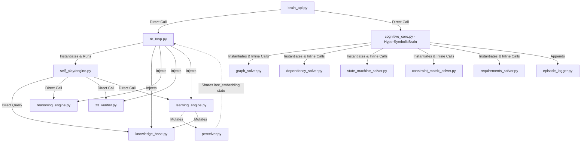

# HSCI V4 — Dependency Analysis

This document identifies architectural violations, circular dependencies, coupling issues, and state-sharing problems in the existing codebase, and provides recommendations for clean decoupling in V4.

---

## 1. Existing Codebase Dependency Mapping

The legacy repository maintains a highly coupled structure between cognitive orchestrators, storage engines, and deterministic solvers. The diagram below maps these relationships.



---

## 2. Identified Coupling & Architectural Violations

### 2.1 Circular Dependency Loops
*   **The Learning-Storage Loop**: `RIRLoop` -> `LearningEngine` -> `KnowledgeBase` -> `RIRLoop`. The `LearningEngine` directly mutates `KnowledgeBase` and `Perceiver` states. `KnowledgeBase` triggers updates that inform next-cycle classifications in `Perceiver`.
*   **Self-Play Dependency Loop**: `SelfPlayEngine` is instantiated inside `RIRLoop`, and receives references to `KnowledgeBase`, `ReasoningEngine`, `verifier`, and `LearningEngine`. It runs a background thread that executes loops querying and mutating the exact same instances that the active request thread is using. Because there are no database locks or request-scoped contexts, concurrent requests and background self-play execute write operations on shared PyTorch weight vectors and concept dictionaries simultaneously.

### 2.2 Tight Coupling
*   **Inline Solver Hardcoding**: `hnsds/brain/cognitive_core.py` is tightly coupled to all five verifier solvers. It directly imports them, instantiates them in its `__init__` constructor, and routes data to them using raw string checks on the user input string (e.g. `"ENTERPRISE DEPLOYMENT TOPOLOGY" in stimulus`). Adding a new domain solver requires modifying `cognitive_core.py`.
*   **Shared Config File Coupling**: The `PerceiverConfig` in `hsci/core/config.py` is directly referenced inside `hsci/neural/perceiver.py` and `intent_classifier.py`, making it difficult to parameterize solver thresholds for tests without writing config variables to disk.

### 2.3 Shared & Global State Violations
*   **The Perceiver Concurrency Race Condition**: `NeuralPerceiver` maintains a class instance variable `self.last_embedding`. When a request is parsed, the computed GNN tensor is stored in `self.last_embedding` so that `LearningEngine.learn()` can access it at the end of the RIR cycle. In a multi-threaded web server (such as FastAPI running concurrent worker threads), a second concurrent request will overwrite `self.last_embedding` before the first request completes its verification and learning phase, leading to proof-guided weight updates using the wrong gradient vector.
*   **EpisodeLogger File Contention**: The legacy `EpisodeLogger` writes directly to a single shared file `episodes.jsonl`. It opens, parses, appends, and saves this file with no file locking. Concurrent API requests trigger simultaneous file modifications, leading to silent data truncation or write collisions.

### 2.4 Architectural Layer Violations
*   **Storage Access from Solvers**: In `hnsds/synthesizer/enumerative.py`, the code synthesizer accesses the `EpisodeLogger` instance directly to fetch past successful code patterns. This bypasses the memory layer, violating Clean Architecture principles (business logic must not directly call data logging utilities).
*   **Sympy Symbole Evaluation**: `hnsds/formalizer/spec_builder.py` performs raw parsing and uses mathematical dependencies that conflict with the Z3 representations built in `hsci/symbolic/z3_verifier.py`.

---

## 3. Recommended Decoupling Architecture for V4

To resolve these violations, V4 must implement three design patterns:

### 3.1 Request-Scoped Contexts via `WorkingMemory`
Remove all transient state variables (such as `last_embedding`, `session_history`, and current reasoning outputs) from service instances. Wrap every incoming request in a transactional `CognitiveContext` holding a fresh `WorkingMemory` object:

```python
class CognitiveContext:
    def __init__(self, request_id: str):
        self.request_id = request_id
        self.working_memory = WorkingMemory()
        self.z3_context = z3.Context()
```

Every service in the 10-stage pipeline must be stateless, receiving the `CognitiveContext` as an argument. The `NeuralPerceiver` writes the computed GNN tensor to `context.working_memory.embedding`, ensuring total isolation between concurrent requests.

### 3.2 Dynamic Solver Registry (Interface Segregation)
Decouple the orchestrator from individual solvers by introducing a unified `SolverRegistry`. The orchestrator does not import solvers. Instead, solvers implement a common `AbstractSolver` interface and register themselves dynamically.

```python
class AbstractSolver(ABC):
    @abstractmethod
    def can_solve(self, subgoal: SubGoal, perception: PerceptionMap) -> bool:
        pass

    @abstractmethod
    def solve(self, subgoal: SubGoal, context: WorkingMemory) -> Expression:
        pass
```

The `SolverRegistry` acts as a service locator:

```python
class SolverRegistry:
    def __init__(self):
        self._solvers: List[AbstractSolver] = []

    def register_solver(self, solver: AbstractSolver) -> None:
        self._solvers.append(solver)

    def dispatch(self, subgoal: SubGoal, perception: PerceptionMap, context: WorkingMemory) -> Expression:
        for solver in self._solvers:
            if solver.can_solve(subgoal, perception):
                return solver.solve(subgoal, context)
        raise NoSolverFoundError(f"No solver registered for subgoal: {subgoal}")
```

### 3.3 Database Isolation via the UKM API
Services must never read or write directly to flat files or make direct database calls. All knowledge storage operations must route through the `UniversalKnowledgeModel` (UKM) interface, which enforces readers-writer locking at the SQLite level.
*   **Episodic Memory**: Accessed via `UKM.store_episode` and `UKM.find_similar_episodes`.
*   **Concept Memory**: Accessed via `UKM.put_concept` and `UKM.get_concept`.
This isolates the storage backend. Swapping SQLite for PostgreSQL or an in-memory test store requires zero changes to the cognitive pipeline.
