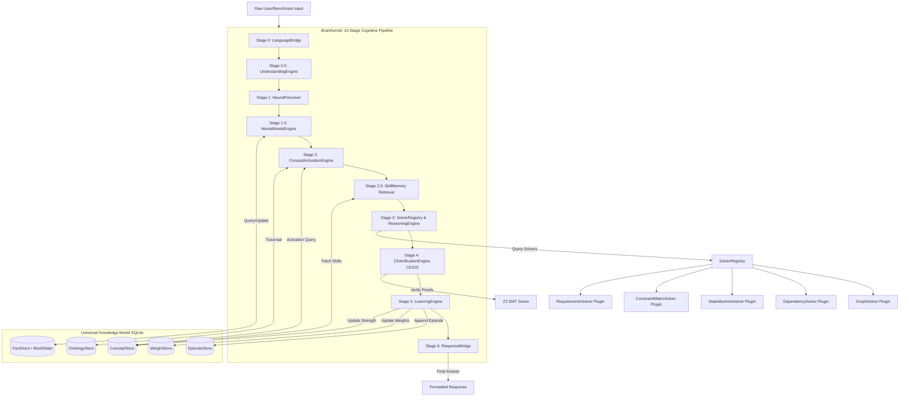

# HSCI V4 — Repository Migration Plan

## 1. Executive Summary & Scope

This document defines the official engineering roadmap and migration strategy to transition the Hyper-Symbolic Cognitive Invention (HSCI) repository from the hybrid V2/V3 structure to the unified, self-verifying V4 architecture. 

The primary mandate of this migration is **incremental evolution without regression**. The legacy system contains production-quality components—particularly the five deterministic solvers in `hnsds/verifier/` and the neural cortex in `hsci/neural/`—that must be preserved and integrated. This plan guarantees that existing capabilities are never broken, and the system can be benchmarked continuously at every phase of the migration.

---

## 2. Core Transition Architecture (V3 to V4)

The V4 migration consolidates two parallel execution pathways into a single, unified cognitive loop. Currently, the repository runs a dual-brain architecture:
*   `hnsds/brain/cognitive_core.py` (HyperSymbolicBrain V2): Runs keyword-based matching and routes tasks to specialized deterministic solvers for benchmark execution.
*   `hsci/core/rir_loop.py` (RIRLoop V3): Orchestrates general natural language reasoning via a 7-layer pipeline (GNN + Z3 CEGIS + Proof-Guided Learning).

The transition architecture merges these paths by introducing the **BrainKernel** as the single runtime orchestrator and the **Universal Knowledge Model (UKM)** as the sole persistence layer.



---

## 3. Core Component Roles

### 3.1 The BrainKernel (The Orchestrator)
The `BrainKernel` replaces both `HyperSymbolicBrain` and the V3 `RIRLoop`. It coordinates a **10-stage execution pipeline**:
1.  **Stage 0: LanguageBridge**: Tokenizes and normalizes the raw input text.
2.  **Stage 0.5: UnderstandingEngine**: Resolves co-references and follow-up contexts via the session history, compiling the parsed signal into a `SemanticFrame`.
3.  **Stage 1: NeuralPerceiver**: Computes GNN embeddings from the `SemanticFrame` and Classifies the cognitive intent.
4.  **Stage 1.5: MentalModelEngine**: Detects state gaps in the active domain by querying the `WorldStateGraph`.
5.  **Stage 2: ConceptActivationEngine**: Performs spreading activation over the `OntologyGraph` to retrieve a weighted field of active concepts.
6.  **Stage 2.5: SkillMemory**: Retrieves applicable procedural skills based on trigger embedding similarity.
7.  **Stage 3: SolverRegistry & ReasoningEngine**: Decomposes the goal into sub-goals and assigns solver plugins or concepts.
8.  **Stage 4: Z3VerificationEngine**: Performs formal verification using the CEGIS loop (up to 5 iterations) to guarantee solution soundness.
9.  **Stage 5: LearningEngine**: Executes proof-guided weight updates and updates concept/skill strengths in the UKM.
10. **Stage 6: ResponseBridge**: Generates the final natural language or structured output along with a calibrated confidence statement.

### 3.2 The Universal Knowledge Model (UKM)
The `UniversalKnowledgeModel` replaces all six fragmented, thread-unsafe storage formats (`episodes.jsonl`, `concept_graph.json`, `cognitive_weights.json`, etc.) with a transactional, SQLite-backed unified schema.
*   **ConceptStore**: Manages concept lifecycle states (`CANDIDATE`, `ACTIVE`, `WEAKENED`, `DEPRECATED`, `ARCHIVED`). Keeps a hot in-memory cache of the top 500 concepts.
*   **FactStore**: Powers the MME's `WorldStateGraph` using an Entity-Attribute-Value (EAV) model with confidence decay.
*   **OntologyStore**: Manages semantic relationships (`IS_A`, `GENERALIZES`, `CONTRADICTS`) to guide spreading activation.
*   **EpisodeStore**: Stores historical experiences with SQLite FTS5 index mapping for analogical retrieval.
*   **WeightStore**: Synchronizes the NeuralPerceiver's weight state dicts with the DB, tracking training versions.

---

## 4. Interoperability & Legacy Solver Integration

The five specialized solvers in `hnsds/verifier/` are highly performant and correct. To avoid rewriting them, they will be wrapped in a new `DeterministicSolverPlugin` interface and registered dynamically in the V4 `SolverRegistry`.

```python
class DeterministicSolverPlugin(AbstractSolver):
    """
    Adapter pattern to expose legacy HNSDS verifiers to the V4 ReasoningEngine.
    """
    def __init__(self, solver_instance: Any):
        self.solver = solver_instance

    def can_solve(self, subgoal: SubGoal, perception: PerceptionMap) -> bool:
        # Match using domain string, axiom type, or structural entities
        return subgoal.axiom_type == AxiomType.COMPOSITION and self._matches_signature(subgoal, perception)

    def solve(self, subgoal: SubGoal, context: WorkingMemory) -> Expression:
        # 1. Read input artifacts parsed from WorkingMemory
        # 2. Invoke legacy verifier methods
        # 3. Return compiled Expression
        ...
```

The V4 `LogicParser` (migrating from `hnsds/perception/logic_parser.py`) will run during **Stage 0.5 / Stage 1.5** to populate the request-scoped `WorkingMemory` with structured structures (e.g., `parsed_graph`, `parsed_constraints`, `parsed_state_machine`). When the `ReasoningEngine` executes at **Stage 3**, it queries the `SolverRegistry` and dispatches the task to the appropriate plugin, feeding it the pre-parsed data from `WorkingMemory`.

---

## 5. Legacy Deprecation Path

The migration implements a strict deprecation timeline for legacy code:

```
[Phase 1: Stabilize] ──> [Phase 2-3: Core UKM/WM] ──> [Phase 4-5: BrainKernel/Plugins] ──> [Phase 6-13: Subsystems]
                                                                                                 │
                                                                                [Decommission HyperSymbolicBrain]
                                                                                                 │
                                                                                 [hnsds/ becomes pure Solver Lib]
```

1.  **Immediate (Phase 1)**: Keep `HyperSymbolicBrain` as the benchmark target, but resolve its internal thread-safety bugs (lock concurrent writes to `episodes.jsonl` and secure `exec()` call paths).
2.  **Intermediate (Phases 2–5)**: Introduce the `BrainKernel` alongside `HyperSymbolicBrain`. The benchmark suite is updated to run a dual-runner (`HSCIRunner` for V2 and `RIRLoopRunner` for V3/V4). Both run against the same test suites to verify parity.
3.  **Solver Redirection (Phase 5)**: The `SolverRegistry` is completed. `HyperSymbolicBrain`'s custom routing logic in `cognitive_core.py` is marked `@deprecated` and rewritten to delegate directly to the `BrainKernel`'s solver dispatch path.
4.  **Final Consolidation (Phase 13+)**:
    *   Decommission `hnsds/brain/cognitive_core.py` entirely.
    *   Remove legacy entry points like `orchestrator.py` and `run_mind.py`.
    *   Refactor `hnsds/` to exclude all routing, memory, and perception logic, leaving it as a pure deterministic solver package: `hnsds-solvers`.
    *   `hsci/` becomes the sole runtime for the cognitive operating system.
