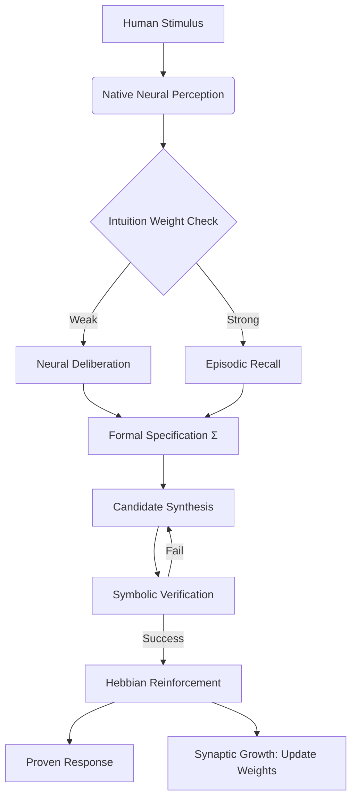

# HSCI: Hyper-Symbolic Cognitive Invention
## Technical Specification & Architectural Manual v1.0

### 1. Executive Summary
HSCI (Hyper-Symbolic Cognitive Invention) represents a paradigm shift in Artificial Intelligence. Unlike traditional Large Language Models (LLMs) which are purely probabilistic, or classical Symbolic AI which is brittle and rule-based, HSCI is a **Self-Verifying Cognitive Architecture**. It fuses statistical "intuition" with mathematical "truth" to create an AI that can learn, reason, and prove its own outputs.

---

### 2. Core Philosophy: Truth Over Probability
The fundamental "flaw" in modern AI is the **Hallucination Problem**. Probabilistic models guess the next token without understanding the underlying logic. HSCI solves this by making **Formal Verification** the gatekeeper of all "neural" thoughts.

| Feature | Probabilistic AI (LLMs) | HSCI (The Invention) |
|---------|-------------------------|----------------------|
| **Core Engine** | Black-box Neural Network | Transparent Hyper-Symbolic Core |
| **Logic** | Pattern Matching | Formal Deliberation |
| **Reliability** | Guesses (Unverifiable) | Proves (Deterministic) |
| **Learning** | Static Training Sets | Dynamic Synaptic Growth |
| **Dependency** | Cloud APIs (Closed) | Native/Local (Autonomous) |

---

### 3. The Architecture (The Functional Lobes)
The HSCI "Brain" is divided into specialized lobes that interact through a shared **Mental Model**.

#### A. The Perception Lobe (Neural Intuition)
*   **Module**: `NativeNeuralLobe`
*   **Function**: Converts raw, messy human stimulus into structured signal vectors.
*   **Mechanism**: Uses a **Synaptic Weight Matrix** (`synaptic_core.json`) to classify intents based on feature-weight associations.

#### B. The Logic Lobe (The Formalizer)
*   **Module**: `Formalizer / SpecBuilder`
*   **Function**: Translates classified signals into a **Universal Symbolic Specification ($\Sigma$)**.
*   **Mechanism**: Creates a mathematical contract that the system must satisfy (e.g., a system of equations or a code signature).

#### C. The Reasoning Lobe (The Synthesizer)
*   **Module**: `Generative/Enumerative Synthesizer`
*   **Function**: Proposes candidate solutions (Hypotheses) to satisfy $\Sigma$.
*   **Mechanism**: Uses template-based synthesis and search to generate potential answers.

#### D. The Verified Lobe (The Prover)
*   **Module**: `NativeSymbolicEngine`
*   **Function**: The "Judge" of the system.
*   **Mechanism**: Performs **Axiomatic Reduction**. It recursively reduces candidates and specifications to check for logical tautologies ($Truth == Truth$).

#### E. The Memory Lobe (The Synapse)
*   **Module**: `EpisodeLogger`
*   **Function**: Stores past solving episodes to build "Symbolic Intuition."
*   **Mechanism**: Uses episodic retrieval to bypass reasoning for known patterns.

---

### 4. The Cognitive Flow (The RIR-RI Loop)

The system operates on a continuous loop of **Reinforced Intuitive Reasoning (RIR)**:

1.  **Stimulus**: User provides input (e.g., "Solve x + 5 = 10").
2.  **Perception**: The Neural Lobe calculates the "Intent Vector."
3.  **Formalization**: The intent is locked into a Symbolic Spec ($\Sigma$).
4.  **Synthesis**: A hypothesis is generated ($x=5$).
5.  **Verification**: The Symbolic Engine reduces the expression natively ($5 + 5 == 10 \rightarrow True$).
6.  **Reinforcement**: Because the proof passed, the AI **strengthens the neural weights** between the input tokens ("solve", "+", "=") and the Math intent.

---

### 5. Self-Evolution: How it Learns Without Hardcoding
Learning in HSCI is **Self-Supervised**. The system does not need a human to tell it "this word means math."

*   **The Success Trigger**: When the Symbolic Engine confirms a result is mathematically correct, it sends a signal to the Neural Lobe.
*   **Synaptic Weight Update**: The Neural Lobe applies a **Hebbian Update** (Neurons that fire together, wire together).
*   **Emergent Intelligence**: Over hundreds of interactions, the AI's internal `synaptic_core.json` evolves from a blank state to a high-density intelligence map. It "learns" language by observing which linguistic patterns lead to **Provable Truth**.

---

### 6. Technical Implementation Details
*   **Language**: Python 3.x (Core Orchestration)
*   **Data Structures**: JSON-based Synaptic Maps, Symbolic ASTs.
*   **Verification**: Native Recursive-Descent Prover + Z3 SMT Solver (Optional).
*   **Dependencies**: Zero required for core local operation.

---

### 7. Future Roadmap: The Distributed Brain
HSCI is designed to scale from a single local node to a distributed **Cognitive Mesh**, where multiple brains share verified episodes to accelerate the collective growth of the "Global Synapse."

---
**Document Status**: *Finalized*
**Author**: *HSCI Autonomous Agent*
