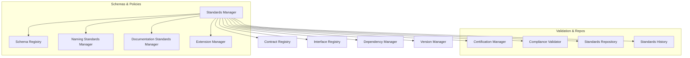
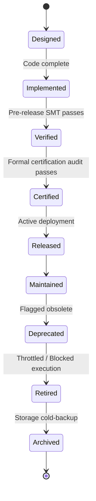

# HSCI V5 — Architecture Standards & Contracts (ASC-1)

**Version**: 1.0  
**Status**: Constitutional Cognitive Specification  
**Verdict**: Approved for Milestone 2 Development  

---

## 1. Purpose

The Architecture Standards & Contracts (ASC-1) defines the engineering standards, interface schemas, lifecycle transitions, and API contracts that every HSCI module must obey.

### Terminology Matrix
*   **Contract**: Formal mathematical declarations of interfaces, preconditions, and invariants.
*   **Interface**: The structural schema defining input-output bounds.
*   **Protocol**: The communication sequence (e.g. 3PC consensus loops).
*   **Module / Component**: A discrete runtime unit (e.g. CRE, HTN).
*   **Interoperability / Federation**: Guidelines mapping communication between disparate agent swarms.

*Maintainability Standard*: Formally documenting contracts prevents semantic drift and guarantees backward compatibility as individual cognitive modules undergo upgrades.

---

## 2. Positioning Inside HSCI

```
       Architecture Standards (ASC-1)
                    │
                    ▼
            Governance (GCA-1) ──► Verification (VVA-1) ──► Executive (ECA-1)
```
### Why Every Architecture Must Comply with ASC-1
If a module bypasses contract validation, it runs the risk of introducing schema mismatch faults, thread deadlocks, or security leaks into the shared Universal Semantic Memory. Registering all interfaces with ASC-1 guarantees formal consistency.

---

## 3. Subsystem Architecture Overview



---

## 4. Contract Schema & Module Lifecycle

### 4.1 Contract Object Schema
*   **Contract ID**: Unique coordinate namespace (e.g. `contract.module.reasoning.001`).
*   **Preconditions / Postconditions**: Z3 logical assertions.
*   **Compatibility Rules**: Version bounds (e.g. `requires >= v2.0.0`).
*   **Certification Status**: Enum (`Designed`, `Implemented`, `Verified`, `Certified`).

### 4.2 Lifecycle Transitions
The Lifecycle Manager enforces the compile-to-retire process:



---

## 5. Versioning & Dependency Management

### 5.1 Semantic Versioning Rules
ASC-1 enforces semantic version parameters:
*   **Major**: Breaking changes (requires re-certification of dependent modules).
*   **Minor**: Backward-compatible functionality additions.
*   **Patch**: Backward-compatible bug fixes.

### 5.2 Dependency Validation
The Dependency Manager builds an acyclic dependency graph. Circular dependency detection runs at compile time, rejecting builds that loop reference modules.

---

## 6. Complete Walkthrough Benchmarks

### Scenario A: Registering a New Module (Emotion Architecture)
1.  **Contract Definition**: Developer structures contract `contract.module.emotion.001` containing preconditions and dependencies.
2.  **Interface Registration**: Interface Registry records input-output parameter schemas.
3.  **Dependency Validation**: Dependency Manager scans references: Maps `emotion` -> `Self_Model_v1.2` (SAT pass).
4.  **Compatibility Check**: Evaluates compatibility constraints. No breaking references detected.
5.  **Certification**: Certification Manager executes SMT verification checks. Outputs trace certificate.
6.  **Release & Integration**: Lifecycle state advances to `Released`. Executive Controller loads the module.

### Scenario B: Tool & Capability Architecture Upgrade (v2.1 to v3.0)
1.  **Version Analysis**: Version Manager identifies a major version shift (`v2.1` -> `v3.0`).
2.  **Breaking Change Detection**: Scans schemas; identifies changes in tool input specifications.
3.  **Dependency Evaluation**: Dependency Manager checks all dependent modules (e.g., HTN Planner, Self Model).
4.  **Compatibility Validation**: Formally verifies whether dependent modules satisfy the new preconditions (UNSAT detect on `Self_Model_v1.0`).
5.  **Migration & Certification**: Triggers compilation blocks. Upgrades `Self_Model` parameters to target `v2.0` layout, resolving conflicts.
6.  **Deployment**: Certified build is deployed; old schemas are marked as `Retired`.

---

## 7. Standards Metrics

*   **Contract Compliance Rate**: Percentage of registered modules fully satisfying preconditions.
*   **Upgrade Success Rate**: Fraction of version shifts completed without rollbacks.
*   **Certification Success Rate**: Count of modules passing formal audits on the first run.

---

## 8. ASC-1 Architecture Principles

The Architecture Standards & Contracts system **MUST NOT**:
1.  Perform domain reasoning or planning.
2.  Modify the runtime behavior of active modules directly.
3.  Bypass Governance policies.

Its sole responsibility is registry maintenance, version audits, dependency verification, and lifecycle certifications.
