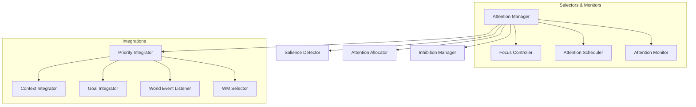

# HSCI V5 — Attention System Architecture (ASA-1)

**Version**: 1.0  
**Status**: Constitutional Cognitive Specification  
**Verdict**: Approved for Milestone 2 Development  

---

## 1. Purpose

The Attention System (AS) selects which information, goals, memories, and environmental changes receive computational focus. It acts as the cognitive spotlight of HSCI, maximizing processing efficiency by filtering out distractions.

### Terminology Distinctions
*   **Attention**: The global resource allocation subsystem.
*   **Focus**: The specific set of entities currently active in WorkingMemory cache.
*   **Working Memory**: Request-scoped, thread-isolated storage buffers.
*   **Goal**: The target state representation.
*   **Context**: Situation variables filtering concepts.
*   **Executive Control**: The prefrontal scheduler dispatching engines.
*   **Reasoning / Planning**: Subsystems operating exclusively on attended concepts.

---

## 2. Positioning Inside HSCI

```
World Model (WMA-1) ──► Goal Manager (GMA-1) ──► Attention System (ASA-1)
                                                       │
                                                       ▼
                                              Working Memory Focus
                                                       │
                                 ┌─────────────────────┴─────────────────────┐
                                 ▼                                           ▼
                           Task Planner                              Reasoning Engine
```
### Why Reasoning Operates Only on Attended Information
Reasoning over millions of concept nodes causes combinatorial explosion in Z3 SMT solver contexts. The Attention System restricts active solver assertions to a small focus subset (typically under 50 concepts), guaranteeing proof execution within the 50ms timeout window.

---

## 3. Subsystem Architecture Overview



---

## 4. Attention Representation & Lifecycle

### 4.1 Attention Object Schema
*   **Attention ID**: Unique coordinate namespace (e.g. `focus.travel.flight_price.001`).
*   **Salience & Activation Level**: Floats \(\in [0.0, 1.0]\).
*   **Focus Duration**: Number of execution cycles to retain focus.
*   **Decay Rate**: Exponential time-decay coefficient.

### 4.2 Attention Lifecycle
`Candidate` \(\rightarrow\) `Evaluated` \(\rightarrow\) `Selected` \(\rightarrow\) `Focused` \(\rightarrow\) `Maintained` \(\rightarrow\) `Shifted / Suppressed` \(\rightarrow\) `Released` \(\rightarrow\) `Archived`.

---

## 5. Salience and Prioritization Models

### 5.1 Salience Computation
The Salience Detector calculates concept salience (\(S_{sal}\)) deterministically:

\[
S_{sal}(c) = w_{nov} \cdot Novelty(c) + w_{threat} \cdot Threat(c) + w_{chg} \cdot State_{Changes}(c)
\]

### 5.2 Attention Prioritization Scoring
The Priority Integrator computes final attention scores (\(S_{att}\)):

\[
S_{att}(c) = S_{sal}(c) + w_g \cdot Goal_{Weight}(c) + w_{ctx} \cdot Context_{Relevance}(c) - w_{dec} \cdot Decay(t) - Inhibition(c)
\]

*   Concepts with scores exceeding the focus threshold are loaded into WorkingMemory's attention registers.

---

## 6. Attention Switching & Capacity

*   **Capacity Limit**: Capt focus registers to 7 concurrent primary entities (mirroring Miller's Law).
*   **Divided Attention**: Allocates processing bandwidth proportionally (e.g. \(70\%\) focus on booking flights, \(30\%\) focus on weather monitoring).
*   **Attention Switch Interrupt**: A high-salience threat event (e.g. alert) triggers the `Inhibition Manager` to preempt current focus registers, clearing low-priority slots.

---

## 7. Complete Walkthrough Benchmark

### Ingestion: *"Book the cheapest flight to London before Friday while monitoring weather updates."*

1.  **Candidate Generation**: Instantiates focus objects: `flight_price.001`, `london.001`, `weather.001`.
2.  **Allocation**:
    *   `flight_price.001`: Score \(0.85\) (High goal weight) \(\rightarrow\) Loaded into Active Focus.
    *   `weather.001`: Score \(0.55\) (Divided attention slot) \(\rightarrow\) Scheduled for background monitoring.
3.  **Planning / Reasoning**: HTN planner queries travel coordinates under the flight focus subset.

### Emergency Switch: *"Airport closes due to storm."*
1.  **World Event Listener**: Captures state change: `status(airport) = closed`.
2.  **Salience Spike**: Novelty and Threat metrics spike. Salience score evaluates to \(1.0\).
3.  **Preemption**: Interrupts current booking tasks. The `Inhibition Manager` suppresses `flight_price.001` focus.
4.  **Attention Switch**: `airport_closure.001` is loaded as Primary Focus.
5.  **Recovery**: Goal Manager recalculates path priorities; Task Planner generates flight cancellation actions.

---

## 8. ASA-1 Architecture Principles

The Attention System **MUST NOT**:
1.  Verify logical assertions using Z3 SMT solver context.
2.  Formulate HTN plans or execution steps.
3.  Modify World Model state variables.

Its sole responsibility is calculating salience and focus variables to allocate cognitive bandwidth.
