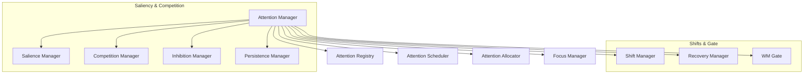
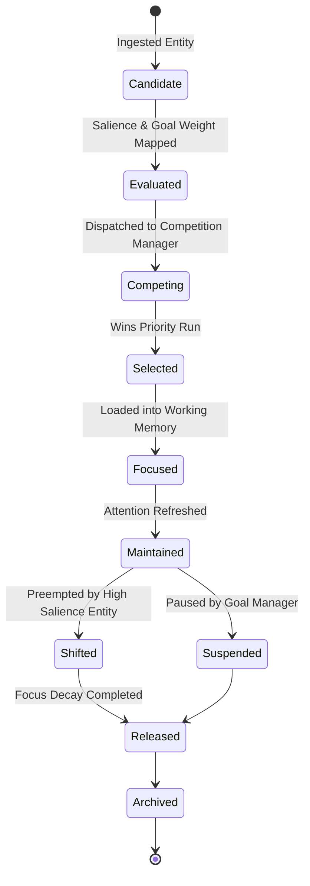

# HSCI V5 — Attention System Architecture (ASA-1)

**Version**: 1.0  
**Status**: Constitutional Cognitive Specification  
**Verdict**: Approved for Milestone 2 Development  

---

## 1. Purpose

The Attention System (AS) selects which information, goals, memories, and environmental changes receive computational focus. It acts as the cognitive spotlight of HSCI, maximizing processing efficiency by filtering out distractions.

### Terminology Distinctions
*   **Attention**: The global resource allocation subsystem that calculates salience and prioritizes focus.
*   **Focus**: The specific set of entities currently active in WorkingMemory cache.
*   **Working Memory**: Request-scoped, thread-isolated storage buffers.
*   **Goal Management**: Determines target states of intentions.
*   **Context**: Situation variables filtering concepts.
*   **Executive Control**: The prefrontal scheduler dispatching engines.
*   **Memory Retrieval**: Querying USM tables.
*   **Reasoning / Planning / Simulation**: Algorithmic processes executing over attended representations.

---

## 2. Positioning Inside HSCI

```
World Model (WMA-1) ──► Goal Manager (GMA-1) ──► Attention System (ASA-1)
                                                       │
                                                       ▼
                                              Working Memory Focus
                                                       │
                                 ┌─────────────────────┴─────────────────────┐
                                 ▼                                           ▼
                           Task Planner                              Reasoning Engine
```
### Why Attention Operates After Goals but Before Reasoning
Goals establish the intentional boundaries of cognition. Without goals, the attention system cannot calculate goal-driven relevance weights, leading to focus starvation. Conversely, running reasoning engines (Z3) over un-filtered, massive world state tables leads to combinatorial proof explosion. Attention must restrict the reasoning scope to a small focus subset.

---

## 3. Subsystem Architecture Overview



### Module Specifications

*   **Attention Manager**: Orchestrates focus selection cycles and schedules priority checks.
*   **Salience Manager**: Calculates target entity salience based on novelty, threats, and changes.
*   **Competition Manager**: Resolves prioritization tie-breaks and preemption overrides.
*   **Inhibition Manager**: Suppresses repeated events, loops, and noise.
*   **WM Gate**: Restricts WorkingMemory entry to attended concepts, evicting expired nodes.

---

## 4. Attention Object Model

Every focus object contains the following structured attributes:
*   **Attention ID**: Unique coordinate namespace (e.g. `focus.travel.flight_price.001`).
*   **Target Entity**: Coordinate node in World Model.
*   **Priority & Salience**: Floats \(\in [0.0, 1.0]\).
*   **Goal & Context Relevance**: Weights mapped by Goal/Context engines.
*   **Activation Level**: Current activation potential (\(A \in [0.0, 1.0]\)).
*   **Decay Rate**: Time-decay coefficient.
*   **Focus Duration**: Number of execution cycles to retain focus.
*   **Attention Budget**: Maximum thread allocation budget.

---

## 5. Attention Lifecycle



---

## 6. Attention Types

*   **Selective Attention**: Focuses resources on a single entity while ignoring distractions.
*   **Divided Attention**: Splits processing bandwidth proportionally across multiple focus points.
*   **Sustained Attention**: Maintains activation level over long reasoning cycles.
*   **Emergency Attention**: Bottom-up preemption triggered by high-salience threat signals.
*   **Background Attention**: Monitors low-priority streams (e.g. log files).

---

## 7. Salience & Prioritization Models

### 7.1 Salience Computation
The Salience Manager calculates concept salience (\(S_{sal}\)) deterministically:

\[
S_{sal}(c) = w_{nov} \cdot Novelty(c) + w_{threat} \cdot Threat(c) + w_{chg} \cdot State_{Changes}(c)
\]

### 7.2 Attention Prioritization Scoring
The Priority Integrator computes final attention scores (\(S_{att}\)):

\[
S_{att}(c) = S_{sal}(c) + w_g \cdot Goal_{Weight}(c) + w_{ctx} \cdot Context_{Relevance}(c) - w_{dec} \cdot Decay(t) - Inhibition(c)
\]

---

## 8. Competition, Allocation, and Switching

*   **Competition Overrides**: Priority tie-breakers favor `Safety` goals first, followed by direct `User` requests.
*   **Attention Bandwidth Allocation**: Caps focus capacity to a maximum of 7 concurrent active primary entities (Miller's Law) and reserves \(10\%\) thread capacity for background monitors.
*   **Attention Switching**: Preemption commands interrupt current tasks, executing a thread-state snapshot before shifting focus.

---

## 9. Attention Inhibition & Working Memory Gate

*   **Inhibition**: Prevents infinite focus loops by applying a negative inhibition weight to concepts currently focused for more than 5 consecutive cycles.
*   **WM Gate Replacement Policy**: If attention slots are saturated, the node with the lowest activation level is evicted using a Least-Attended-First (LAF) policy.

---

## 10. Complete Walkthrough Benchmark

### Ingestion: *"Book the cheapest flight to London before Friday while continuously monitoring weather and airport alerts."*

1.  **Candidate Generation**: Instantiates focus objects: `flight_price.001`, `weather.001`, `airport_alerts.001`.
2.  **Allocation**:
    *   `flight_price.001`: Score \(0.85\) (High goal weight) \(\rightarrow\) Loaded into Active Focus.
    *   `weather.001`: Score \(0.55\) (Divided attention slot) \(\rightarrow\) Background monitor.
    *   `airport_alerts.001`: Score \(0.60\) (Divided attention slot) \(\rightarrow\) Background monitor.
3.  **Planning / Reasoning**: HTN planner queries travel coordinates under the flight focus.

### Emergency Alert: *"London Heathrow closes because of severe weather."*
1.  **World Event Monitor**: Captures state change: `status(airport_heathrow) = closed`.
2.  **Salience Spike**: Threat and Unexpectedness metrics evaluate to \(1.0\).
3.  **Competition**: `airport_heathrow` preemption win. `Inhibition Manager` suppresses `flight_price.001` focus.
4.  **Attention Switch**: `airport_heathrow` loaded into WorkingMemory active Focus slot.
5.  **Answer**: Executive Controller triggers re-planning.

---

## 11. Attention Metrics

*   **Focus Retention**: Ratio of successful task completions to focus shifts.
*   **Attention Switching Cost**: Latency (ms) to save and restore attention states.
*   **WM Utilization**: Percentage of active WorkingMemory slots occupied by high-attention entities.

---

## 12. ASA-1 Architecture Principles

The Attention System **MUST NOT**:
1.  Verify logical proofs using Z3.
2.  Execute HTN planner steps.
3.  Modify World Model state variables directly.

Its sole responsibility is calculating salience and focus variables to allocate cognitive bandwidth.
