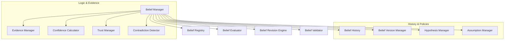

# HSCI V5 — Belief System Architecture (BSA-1)

**Version**: 1.0  
**Status**: Constitutional Cognitive Specification  
**Verdict**: Approved for Milestone 2 Development  

---

## 1. Purpose

The Belief System (BS) represents what HSCI currently believes to be true or false. It manages uncertainty by tracking confidence, evidence, provenance, and revision histories.

### Terminology Matrix
*   **Fact**: An objective, immutable state invariant (e.g. \(1+1=2\)).
*   **Observation**: Raw sensory input recorded in the World Model.
*   **Evidence**: A verified observation supporting or contradicting a proposition.
*   **Belief**: A subjective proposition modeled with a confidence value (\(C \in [0.0, 1.0]\)).
*   **Hypothesis / Assumption**: A temporary belief initialized with low confidence.
*   **Knowledge**: Beliefs verified by Z3 SMT proofs and high trust scores.

*Beliefs are not facts*: A belief can be revised or retracted when new contradictory evidence arrives, whereas facts are immutable.

---

## 2. Positioning Inside HSCI

```
World Model (WMA-1) ──► Attention System (ASA-1) ──► Belief System (BSA-1)
                                                           │
                                                           ▼
                                                  Working Memory Focus
                                                           │
                                                    Reasoning Engine
```
### Why Reasoning Operates Over Beliefs Rather Than Observations
Observations are noisy, incomplete, and sometimes contradictory. If the Reasoning Engine (Z3) is fed raw, un-filtered observations directly, it will fail due to logical contradictions. The Belief System filters observations into consistent propositions, allowing Z3 to prove constraints over a stable state.

---

## 3. Subsystem Architecture Overview



---

## 4. Belief Object Schema & Lifecycle

### 4.1 Belief Object Schema
*   **Belief ID**: Unique coordinate namespace (e.g. `belief.schedule.meeting_time.001`).
*   **Subject/Predicate/Object**: The core logic proposition (e.g. `meeting_time` `starts_at` `15:00`).
*   **Confidence**: Float \(\in [0.0, 1.0]\).
*   **Evidence List**: Array of source event IDs.
*   **Trust Score**: Source reliability metric.

### 4.2 Belief Lifecycle
`Observed` \(\rightarrow\) `Candidate` \(\rightarrow\) `Evaluated` \(\rightarrow\) `Accepted` \(\rightarrow\) `Strengthened / Maintained` \(\rightarrow\) `Revised / Contradicted` \(\rightarrow\) `Deprecated` \(\rightarrow\) `Archived`.

---

## 5. Confidence, Trust, and Revision Models

### 5.1 Confidence Calculator
Calculates belief confidence (\(C_{bel}\)) deterministically:

\[
C_{bel} = w_e \cdot \frac{\sum E_{weight}}{E_{count}} + w_t \cdot Trust(Source) - w_{dec} \cdot Decay(t)
\]

### 5.2 Trust Manager
Maintains trust scores for users, sensors, and databases. Trust decays exponentially over time without reinforcement and is penalized immediately when source observations contradict verified facts.

### 5.3 Revision Engine Rules
*   **New Evidence**: Increases confidence if consistent; triggers evaluation if contradictory.
*   **Contradiction**: If new evidence contradicts an active belief, the system compares the trust scores of the sources. The belief supported by the higher trust score is retained, and the other is retracted.

---

## 6. Complete Walkthrough Benchmarks

### Scenario A: Meeting Schedule Correction
1.  **Ingestion 1**: *"The meeting starts at 3 PM."*
    *   **Evidence**: User input (Trust: 0.90).
    *   **Belief Created**: `starts_at(meeting_01, 15:00)`, confidence 0.90. Status: `Accepted`.
2.  **Ingestion 2**: *"Actually, the meeting was moved to 4 PM."*
    *   **Contradiction Detection**: `starts_at(meeting_01, 16:00)` contradicts initial belief.
    *   **Resolution**: Since both originate from the same user (identical trust), the newer timestamp updates the belief.
    *   **Revision**: Initial belief deprecated; new belief `starts_at(meeting_01, 16:00)` created. Confidence updated. History preserved in version manager log.

### Scenario B: Weather Hypothesis
1.  **Ingestion 1**: *"I think it might rain tomorrow."*
    *   **Belief Created**: `weather_tomorrow(rain) = True`. Type: `Hypothesis`. Confidence: 0.30 (Low trust source prediction).
2.  **Ingestion 2**: Local weather radar API reports `precipitation_prob = 95%` (Trust: 0.98).
3.  **Revision**: Confidence Calculator re-evaluates score to 0.96. Status transitions to `Verified Belief`.

---

## 7. Belief Metrics

*   **Belief Accuracy**: Correlation rate between predictions and verified world state updates.
*   **Contradiction Rate**: Number of contradictory assertions detected per 1000 belief nodes.
*   **Trust Stability**: Standard deviation of source trust changes.

---

## 8. BSA-1 Architecture Principles

The Belief System **MUST NOT**:
1.  Verify downstream logical proofs directly (delegated to CRE).
2.  Sequence HTN planner tasks.
3.  Modify World Model base tables.

Its sole responsibility is representing epistemic truth values, managing trust, and executing belief updates.
