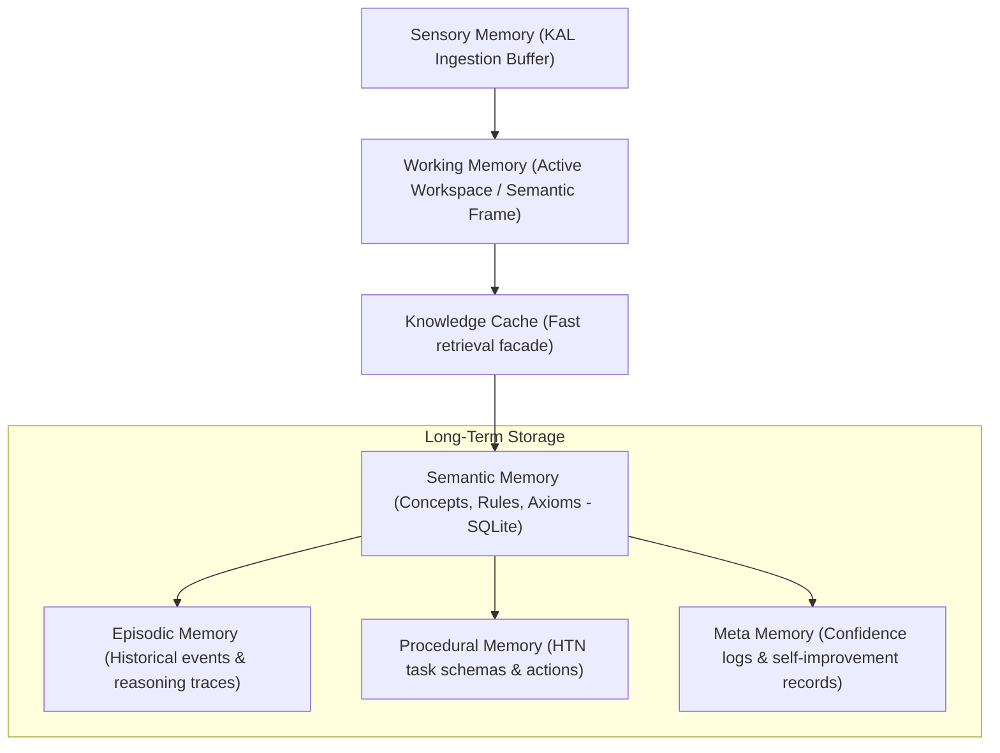
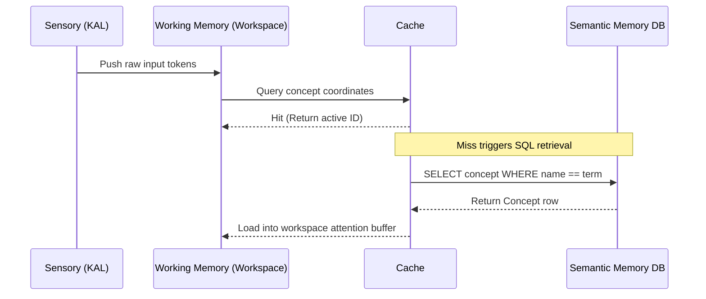

# HSCI V4 — Cognitive Memory Architecture (Cognitive_Memory_Architecture.md)

This document specifies the storage subdivisions, retrieval pathways, and operational boundaries of the HSCI memory systems.

---

## 1. Memory Subsystems Layout

HSCI splits memory into 6 isolated components:

---

## 2. Memory Ingestion & Retrieval Pathway

---

## 3. Cognitive Memory Characteristics

*   **Working Memory**: Request-scoped, thread-isolated storage containing active concept schemas.
*   **Semantic Memory**: The persistent, structured concept ontology graph.
*   **Procedural Memory**: Sequence of actions and logic plans executed by the task planner.
*   **Episodic Memory**: Chronicles history traces of previous inputs and output reasoning answers.
*   **Meta Memory**: Tracking indices recording "what the system knows" and confidence statistics.
