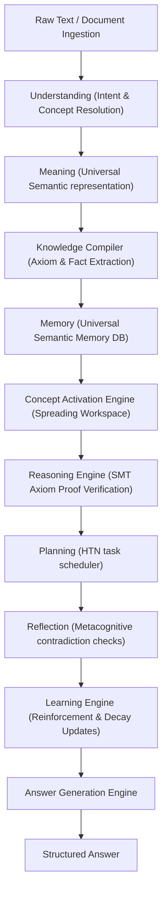

# HSCI V4 — Cognitive Processing Pipeline (Cognitive_Processing_Pipeline.md)

This document specifies the end-to-end cognitive processing pipeline (CPP-1) that converts raw text into verified answers and evolved concepts.

---

## 1. End-to-End Cognitive Flow

---

## 2. Ingestion Transformations Table

| Pipeline Stage | Input Object | Process Performed | Output Object |
|---|---|---|---|
| **Understanding** | Raw Input String | Tokenization & grammatical parsing. | `SemanticFrame` |
| **Meaning** | `SemanticFrame` | Entity mapping and disambiguation. | `LanguageOfThought` |
| **Knowledge** | `LanguageOfThought` | Extract facts, assertions, constraints. | `KnowledgeObject` |
| **Memory** | `KnowledgeObject` | SQLite/PostgreSQL transactional write. | DB Graph State |
| **Activation** | User Query Seed | Spreading decay activation over graphs. | Active Workspace |
| **Reasoning** | Active Workspace | Microsoft Z3 SMT solver proving axioms. | `ReasoningResult` |
| **Answer** | `ReasoningResult` | Compiling markdown sections & evidence logs. | `Answer` Object |
