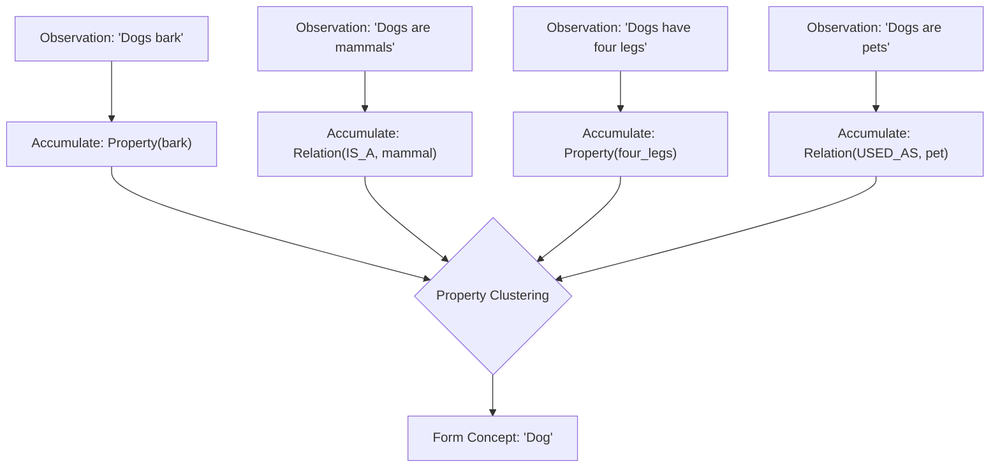

# HSCI V4 — Concept Formation Theory (Concept_Formation_Theory.md)

This document specifies the algorithm, clustering mechanisms, and semantic split/merge criteria governing concept formation.

---

## 1. Dynamic Concept Accumulation Pipeline

Concepts are not static. They emerge from repeated property observations:

---

## 2. Walkthrough: The Formation of concept "Dog"

Suppose the system has never seen the concept "Dog":
1.  **Ingestion 1**: "Dogs bark." The compiler parses `Dogs` as a candidate concept tag and attaches `Property: barks` (confidence 0.90).
2.  **Ingestion 2**: "Dogs are mammals." The relationship discovery engine extracts `Relation: IS_A` pointing to concept `mammal`.
3.  **Ingestion 3**: "Dogs have four legs." The compiler extracts property `legs: 4`.
4.  **Ingestion 4**: "Dogs are pets." The compiler extracts property `role: pet` (confidence 0.85).
5.  **Clustering**: The ontology builder analyzes semantic proximity. Because these assertions share identical candidate tags, it merges them, updates the trust metrics, and establishes the canonical concept namespace node `concept.animal.dog`.

---

## 3. Creation, Merging, and Splitting Criteria

### 3.1 Concept Creation
A concept is instantiated when a unique semantic term tag appears in a validated assertion with a confidence score above \(0.70\) and does not match any existing alias keys.

### 3.2 Concept Merging
Triggered when two concepts share more than \(90\%\) of their properties and relationships (e.g. `Car` and `Automobile`). The builder merges the nodes, registers one as the primary canonical ID, and adds the other to the aliases database index.

### 3.3 Concept Splitting
Triggered when homonym splits are detected. If a concept (e.g. `Java`) accumulates two distinct clusters of properties that have \(0\%\) overlap (e.g. `island, geography` vs. `programming language, code`), the builder splits the node into two distinct namespaces: `concept.geography.java_island` and `concept.software.java_language`.
