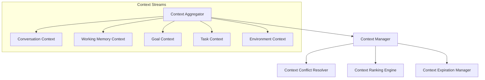
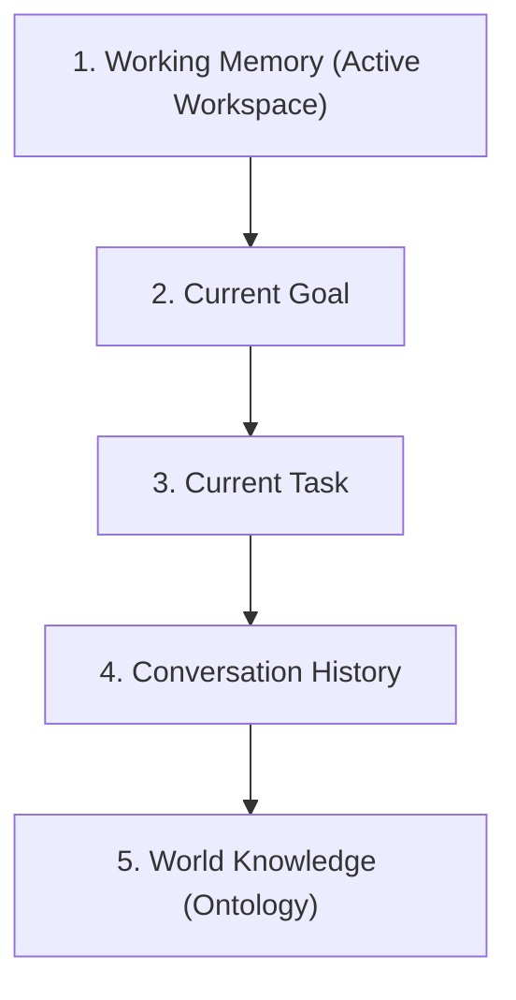

# HSCI V5 — Context Engine Architecture (CEA-1)

**Version**: 1.0  
**Status**: Constitutional Cognitive Specification  
**Verdict**: Approved for Milestone 2 Development  

---

## 1. Purpose

The Context Engine determines situational meaning, resolving the question: *"What does this information mean RIGHT NOW?"*
*   **Language**: The raw syntactic input tokens.
*   **Meaning**: The initial semantic relation graph.
*   **Context**: The active situation variables (goals, history) that filter and prune the Meaning Graph.
*   **Knowledge**: Long-term database graph mapping.
*   **Reasoning / Planning**: Logic computation and task sequence allocation.

---

## 2. Positioning Inside HSCI

```
Raw Language ──► Semantic Interpreter ──► Meaning Graph ──► Context Engine
                                                                │ (CEA-1)
                                                                ▼
    Language of Thought ◄── Knowledge Compiler ◄── Enriched Meaning Graph
```
### Why Context Comes Before Knowledge Compilation
Knowledge compilation maps meaning into logic predicates. If contextual disambiguation occurs *after* compilation, the compiler would produce contradictory predicates, causing SMT solver crashes. Context must prune ambiguity *before* predicate generation.

---

## 3. Subsystem Architecture Overview

The Context Engine comprises 12 core modules:



---

## 4. Context Priority Model

To resolve homonyms (e.g. `Java`, `Apple`), the Context Engine evaluates context in this order of priority:


*   **Rationale**: Local active variables represent current user intent, overriding general ontology defaults.

---

## 5. Context Resolution (Scoring & Candidates)

For ambiguous terms (e.g., `Mouse`), the engine generates candidate concepts:
1.  **Candidate Generation**: Retrieves candidate IDs (`concept.animal.mouse`, `concept.hardware.mouse`).
2.  **Context Scoring**: Computes correlation with active context concepts.
3.  **Selection**: The candidate with the highest score above threshold is selected.

---

## 6. Goal-Based Context

*   *Benchmark*: *"Open the bank."*
    *   **Goal 1**: `goal.finance.check_balance` \(\rightarrow\) Maps `bank` to `concept.org.financial_bank`.
    *   **Goal 2**: `goal.research.flood_simulation` \(\rightarrow\) Maps `bank` to `concept.geography.river_bank`.

---

## 7. Context Scoring Algorithm

The Context Ranking Engine calculates a deterministic compatibility score (\(S_{comp}\)) for each candidate concept (\(c\)) matching active context dimensions (\(D\)):

\[
S_{comp}(c) = \sum_{d \in D} w_d \cdot A(d) \cdot Sim(c, d)
\]

Where:
*   \(w_d\) is the weight of context dimension \(d\) (defined by the Priority Model).
*   \(A(d)\) is the activation potential base of the context dimension in WorkingMemory.
*   \(Sim(c, d)\) is the path-length semantic similarity between concept \(c\) and context node \(d\) in the ontology graph.

---

## 8. Failure Modes & Recovery Procedures

*   **Stale Context**: The Expiration Manager applies exponential time-decay to context activations.
*   **Missing Context**: Fallback to default world knowledge classifications.

---

## 9. Complete Walkthrough Benchmark

### Ingestion 1: *"I went to the bank yesterday."*
*   **Active Context**: `Time: yesterday` (-24h offset).
*   **Ambiguity**: `bank` has dual interpretations (financial vs. river).
*   **Meaning Graph**: Stores both candidate branches.

### Ingestion 2: *"It was closed."*
*   **Coreference**: `It` resolves to `bank`.
*   **Context Scoring**: `closed` has high semantic similarity with `financial_bank` (which has operating hours) and low similarity with `river_bank`.
*   **Resolution**: Branch `financial_bank` score rises, `river_bank` branch is pruned.

### Ingestion 3: *"I deposited money."*
*   **Active Goal**: `goal.finance.deposit`.
*   **Final Interpretation**: `concept.org.financial_bank` confirmed.

---

## 10. CEA-1 Architecture Principles

The Context Engine **MUST NOT**:
1.  Verify logical proofs using Z3.
2.  Execute HTN planner steps.
3.  Create or mutate permanent concept databases.

Its sole responsibility is calculating situational weights to enrich Meaning Graphs before knowledge compilation.
