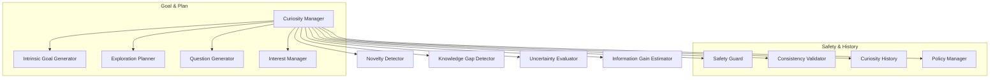
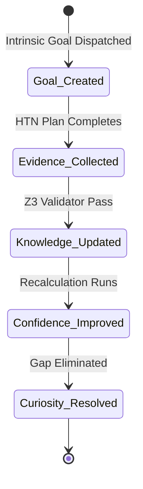

# HSCI V5 — Curiosity & Intrinsic Motivation Architecture (CUE-1)

**Version**: 1.0  
**Status**: Constitutional Cognitive Specification  
**Verdict**: Approved for Milestone 2 Development  

---

## 1. Purpose

The Curiosity & Intrinsic Motivation Architecture (CUE-1) directs autonomous exploration in HSCI. It identifies missing concepts, evaluates uncertainty value, and generates intrinsic task goals.

### Terminology Matrix
*   **Curiosity**: The cognitive subsystem evaluating knowledge deficits.
*   **Exploration**: The plan-directed collection of missing data.
*   **Uncertainty**: Low confidence values in existing belief records.
*   **Novelty**: Input concepts lacking structural matches in USM.
*   **Information Gain**: Expected confidence increase from exploring a concept.
*   **Goal**: The target state description.

*Intentionally Goal-Driven*: Curiosity does not execute actions directly. It outputs proposed intrinsic goals to the Goal Manager (GMA-1), which prioritizes them before task compilation.

---

## 2. Positioning Inside HSCI

```
Executive Controller ──► Goal Manager (GMA-1) ──► Curiosity Engine (CUE-1)
                                                       │
                                                       ▼
                                             Attention System (ASA-1)
```
### Why Curiosity Operates Before Attention Allocation
Curiosity identifies *what* needs attention before attention focus weights are allocated. If attention was mapped first, the system would remain locked to current goal contexts, ignoring high-value external anomalies or knowledge deficits that sit outside the active attention spotlight.

---

## 3. Subsystem Architecture Overview



---

## 4. Curiosity Object Model & Satisfaction Lifecycle

### 4.1 Curiosity Object Schema
*   **Curiosity ID**: Unique coordinate namespace (e.g. `curiosity.gap.quantum_physics.001`).
*   **Novelty / Uncertainty Scores**: Floats \(\in [0.0, 1.0]\).
*   **Information Gain**: Expected utility calculation.
*   **Generated Goal**: Task node reference.

### 4.2 Satisfaction Lifecycle


---

## 5. Knowledge Gap Detection & Information Gain

### 5.1 Knowledge Gap Detector
Determines deficits by scanning:
*   **Concept Sparsity**: Node coordinates lacking outbound relationship edges.
*   **Logical Conflict**: Active contradictions in the Belief System.

### 5.2 Information Gain Calculation
Expected Information Gain (\(E_{ig}\)) calculates priority:

\[
E_{ig}(c) = Novelty(c) \cdot (1.0 - Confidence(c)) - Cost_{Est}(c)
\]

*   Prevents exploring high-cost, low-value contexts.

---

## 6. Complete Walkthrough Benchmarks

### Scenario A: Conceptual Exploration
User: *"Explain quantum computing."*
1.  **Gap Detection**: Knowledge Gap Detector flags missing primitive relations: `quantum_superposition` and `quantum_entanglement` are referenced but lack definitions in USM.
2.  **Novelty Evaluation**: Novelty score maps to \(0.95\). Confidence score: \(0.0\).
3.  **Goal Generation**: Intrinsic Goal Generator dispatches goal: `retrieve_concept_definition(quantum_superposition)`.
4.  **Attention Shift**: Attention Manager prioritizes definition queries.
5.  **Satisfaction**: Definitions retrieved, validated by Z3, and committed to USM. Gap is resolved.

### Scenario B: Skill Acquisition (Chemistry Failures)
System logs repeated HTN planning failures when attempting to solve chemistry questions.
1.  **Deficit Identification**: Self Model flags performance collapse in chemistry tasks.
2.  **Gap Mapping**: Knowledge Gap Detector correlates crashes with missing chemistry reaction equations.
3.  **Goal Proposal**: Intrinsic Goal Generator proposes research goal: `compile_reaction_formulas(organic_chemistry)`.
4.  **Execution**: Executive Controller routes query to database parser.
5.  **Learning**: Chemistry rules consolidated. Future planning succeeds.

---

## 7. Curiosity Metrics

*   **Knowledge Gap Detection Accuracy**: Precision of generated gaps compared to actual missing data needs.
*   **Curiosity Resolution Rate**: Fraction of intrinsic goals resolved within resource limits.
*   **Novelty Detection Accuracy**: F1-score classification matching anomalous inputs.

---

## 8. CUE-1 Architecture Principles

The Curiosity Architecture **MUST NOT**:
1.  Execute tasks directly in the live environment.
2.  Modify the live World Model database.
3.  Override safety/resource limits set by the Executive Controller.

Its sole responsibility is calculating knowledge deficits, estimating information gain, and generating intrinsic goal suggestions.
