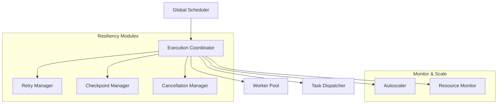
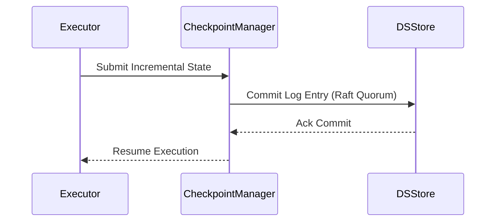

# HSCI V5 — Distributed Execution Architecture (DEA-1)

**Version**: 1.0  
**Status**: Constitutional Engineering Specification  
**Verdict**: Approved  

---

## 1. Purpose

The Distributed Execution Architecture (DEA-1) defines how cognitive workloads, planning tasks, reasoning pipelines, simulations, learning jobs, tool executions, and background operations are distributed, scheduled, monitored, and recovered across HSCI compute resources.

### Core Objectives
*   **Scalability & Parallelism**: Execute thousands of concurrent cognitive operations across distributed nodes.
*   **Resource Efficiency**: Maximize compute utilization through fine-grained task scheduling and resource allocation.
*   **Fault Tolerance & Recoverability**: Ensure execution durability via distributed checkpointing and automatic failover.

---

## 2. Terminology

*   **Execution Task**: The smallest unit of executable work (e.g., Z3 verification steps).
*   **Execution DAG**: A Directed Acyclic Graph defining task dependencies within a workflow.
*   **Executor**: A sandboxed process on a worker node executing designated tasks.
*   **Work Stealing**: A scheduling algorithm where idle executors pull tasks from overloaded nodes.
*   **Execution Lease**: A temporary token authorizing a worker to execute a task for a specified duration.

---

## 3. Position Inside HSCI

```
                  Executive Controller (ECA-1)
                               │
                               ▼
                 Distributed Execution (DEA-1)
                               │
                               ▼
                        Task Scheduler
                               │
                               ▼
                        Worker Registry
                               │
         ┌─────────────────────┼─────────────────────┐
         ▼                     ▼                     ▼
  Worker Node 1         Worker Node 2         Worker Node 3
```

---

## 4. Execution Architecture



### Module Responsibilities
*   **Global Scheduler**: Arbitrates cluster-wide workloads, enforcing priority limits and deadlines.
*   **Task Dispatcher**: Pushes tasks to executors, managing network connection pools and lease updates.
*   **Checkpoint Manager**: Persists incremental executor snapshots to the Distributed Synchronization layer (DSA-1).

---

## 5. Execution Model

*   **Distributed DAG Execution**: Tasks are resolved in topological order. If Node A fails, its dependents are blocked until Node A's recovery.
*   **Speculative Execution**: The engine dispatches duplicate tasks to separate nodes when latency anomalies are detected (e.g., slow reasoning steps). The result of the first to complete is committed, and duplicates are cancelled.

---

## 6. Task Scheduler

The Task Scheduler supports dynamic queue balancing using:
*   **Weighted Fair Queueing (WFQ)**: Allocates bandwidth to queues proportionally to priority configurations.
*   **Work Stealing**: Idle workers steal tasks from the tail of overloaded node queues.

---

## 7. Worker Management

*   **Heartbeat Monitoring**: Workers send heartbeat pulses every 500ms. If no heartbeat is received for 3 periods (1500ms), the node is marked `Offline`.
*   **Capability Advertisement**: Workers advertise their resource profiles (e.g., CPU, GPU availability, and Z3 solver configurations).

---

## 8. Execution Lifecycle

```
Task Creation ──► Validation ──► Scheduling ──► Queue ──► Dispatch ──► Execution ──► Checkpoint ──► Completion
```

---

## 9. Resource Allocation & Isolation

### 9.1 Allocation Limits
*   **CPU / GPU / Memory Quotas**: Evaluators allocate resources per execution stage. Critical tasks have unlimited burst access up to node capacity limits.
*   **Tool Resources**: Capped at specific socket limits to prevent DoS side effects during integration.

### 9.2 Execution Isolation
*   **Sandbox Isolation**: Tasks execute within Docker/Kubernetes container contexts.
*   **Security Boundaries**: Restricts filesystem access to temp workspace paths (`/tmp/hsci/sandbox/<task_id>/`).

---

## 10. Checkpoint & Recovery

The Checkpoint Manager performs periodic increments:



---

## 11. Failure Handling & Load Balancing

*   **Circuit Breakers**: Tripped when task failures on a specific worker node exceed \(20\%\) over a 30s sliding window.
*   **Load Balancing (Resource-Aware)**: Selects nodes using the metric:

\[
Score_{node} = \frac{CPU_{available}}{CPU_{capacity}} \cdot \frac{Mem_{available}}{Mem_{capacity}}
\]

---

## 12. Quality of Service (QoS)

| QoS Class | Scheduling Priority | Target Latency Budget | Preemption Policy |
|---|---|---|---|
| **Critical** | Tier 0 | \(\le 10\text{ms}\) | Non-Preemptible |
| **High** | Tier 1 | \(\le 50\text{ms}\) | Preempts Normal/Background |
| **Normal** | Tier 2 | \(\le 200\text{ms}\) | Preempts Background |
| **Background** | Tier 3 | Best Effort | Fully Preemptible |

---

## 13. Failure Scenarios

### Scenario 1: Worker Failure
*   **Detection**: Heartbeat Manager registers loss of heartbeat.
*   **Mitigation**: Stop routing tasks to the worker; mark active leases as expired.
*   **Recovery**: Retry Manager schedules uncommitted tasks on alternative nodes using checkpoints.

### Scenario 2: Scheduler Failure
*   **Detection**: Consul/ZooKeeper registers loss of master leader lock.
*   **Mitigation**: Active workers continue running current tasks but drop new dispatches.
*   **Recovery**: A backup coordinator acquires the leader lock, rebuilds the DAG execution state from the committed WAL logs, and resumes dispatches.

### Scenario 3: Execution Deadlock
*   **Detection**: Dependency Manager identifies cyclic dependency loops in the active execution DAG.
*   **Mitigation**: Halt processing on the affected branch.
*   **Recovery**: Abort the execution branch, rollback active state segments, and report structural faults to the Executive Controller.

### Scenario 4: Queue Saturation
*   **Detection**: Queue depth exceeds \(90\%\) of buffer capacity.
*   **Mitigation**: Enable backpressure; drop normal and background queue ingestions.
*   **Recovery**: Trigger scale-out pod allocations and increase priority allocations to expedite queue clearance.

### Scenario 5: Autoscaler Failure
*   **Detection**: Resource Monitor detects CPU loads exceeding \(95\%\) without new node registrations.
*   **Mitigation**: Switch to static maximum node pools.
*   **Recovery**: Re-route non-critical workloads to background processing queues.

### Scenario 6: Checkpoint Corruption
*   **Detection**: Checksum validation fails during worker state restores.
*   **Mitigation**: Discard the corrupted snapshot.
*   **Recovery**: Rollback node state to the last verified full checkpoint, replaying logs from that boundary.

### Scenario 7: Task Dependency Failure
*   **Detection**: Upstream task in the DAG returns a failure code.
*   **Mitigation**: Halt executions of all downstream dependent tasks.
*   **Recovery**: Mark the DAG run as `Failed`, trigger cleanup, and notify the Executive Controller.

---

## 14. Interfaces

*   **Planning Engine**: Submits plans to DEA-1 as execution DAG specifications.
*   **Simulation Engine**: Integrates with DEA-1 to scale speculative branch containers.
*   **Synchronization Layer**: Receives checkpoint logs to ensure cluster alignment.

---

## 15. DEA-1 Architecture Principles

The Distributed Execution Architecture **MUST NOT**:
1.  Perform cognitive reasoning or planning tasks.
2.  Mutate long-term semantic registries.
3.  Bypass Governance policies.

Its sole responsibility is task scheduling, scheduling priority enforcement, sandboxed executor isolation, checkpoint management, resource tracking, and autoscaling.
