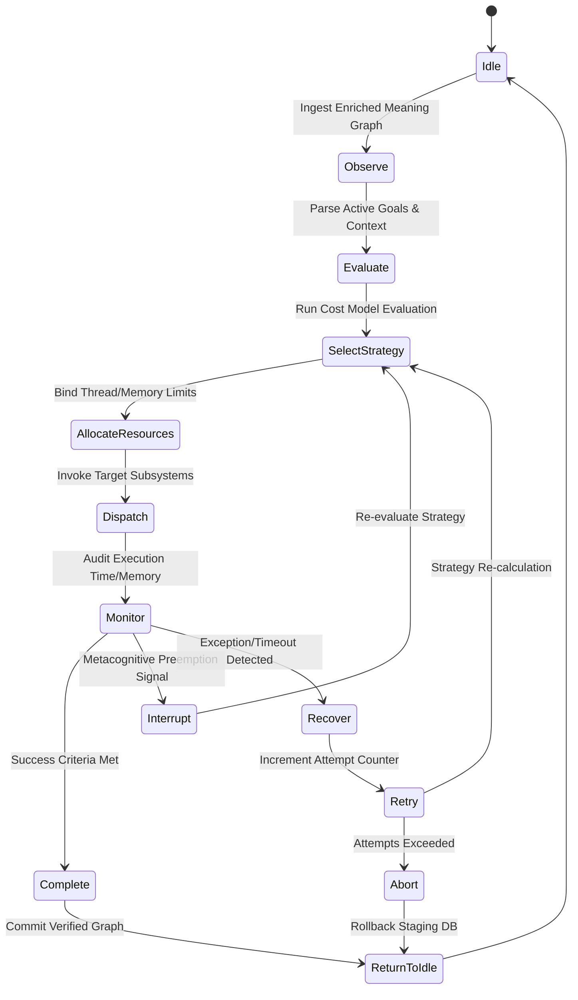

# HSCI V5 — Executive Controller Architecture (ECA-1)

**Version**: 1.1  
**Status**: Constitutional Cognitive Specification  
**Revision**: 2 (Cognitive Executive Scheduler)  
**Verdict**: Approved for Milestone 2 Development  

---

## 1. Purpose

The Executive Controller (EC) is the prefrontal cortex of the HSCI architecture. It acts as a real-time, deterministic cognitive scheduler, intercepting context-enriched Meaning Graphs to sequence and dispatch processing tasks across downstream cognitive subsystems.

### Subsystem Distinctions
*   **BrainKernel**: The OS micro-kernel managing raw concurrency threads, memory buffers, and subprocess execution.
*   **Executive Controller**: The cognitive orchestrator selecting high-level search, reasoning, and planning execution paths.
*   **Reasoning Engine (CRE)**: The downstream symbolic constraint solver (Z3 SMT).
*   **Task Planner**: Sequences execution tasks using Hierarchical Task Networks (HTN).
*   **Meta Cognition**: Audits logic consistency, monitoring confidence metrics and triggering preemption signals when contradictions arise.

---

## 2. Positioning Inside HSCI

```
Semantic Interpreter (SIA-1) ──► Meaning Graph (MGS-1) ──► Context Engine (CEA-1)
                                                                 │
                                                                 ▼
    Language of Thought ◄── Knowledge Compiler ◄── Executive Controller (ECA-1)
                                                                 │
                                           ┌─────────────────────┼─────────────────────┐
                                           ▼                     ▼                     ▼
                                    Reasoning Engine       Task Planner        Answer Generation
```

---

## 3. Subsystem Module Details

1.  **Executive Manager**: Controls initialization and global execution cycles of the controller.
2.  **Decision Engine**: Evaluates active policy parameters to select cognitive strategies.
3.  **Attention Coordinator**: Coordinates concept activation weights within WorkingMemory.
4.  **Task Dispatcher**: Executes commands invoking target pipelines.
5.  **Resource Allocator**: Enforces CPU, thread, and memory budgets.
6.  **Priority Scheduler**: Sequences execution tasks using priority-driven RTOS algorithms.
7.  **Interrupt Manager**: Handles preemption alerts from Meta-Cognition.
8.  **Clarification Manager**: Manages user prompt query interfaces for resolving ambiguities.
9.  **Verification Manager**: Validates logical proof results before releasing answers.

---

## 4. Cognitive State Machine

The Executive Controller cycles through a deterministic state machine during task execution:



### State Transitions & Entry/Exit Conditions

| State | Entry Condition | Exit Condition | Failure/Recovery Transition |
|---|---|---|---|
| **Idle** | System starts or previous task completes. | Meaning Graph parsed by Context Engine. | N/A |
| **Observe** | Enriched Meaning Graph available. | Focus concepts identified in WorkingMemory. | Route to `Recover` on syntax parse failure. |
| **Evaluate** | Focus concepts mapped. | Confidence and cost vectors computed. | Route to `Recover` on empty coordinates. |
| **SelectStrategy** | Cost vectors computed. | Target policy ID resolved. | Route to `Abort` if no valid policy matches. |
| **AllocateResources**| Policy ID resolved. | Thread boundaries locked. | Route to `Abort` on out-of-memory flags. |
| **Dispatch** | Resource limits bound. | Downstream subsystems triggered. | Route to `Recover` on channel execution error. |
| **Monitor** | Target engines executing. | Target execution terminates. | Route to `Interrupt` on logic contradiction. |

---

## 5. Strategy Selection Matrix

| Input Scenario | Trigger Condition | Chosen Strategy | Subsystems Invoked | Priority | Expected Mode |
|---|---|---|---|---|---|
| **Factual Lookup** | Concept exists with high confidence (\(\ge 0.85\)) in USM. | `Memory Lookup` | USM, Cache | `MEDIUM` | Blocking |
| **Logical Contradiction**| Metacognition detects `unsat` logic branches. | `Verify & Reason`| CRE (Z3), USM | `CRITICAL` | Blocking |
| **Unknown Concept** | Concept is missing from cache and USM. | `Acquisition` | KAL, Compiler | `LOW` | Background |
| **Goal Statement** | Ingest contains procedural task parameters. | `Planning` | HTN Planner | `HIGH` | Non-blocking |
| **Ambiguous Meaning** | SCN Context Engine score variance is under 0.05. | `Clarify` | Clarification Mgr | `HIGH` | Streaming |

---

## 6. Composite Cognitive Strategies

Complex tasks trigger sequenced coordination strategies across downstream engines:

### 6.1 "What is Java?" (Fact Retrieval)
```
Memory Retrieval (Fetch concept.software.java_language) ──► Answer Generation
```

### 6.2 "Why can't penguins fly?" (Analytical Deduction)
```
Memory (Fetch Penguin/Fly nodes) ──► Reasoning (Z3 Axiom verification) ──► Verification ──► Answer
```

### 6.3 "Plan a Mars mission" (Procedural Execution)
```
Memory (Fetch constraints) ──► Planning (HTN task sequence) ──► Simulation (Test outcomes) ──► Reasoning (Verify) ──► Answer
```

---

## 7. Execution Modes

*   **Immediate**: Synchronous blocking execution for low-latency queries.
*   **Deferred**: Scheduled for later execution periods when system load is low.
*   **Background**: Runs asynchronously on low-priority threads (e.g. Learning optimizations).
*   **Speculative**: Executes parallel branches of ambiguous concepts, pruning the incorrect branch once context is resolved.
*   **Streaming**: Incrementally emits segments of verified answers to the user during long-running reasoning tasks.

---

## 8. Cognitive Cost Model

The Decision Engine selects strategies using a cost-optimization policy:

\[
Cost_{total} = \alpha \cdot Cost_{CPU} + \beta \cdot Cost_{Memory} + \gamma \cdot Latency - \delta \cdot Confidence_{Gain}
\]

Where:
*   \(\alpha, \beta, \gamma, \delta\) are normalized scaling coefficients.
*   The scheduler always executes the cognitive path yielding the lowest \(Cost_{total}\).

### Subsystem Baseline Weights Table

| Subsystem | CPU Cost | Memory Cost | Latency (ms) | Confidence Gain |
|---|---|---|---|---|
| **Memory Retrieval** | `0.1` | `0.1` | `5` | `0.95` |
| **Reasoning (Z3)** | `0.8` | `0.4` | `45` | `0.99` |
| **HTN Planning** | `0.6` | `0.5` | `30` | `0.90` |
| **Simulation** | `0.9` | `0.8` | `120` | `0.85` |

---

## 9. Executive Trace Model

Every decision produces a structured replay log matching the following JSON Schema:

```json
{
  "$schema": "http://json-schema.org/draft-07/schema#",
  "title": "ExecutiveTrace",
  "type": "object",
  "required": ["decision_id", "timestamp", "selected_policy", "confidence", "outcome"],
  "properties": {
    "decision_id": { "type": "string", "format": "uuid" },
    "timestamp": { "type": "string", "format": "date-time" },
    "input_summary": { "type": "string" },
    "selected_policy": { "type": "string" },
    "alternative_policies": { "type": "array", "items": { "type": "string" } },
    "reason_for_selection": { "type": "string" },
    "confidence": { "type": "number" },
    "subsystems_invoked": { "type": "array", "items": { "type": "string" } },
    "duration_ms": { "type": "integer" },
    "outcome": { "type": "string", "enum": ["SUCCESS", "ABORTED", "PREEMPTED"] }
  }
}
```

---

## 10. Decision Policy Registry

The Decision Policy Registry decouples policy additions from core controller logic. New policies are registered dynamically:

```json
{
  "policy_registry": [
    {
      "policy_id": "POL_MEMORY_LOOKUP",
      "trigger_conditions": "concept_exists_in_usm == true && confidence >= 0.85",
      "required_inputs": ["concept_id"],
      "priority": 3,
      "execution_mode": "IMMEDIATE",
      "target_dispatcher": "USM_DISPATCHER",
      "fallback_policy": "POL_REASONING_PROVE",
      "timeout_ms": 100
    }
  ]
}
```

---

## 11. Architecture Principles

The Executive Controller **MUST**:
1.  Remain strictly deterministic (identical inputs on identical DB state yield identical schedules).
2.  Never bypass the Context Engine (CEA-1) before selecting candidate concepts.
3.  Always output an `ExecutiveTrace` for every scheduled execution cycle.
4.  Always select the lowest-cost valid strategy computed by the Cognitive Cost Model.

---

## 12. Complete End-to-End Walkthrough

User: *"Design a distributed cache for an e-commerce platform."*

### 12.1 Context Resolution & State Machine
1.  **SIA-1 Meaning Graph**: Spawns entities `distributed_cache` and `e-commerce_platform`.
2.  **CEA-1 Context Engine**: Enriches the graph with target domain `software_architecture`.
3.  **State transitions**: Moves `Idle` \(\rightarrow\) `Observe` \(\rightarrow\) `Evaluate` \(\rightarrow\) `SelectStrategy`.

### 12.2 Strategy & Cost Evaluation
1.  **Scoring**: The query contains design goals, mapping to the strategy policy `POL_HTN_PLANNING`.
2.  **Cost calculation**:
    *   `POL_HTN_PLANNING` cost: \(Cost = 0.6(CPU) + 0.5(Memory) + 30(Latency) - 0.9(Confidence) = 30.2\).
    *   `POL_REASONING_PROVE` cost: \(Cost = 0.8(CPU) + 0.4(Memory) + 45(Latency) - 0.99(Confidence) = 45.2\).
3.  **Selection**: The system selects `POL_HTN_PLANNING` (lowest cost).

### 12.3 Execution & Dispatch
1.  **State**: Moves to `AllocateResources`, capping memory at 50 nodes and scheduling threads.
2.  **Dispatcher**: Invokes the **Planning Dispatcher**, generating HTN cache node topology.
3.  **Logical Verification**: Passes HTN output to the Reasoning Dispatcher. Z3 verifies that no single-point-of-failure constraints are violated.
4.  **Complete**: State moves to `Complete`. The Answer Generation Engine compiles the design report.

### 12.4 Executive Trace Generation
The scheduler dumps the final trace log:
```json
{
  "decision_id": "4a8c3d7e-9f2b-4e1a-8c3d-7e9f2b4e1a8c",
  "timestamp": "2026-07-18T14:05:00Z",
  "input_summary": "Design a distributed cache for an e-commerce platform.",
  "selected_policy": "POL_HTN_PLANNING",
  "alternative_policies": ["POL_REASONING_PROVE", "POL_MEMORY_LOOKUP"],
  "reason_for_selection": "Goal-oriented query requiring structural sequence generation. Lowest total cost strategy selected.",
  "confidence": 0.90,
  "subsystems_invoked": ["HTN_Planner", "Reasoning_Engine", "Answer_Generation"],
  "duration_ms": 115,
  "outcome": "SUCCESS"
}
```
