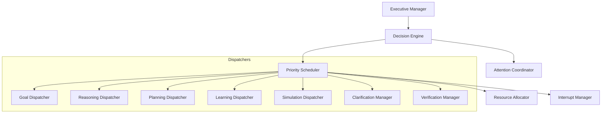
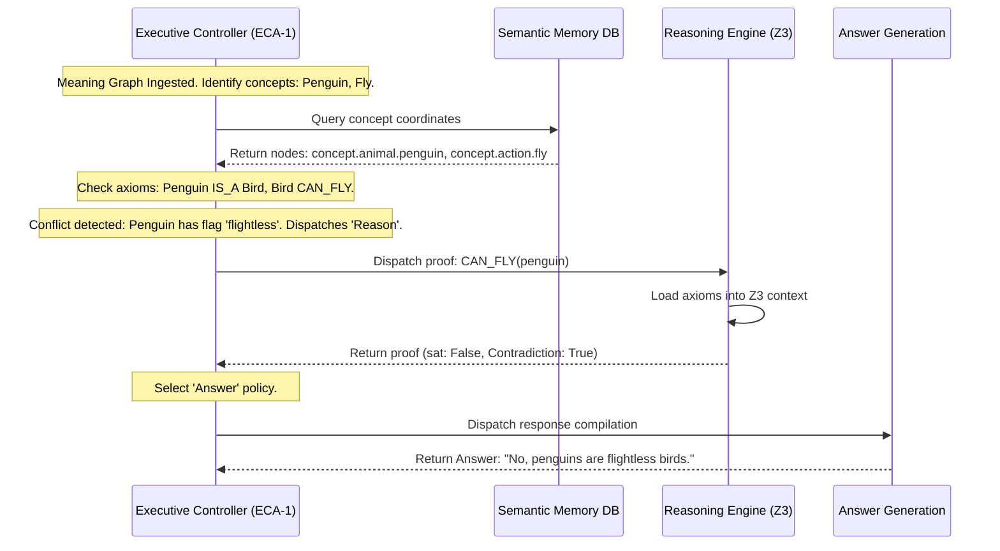

# HSCI V5 — Executive Controller Architecture (ECA-1)

**Version**: 1.0  
**Status**: Constitutional Cognitive Specification  
**Verdict**: Approved for Milestone 2 Development  

---

## 1. Purpose

The Executive Controller (EC) is the cognitive executive function of HSCI. It does not perform reasoning or task sequencing; instead, it determines the next cognitive action the system should perform. It is analogous to the prefrontal cortex in humans and the scheduler in a real-time operating system (RTOS).

### Distinction Matrix
*   **BrainKernel**: The low-level operating system micro-kernel. It orchestrates threads, memory mappings, and raw process scheduling.
*   **Executive Controller**: The cognitive scheduler that acts on semantically enriched Meaning Graphs to direct attention and decide which engine (Reasoning, Memory, Planning, Acquisition) runs next.
*   **Reasoning Engine (CRE)**: A downstream symbolic executor that verifies constraints using the Microsoft Z3 SMT solver.
*   **Task Planner**: Sequences actions using Hierarchical Task Networks (HTN).
*   **Meta Cognition**: Evaluates logical consistency and monitors confidence metrics.

---

## 2. Positioning Inside HSCI

```
Semantic Interpreter (SIA-1)
          ↓  [Outputs raw Meaning Graph]
Meaning Graph (MGS-1)
          ↓
Context Engine (CEA-1)
          ↓  [Enriches graph with situational variables]
Executive Controller (ECA-1)  ◄── Meta-Cognition (Flags preemption/correction)
          ↓  [Schedules & dispatches task]
Logical Engines (CRE / HTN / USM / Answer Generation)
```

### Why Executive Control Precedes Reasoning
Executive control coordinates resource consumption. Formulating logical formulas and invoking SMT solvers (Z3) is computationally expensive. The Executive Controller intercepts the enriched Meaning Graph to determine if the query can be resolved via low-cost memory cache hits before invoking the full reasoning pipeline.

---

## 3. Internal Architecture & Modules



### 3.1 Executive Manager
*   **Purpose**: Orchestrates the main cognitive scheduling loop.
*   **Inputs**: Enriched Meaning Graph, Meta-cognitive alerts.
*   **Outputs**: Dispatched task blocks.
*   **Responsibilities**: Controls initialization, execution cycles, and shutdown routines of the controller.

### 3.2 Decision Engine
*   **Purpose**: Evaluates candidate cognitive paths.
*   **Inputs**: Context vectors, goals state.
*   **Outputs**: Selected Decision Policy Type (e.g. `Reason`, `Search Memory`).
*   **Responsibilities**: Selects optimal cognitive actions based on active policy models.

### 3.3 Attention Coordinator
*   **Purpose**: Directs activation variables in WorkingMemory.
*   **Inputs**: Ingestion concept references.
*   **Outputs**: Active Focus Set.
*   **Responsibilities**: Adjusts concept activation potentials to focus processing on relevant subgraphs.

### 3.4 Priority Scheduler
*   **Purpose**: Manages queue execution priorities.
*   **Inputs**: Action tasks.
*   **Outputs**: Sequenced execution queues.
*   **Responsibilities**: Schedules tasks using real-time deadline-driven and priority-driven algorithms.

### 3.5 Resource Allocator
*   **Purpose**: Enforces processing ceilings.
*   **Inputs**: Request profiles.
*   **Outputs**: Thread budgets and memory constraints.
*   **Responsibilities**: Limits workspace memory buffers and Z3 execution times.

### 3.6 Interrupt Manager
*   **Purpose**: Process preemption and exceptions.
*   **Inputs**: Metacognitive inconsistency flags, thread timeouts.
*   **Outputs**: Thread abort commands.
*   **Responsibilities**: Preempts lower-priority tasks when critical logical contradictions are detected.

---

## 4. Decision Policies & Types

The Executive Controller evaluates state conditions to choose the appropriate policy:

| Policy | Triggering Condition | Subsystem Dispatched |
|---|---|---|
| **Search Memory** | Concepts have high confidence (\(\ge 0.85\)) and exist in USM. | `UniversalSemanticMemory` |
| **Reason** | Logical contradictions or missing implications exist in active workspace. | `ReasoningEngine` (Z3) |
| **Plan** | Input contains target goals or action dependencies. | `TaskPlanner` (HTN) |
| **Verify** | Active assertions contain contradictory evidence. | `VerificationManager` |
| **Clarify** | Concept matches multiple ambiguous namespaces with equal scores. | `ClarificationManager` (Ask User) |
| **Simulate** | Testing outcomes of task plans without executing them. | `SimulationDispatcher` |
| **Abort** | Contradiction entropy (\(H_c\)) exceeds maximum limits or thread timeouts fire. | `InterruptManager` |

---

## 5. Task Scheduling & Preemption

HSCI employs a **Priority-Based Preemptive Scheduler** for cognitive operations:
*   **Priority Levels**:
    1.  `CRITICAL`: Metacognitive contradictions, interrupts (Preempts all tasks).
    2.  `HIGH`: Verification and SMT proofs.
    3.  `MEDIUM`: standard context-matching and memory queries.
    4.  `LOW`: Learning optimizations and Ebbinghaus decays.
*   **Preemption Logic**: If a `CRITICAL` metacognitive contradiction is raised while a `MEDIUM` reasoning proof is executing, the Interrupt Manager immediately aborts the active Z3 thread, rolling back database staging transactions.
*   **Deadlock Prevention**: Nested SMT proofs are constrained to depth thresholds, aborting dependencies that cycle.

---

## 6. Exception Handling & Recovery Strategies

*   **Reasoning Failure / Timeout**: If a Z3 proof fails to resolve within 50ms, the scheduler aborts the task, flags the assertion state as `Uncertain`, and dispatches the `Clarification Manager` to prompt the user.
*   **Ambiguous Meanings**: If the Context Engine returns identical scoring candidates, the `Clarification Manager` formats a multiple-choice question to ask the user.

---

## 7. Complete Walkthrough Benchmark: *"Can penguins fly?"*



---

## 8. ECA-1 Architecture Principles

The Executive Controller **MUST NOT**:
1.  Perform SMT logic proofs or construct Z3 equations.
2.  Store vocabulary parameters or permanent concept indices.
3.  Write directly to databases or caches.

Its sole responsibility is scheduling and dispatching tasks to target cognitive engines.
