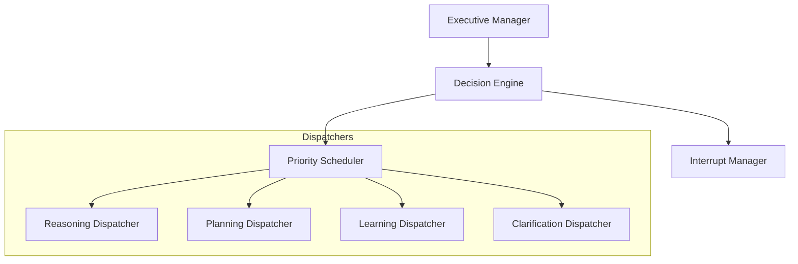
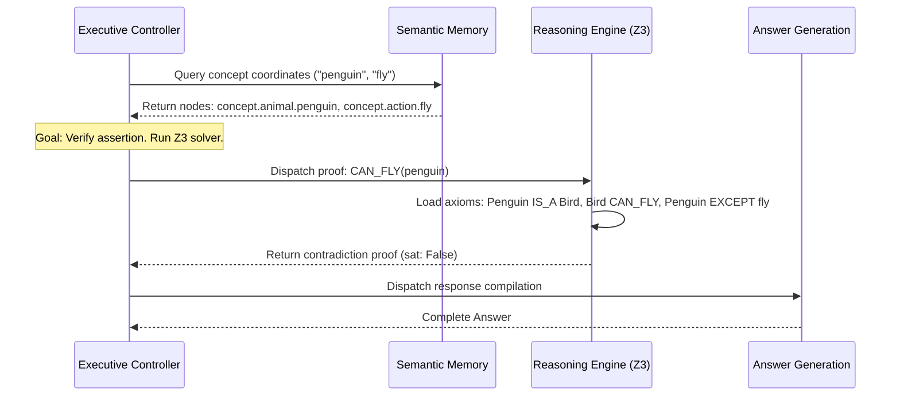

# HSCI V5 — Executive Controller Architecture (ECA-1)

**Version**: 1.0  
**Status**: Constitutional Cognitive Specification  
**Verdict**: Approved for Milestone 2 Development  

---

## 1. Purpose

The Executive Controller decides what cognitive action the system should execute next.
*   **BrainKernel**: The micro-kernel orchestrating thread execution and scheduling.
*   **Executive Controller**: The cognitive scheduler that acts like the prefrontal cortex, choosing the pipeline path (e.g. reasoning vs. memory search vs. user prompt).
*   **Reasoning Engine (CRE)**: The SMT solver verifying logic.
*   **Task Planner (HTN)**: Sequences action tasks.
*   **Meta Cognition**: Monitors confidence levels and flags inconsistencies.

---

## 2. Positioning Inside HSCI

```
Context-Enriched Meaning Graph ──► Executive Controller ──► Target Engine
                                                                 │
                                           ┌─────────────────────┼─────────────────────┐
                                           ▼                     ▼                     ▼
                                    Reasoning Engine       Task Planner        Answer Generation
```
### Why Executive Control Precedes Reasoning
Before running Z3 proofs, the system must decide if reasoning is necessary. If the target query is answered by direct fact matching in memory, executing the reasoning engine consumes CPU cycles unnecessarily. The Executive Controller schedules the optimal processing path.

---

## 3. Subsystem Architecture Overview



---

## 4. Decision Lifecycle & Scheduling Policies

### 4.1 Decision States
`Created` \(\rightarrow\) `Evaluation` \(\rightarrow\) `Prioritization` \(\rightarrow\) `Dispatch` \(\rightarrow\) `Monitoring` \(\rightarrow\) `Completion/Abort`.

### 4.2 Scheduling Policies
*   **Preemption**: Meta-cognition flags (such as finding logical contradictions) interrupt running reasoning threads.
*   **Deadlock Prevention**: Nested SMT proofs are constrained to depth thresholds, aborting dependencies that cycle.

---

## 5. Attention Coordination & Goal Integration

The attention coordinator manages WorkingMemory focus.
*   Concepts with activation thresholds above \(0.80\) are cached in local registers.
*   **Goal Influence**: Active goals adjust context weights, steering scheduling priorities (e.g. if current task is `verify`, scheduling defaults to Z3 proofs over memory retrieval).

---

## 6. Resource Budgets

*   **Memory Budget**: Workspace buffers are capped at 50 active concepts.
*   **SMT Solver Budget**: Z3 executions are capped at 50ms per proof run.

---

## 7. Complete Walkthrough Benchmark: *"Can penguins fly?"*


*   **Final Answer**: "No, penguins cannot fly because they are flightless birds."
*   **Reasoning trace**: `Penguin(x) -> Bird(x); Bird(x) -> CanFly(x) [except x=penguin]`.

---

## 8. ECA-1 Architecture Principles

The Executive Controller **MUST NOT**:
1.  Perform SMT logic proofs.
2.  Store concept parameters.
3.  Write directly to databases.

Its sole responsibility is scheduling and dispatching cognitive tasks.
