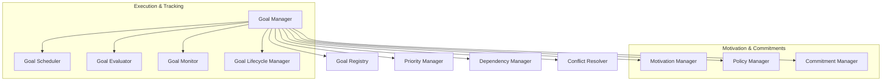
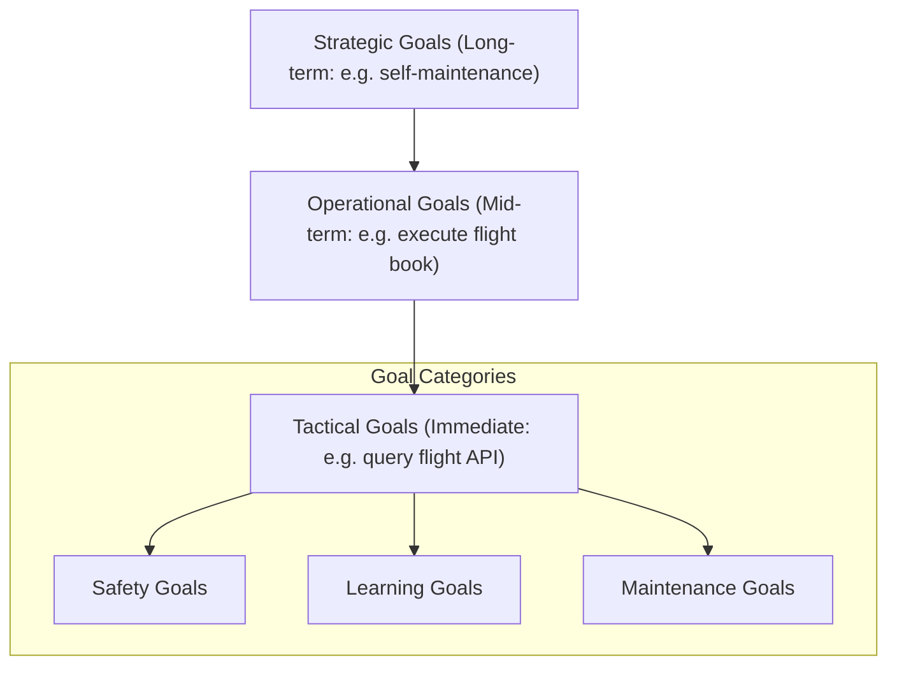
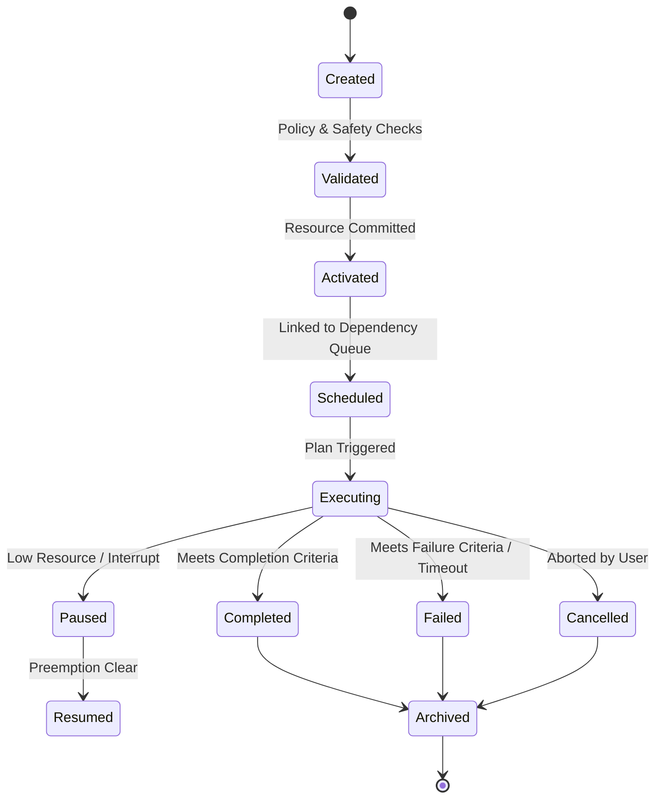

# HSCI V5 — Goal Manager Architecture (GMA-1)

**Version**: 1.0  
**Status**: Constitutional Cognitive Specification  
**Verdict**: Approved for Milestone 2 Development  

---

## 1. Purpose

The Goal Manager (GM) is the executive intention system of HSCI. It manages intentions, priorities, motivations, commitments, and lifecycles to define **WHAT** the system should attempt to achieve (leaving the **HOW** to the HTN Task Planner).

### Terminology Matrix
*   **Goal**: The target state representation.
*   **Task**: A scoped segment of work scheduled to satisfy a goal.
*   **Action**: A single atomic operation executed by low-level system modules.
*   **Plan**: A structured sequence of tasks generated by the planner.
*   **Intention**: A committed goal currently scheduled for active execution.
*   **Motivation**: Internal drives (safety, curiosity) triggering goal creation.
*   **Constraint**: Invariant boundaries that cannot be violated during execution.

---

## 2. Positioning Inside HSCI

```
Executive Controller (ECA-1) ──► Goal Manager (GMA-1) ──► Task Planner (HTN)
                                             │
                                             ▼
                                     World Model (WMA-1)
```
### Why Planning Never Occurs Before Goals Exist
Planning is a search operation over state spaces to find paths to a target. Without a defined target state (Goal), the state space search lacks boundaries, leading to infinite plan-state calculations. Goals must exist to frame planning parameters.

---

## 3. Subsystem Architecture Overview



---

## 4. Goal Representation & Hierarchy

### 4.1 Goal Object Schema
*   **Goal ID**: Unique coordinate namespace (e.g. `goal.travel.book_flight.001`).
*   **Urgency & Importance**: Floats \(\in [0.0, 1.0]\).
*   **Completion Criteria**: A set of target predicates to verify in the World Model.
*   **Failure Criteria**: Timeout bounds or state contradiction conditions.

### 4.2 Goal Hierarchy



---

## 5. Goal Lifecycle States



---

## 6. Goal Prioritization Scoring

The Priority Manager calculates goal priority metrics deterministically:

\[
Priority(g) = w_i \cdot Importance(g) + w_u \cdot Urgency(g) + w_s \cdot Safety(g) - w_c \cdot Conflict_{Cost}
\]

Where:
*   \(w_i, w_u, w_s, w_c\) are priority dimension weights.
*   Goals with high computed priorities preempt lower-priority goals.

---

## 7. Goal Conflict Resolution

*   **Detection**: Evaluated by analyzing resource overlaps and target-state logic contradictions in Z3.
*   **Resolution Rules**:
    *   **Rule 1 (Safety First)**: Safety Goals override all operational goals.
    *   **Rule 2 (User Primacy)**: User-directed intentions override learning/curiosity goals.
    *   **Rule 3 (Resource Constraints)**: Low-priority goals are suspended/paused to release resources for high-priority targets.

---

## 8. Complete Walkthrough Benchmark

### Ingestion: *"Book the cheapest flight to London before Friday."*

1.  **State Machine**: Goal `goal.travel.book_flight.001` initialized as `Created`.
2.  **Validation**: Policy Manager verifies that flight coordinates do not violate security constraints.
3.  **Prioritization**: Priority Manager calculates deadline urgency:
    *   `Urgency` increases as "Friday" deadline approaches.
    *   State moves to `Activated` and `Scheduled`.
4.  **Dependencies**: Dependency Manager links target predicates: `Retrieve_Prices` \(\rightarrow\) `Select_Lowest` \(\rightarrow\) `Execute_Purchase`.
5.  **Execution**: Task Planner generates HTN plan, executing Z3 checks.
6.  **Completion**: State moves to `Completed` when the confirmation predicate `is_purchased(flight)` resolves to `True` in the World Model.

### Recovery Walkthrough: *"What if the flight becomes unavailable?"*
1.  **Goal Monitor**: Detects API error mapping to failure condition: `available(flight) == False`.
2.  **State Change**: Moves from `Executing` to `Paused` (Triggering re-planning).
3.  **Conflict & Priority**: Urgency remains high. Conflict Resolver suspends non-travel tasks.
4.  **Re-Planning**: HTN Planner generates alternate search path (different airline or date).
5.  **Final State**: Transitions back to `Executing`, compiling alternate purchase task loops.

---

## 9. GMA-1 Architecture Principles

The Goal Manager **MUST NOT**:
1.  Formulate HTN plans.
2.  Execute SMT logical proofs.
3.  Modify World Model state variables directly.

Its sole responsibility is managing intention priorities, commitments, and target states.
