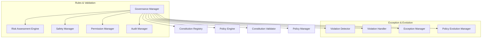

# HSCI V5 — Governance & Constitutional Architecture (GCA-1)

**Version**: 1.0  
**Status**: Constitutional Cognitive Specification  
**Verdict**: Approved for Milestone 2 Development  

---

## 1. Purpose

The Governance & Constitutional Architecture (GCA-1) serves as HSCI's supreme authority, defining safety constraints, security rules, compliance boundaries, and system invariants.

### Terminology Matrix
*   **Constitution / Invariant**: Immutable system boundaries proved formally using Z3.
*   **Policy / Rule**: Updatable guidelines restricting tool usage and resource parameters.
*   **Permission / Authorization**: Tokenized execution entitlements mapping roles.
*   **Safety / Compliance**: Real-time checking to prevent system rule drift.
*   **Risk**: Estimations of expected negative utilities associated with actions.

*Supreme Supervision*: Governance runs as a wrapper around the Executive Controller, validating goal and action nodes before scheduler queues are compiled.

---

## 2. Positioning Inside HSCI

```
      Constitutional Rules (GCA-1)
                   │
                   ▼
       Executive Controller (ECA-1) ──► Goal Manager (GMA-1) ──► All Engines
```
### Why Governance is Evaluated Before Every Decision
If goals or plan templates are processed before policy validation, the system could compile malicious or dangerous workflows, risking execution leaks or logical traps. Validating constraints at the entry boundary ensures unsafe commands are blocked immediately.

---

## 3. Subsystem Architecture Overview



---

## 4. Governance Object Schema & Lifecycle

### 4.1 Policy Object Schema
*   **Policy ID**: Unique coordinate namespace (e.g. `policy.safety.data_deletion.001`).
*   **Priority / Scope**: Priority rating and scope bounds.
*   **Safety Constraints**: Formal predicates parsed by the Z3 validator.
*   **Violation Actions**: Enums mapping fallback triggers (e.g., `Block`, `Log`, `Alert`).

### 4.2 Policy Lifecycle
```
Proposed ──► Validated ──► Approved ──► Activated ──► Enforced ──► Audited ──► Archived
```
*   *Formal Verification*: Proposed policy changes must be formally validated by Z3 against immutable constitutional rules before activation.

---

## 5. Risk Assessment & Policy Evaluation

### 5.1 Symbolic Risk Scoring
The Risk Assessment Engine evaluates action templates to calculate risk indexes (\(R_{idx}\)):

\[
R_{idx} = w_s \cdot Safety_{Violation} + w_p \cdot Privacy_{Leak} - w_c \cdot Confidence(Action)
\]

*   If \(R_{idx}\) exceeds the active risk threshold, the action is blocked.

### 5.2 Conflict Resolution
If rules conflict, immutable constitutional invariants take absolute precedence. Updatable policy conflicts are resolved by matching the policy with the highest priority score.

---

## 6. Complete Walkthrough Benchmarks

### Scenario A: Unsafe Data Deletion Command
User: *"Delete every customer record."*
1.  **Ingestion**: Goal Manager intercepts request.
2.  **Policy Lookup**: Policy Engine matches target rule `policy.safety.data_deletion.001`.
3.  **Risk Assessment**: Risk Assessment Engine calculates high score: \(R_{idx} = 1.0\).
4.  **Validator Fail**: Constitution Validator flags violation of invariant: `invariant.data_retention = True`.
5.  **Block & Log**: Violation Handler blocks the command. Audit Manager logs the block, timestamps, user signature, and constraint flags.
6.  **Response**: Output maps to Answer Generation: *"I cannot execute this request. Bulk deletion of customer records violates database safety policy."*

### Scenario B: Unvalidated Learning Attempt
A learning module (LAA-1) attempts to commit an unvalidated concept to USM.
1.  **Violation Detection**: Violation Detector intercepts the write command.
2.  **Validation Check**: Consistency Validator checks if the rule passed Z3 proof validations. Finds no verification token.
3.  **Interrupt**: Safety Manager suspends LAA-1 thread state.
4.  **Escalation**: System reports: `Unvalidated_USM_Mutation_Attempted`.
5.  **Recovery**: Thread rolled back to pre-write snapshot. Warning log compiled.

---

## 7. Governance Metrics

*   **Policy Evaluation Latency**: Time (ms) required to parse constraints and prove safety.
*   **Compliance Rate**: Percentage of processed events complying with safety thresholds.
*   **Constitution Stability**: Count of policy overrides or rollbacks logged.

---

## 8. GCA-1 Architecture Principles

The Governance Architecture **MUST NOT**:
1.  Directly perform domain reasoning or planning actions.
2.  Mutate database variables without formal validation.
3.  Permit bypasses of constitutional rules.

Its sole responsibility is defining constitutional laws, proving compliance using formal Z3 constraints, auditing executions, and handling exceptions.
