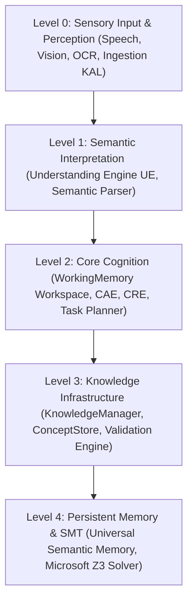
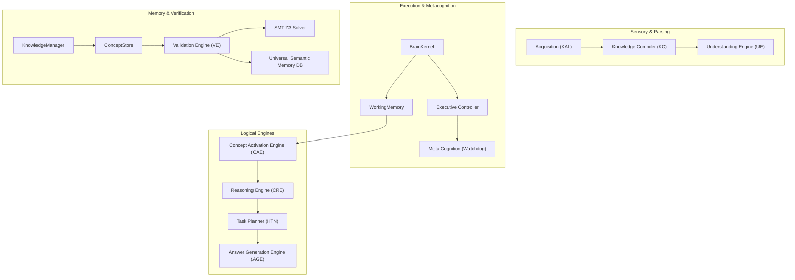
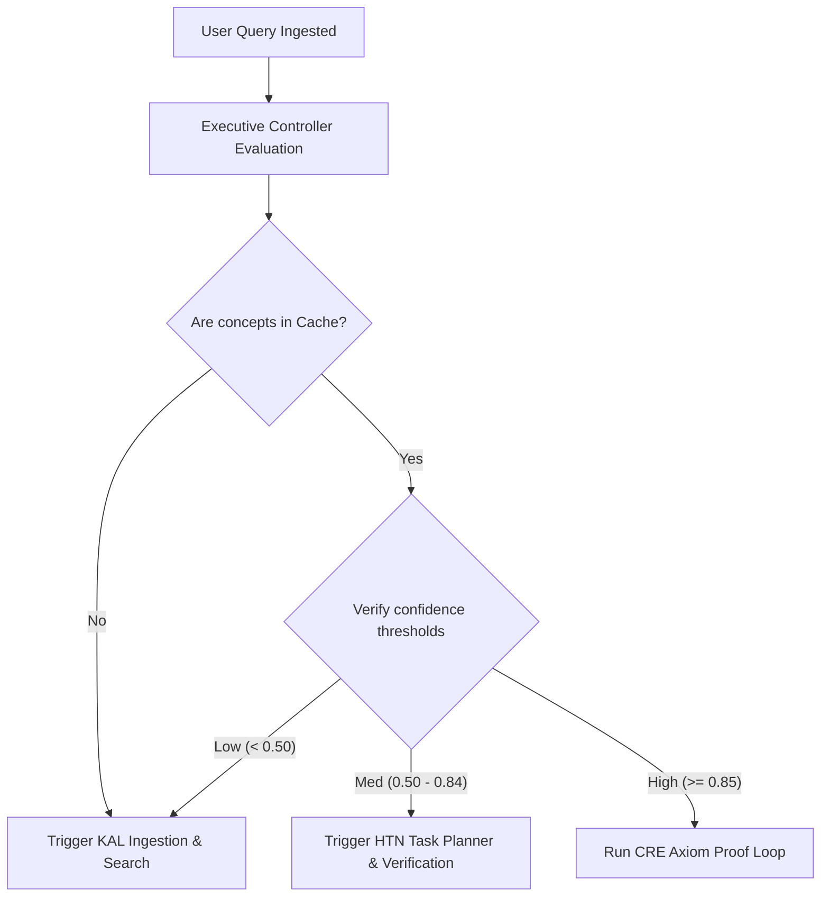
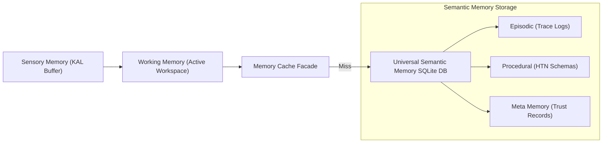
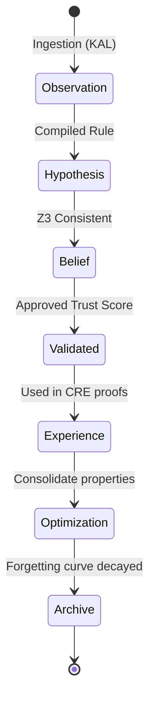
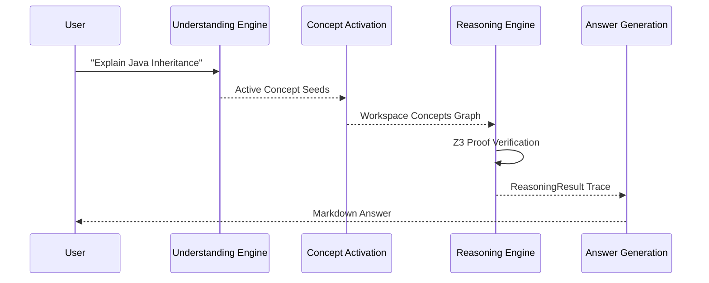

# Hyper-Symbolic Cognitive Invention (HSCI) Reference Cognitive Architecture (RCA-1)

**Version**: Milestone 2 (v0.2.0-beta)  
**Status**: Constitutional Engineering Blueprint & Single Source of Truth  
**Authoritative Verdict**: Approved for Milestone 2 Development  

---

## 1. Executive Summary

HSCI is a non-probabilistic, self-verifying **Cognitive Operating System** designed to replace traditional language model token prediction loops with deterministic, axiomatic deliberation. Unlike Large Language Models (LLMs) which operate on statistical weight distributions, HSCI relies on an explicit **Language of Thought (LoT)** predicate logic representation. It processes information through structured pipelines, verifying logical axioms via SMT theorem solvers (Z3) to produce completely hallucination-free, explainable, and trace-verifiable reasoning outcomes.

---

## 2. Architecture Philosophy

HSCI is governed by the following core architectural principles:
*   **Deterministic Reasoning**: Identical inputs on equivalent knowledge base states yield identical deductions.
*   **Knowledge-First Design**: Cognition is performed over explicit taxonomical graphs, not implicit statistical parameters.
*   **Neural Perception / Symbolic Intelligence**: Deep learning is used for sensory classification (speech, vision), while all executive tasks (reasoning, planning) are strictly symbolic.
*   **Metacognitive Self-Correction**: Watchdog loops monitor logic consistency and trigger knowledge decay and validation when conflicts emerge.

---

## 3. Overall Architecture Layering

The system is organized into five conceptual levels:



---

## 4. Complete Component Diagram



---

## 5. Complete Information Flow

```
Raw Bytes/Text (Sources)
    ↓   [Acquisition KAL plugins normalize input format]
Normalized Payload
    ↓   [Knowledge Compiler extracts syntax tokens and dependency structures]
Semantic AST Predicates
    ↓   [Validation Engine verifies consistency using SMT solver assertions]
Validated Concepts & Relations
    ↓   [Storage repository writes transaction to SQLite/PostgreSQL memory]
Universal Semantic Memory DB
    ↓   [Concept Activation spreads weights to populate active workspace]
Active Workspace (WM)
    ↓   [Cognitive Reasoning Engine derives verified inference traces]
ReasoningResult Trace
    ↓   [Answer Generation Engine compiles Markdown explanation summaries]
Final Answer
```

---

## 6. Complete Thought Flow

Trace walkthrough for the user question: *"Explain Java Inheritance"*:
1.  **Semantic Interpreter**: Normalizes query, extracts term `Java` and `Inheritance`.
2.  **Context Engine**: Disambiguates `Java` using active frame. Maps `Java` to `concept.software.java_language` (avoiding `java_island`).
3.  **Concept Activation**: Spreads activation weights to retrieve `generalizes_to` relationships, loading parent node `Class` and sibling node `specialization`.
4.  **Reasoning Engine**: Formulates the SMT axiom matrix: `Inheritance generalizes_to Class`. Z3 evaluates this as consistent (`sat`).
5.  **Answer Generation**: Orders the verified assertions, attaches confidence weights, and compiles the Markdown explanation report.

---

## 7. Decision Flow & Executive Controller

HSCI introduces the **Executive Controller** to orchestrate cognitive transitions:



---

## 8. Memory Interaction Model



---

## 9. Knowledge Evolution Lifecycle



---

## 10. Neural + Symbolic Integration

HSCI maintains strict boundaries for deep learning models:

*   **Neural Networks (Perception Boundary)**: Used solely for sensory classification tasks: Speech-to-text, OCR image parsing, and initial vector embedding calculations.
*   **Symbolic Engines (Cognition Boundary)**: Executed for all logical operations: concept definition, alias resolution, SMT constraint verification (Z3), HTN planning, and answer construction.
*   **Rationale**: Neural networks do not guarantee logic consistency and are prone to hallucinations. Restricting them to sensory inputs guarantees deterministic cognition.

---

## 11. Core Architecture Principles

1.  **BrainKernel isolation**: BrainKernel manages pipeline transitions and never reads from storage directly.
2.  **No direct mutations**: Reasoning Engine never modifies databases. All memory changes go through `KnowledgeManager` savepoints.
3.  **Strict validation**: The Learning Engine cannot inject concepts without Z3 SMT consistency clearance.
4.  **No global mutable state**: WorkingMemory is request-scoped and thread-isolated.

---

## 12. Complete Sequence Diagrams

### Question Answering Flow


---

## 13. Deployment Architecture

*   **Local Development**: Lightweight setup running on SQLite in WAL mode.
*   **Distributed Cluster**: Repository interfaces route SQL operations to shared PostgreSQL databases, using Redis caches to synchronize active concept namespaces.

---

## 14. Performance Strategy

*   **Caching**: `InMemoryKnowledgeCache` utilizes LRU eviction maps to resolve lookups.
*   **Ebbinghaus Decays**: The Learning Engine reduces base activations of unused concepts to keep active tables under 1 million rows.
*   **SMT Timeouts**: SMT validations set maximum Z3 timeouts to 50ms, aborting complex loops to prevent execution freezes.

---

## 15. Architecture Risks & Mitigations

*   **Alias Collisions**: Resolved by enforcing mandatory namespace paths (`concept.food.apple` vs `concept.corp.apple`).
*   **Reasoning Loops**: Mitigated by Z3 depth constraint checks.
*   **Memory Explosion**: Mitigated by Ebbinghaus activation decay retirement.

---

## 16. Implementation Roadmap

```
Phase 1: Core Infrastructure (Finalize BrainKernel and WorkingMemory thread isolations)
                     │
                     ▼
Phase 2: Knowledge Ingestion (Deploy KAL plugins and Knowledge Compiler tokenizers)
                     │
                     ▼
Phase 3: Cognitive Verification (Deploy Staging DB, Z3 validator, and CRE loops)
                     │
                     ▼
Phase 4: Advanced Evolution (HTN Planner and Learning Engine Ebbinghaus decay)
```

---

## 17. Architecture Decision Record (ADR) Summary

*   **ADR-0001: Knowledge Storage**: Relational SQL (SQLite/PostgreSQL) serves as primary storage, accessed behind generic repository wrappers (`IConceptRepository`) to enable Neo4j migration later.
*   **ADR-0002: Language of Thought**: Predict logic graph schemas serve as internal representation (LoT), rejecting natural language strings to prevent semantic drift.
