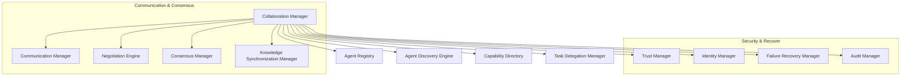

# HSCI V5 — Inter-Agent Collaboration Architecture (ICA-1)

**Version**: 1.0  
**Status**: Constitutional Cognitive Specification  
**Verdict**: Approved for Milestone 2 Development  

---

## 1. Purpose

The Inter-Agent Collaboration Architecture (ICA-1) governs communication, task delegation, and knowledge synchronization across multiple distributed HSCI agents.

### Terminology Matrix
*   **Agent**: A self-contained HSCI cognitive instance executing an ECA-1 scheduler loop.
*   **Role**: A behavior schema mapping capability restrictions (e.g. `role.coder`).
*   **Consensus**: Distributed validation of logical propositions before writing to shared tables.
*   **Delegation**: Assigning task subsets to compatible agent nodes.
*   **Swarm / Coalition**: Dynamic temporary groupings to solve clustered goals.

*Symbolic Collaboration*: Interaction is mediated by sharing logical predicates (Meaning Graphs, Z3 axioms) through shared semantic spaces rather than unstructured message streams, preventing semantic drift.

---

## 2. Positioning Inside HSCI

```
Goal Manager (GMA-1) ──► Collaboration Manager (ICA-1) ──► Meta-Reasoning
                                                                │
                                                                ▼
                                                        Task Planner (HTN)
```
### Why Collaboration Occurs Before Planning
Subtasks must be delegated to the target agents that possess the necessary capabilities *before* local HTN planning compiles actions. If local planning ran first, it would build detailed action hierarchies that the agent cannot execute or lacks permission to run, wasting CPU resources.

---

## 3. Subsystem Architecture Overview



---

## 4. Agent Schema & Discovery Lifecycle

### 4.1 Agent Object Schema
*   **Agent ID**: Unique URI namespace (e.g. `agent.node.coder.001`).
*   **Role / Capabilities**: Categorized action models.
*   **Trust Score**: Reliability rating float \(\in [0.0, 1.0]\).
*   **Knowledge Domains**: Subgraphs from Universal Semantic Memory the node owns.

### 4.2 Discovery Lifecycle
```
Registry Advertisement ──► Active Heartbeat ──► Work Delegation ──► Retirement / Pruning
```
*   *Heartbeat Monitoring*: Nodes broadcast heartbeats at 100ms intervals. Missing 3 heartbeats shifts state to `Unreachable`.

---

## 5. Consensus & Shared Memory Synchronization

### 5.1 Shared Memory Merging
Shared memory updates use a deterministic, Z3-validated three-phase commit (3PC) protocol to prevent logical race conditions:

```mermaid
sequenceDiagram
    participant Initiator
    participant Consensus Manager
    participant Participant Nodes
    
    Initiator->>Consensus Manager: Propose USM change (Z3 constraints)
    Consensus Manager->>Participant Nodes: Request consistency check (sat/unsat verification)
    Participant Nodes->>Consensus Manager: Return sat validation
    Consensus Manager->>Initiator: Commit update to shared memory tables
```

### 5.2 Negotiation Engine
Arbitrates priorities. Tie-breakers default to the supervisor node or the agent holding the highest task-specific priority.

---

## 6. Complete Walkthrough Benchmarks

### Scenario A: Distributed Development Pipeline
User: *"Design, implement, test, and deploy a web application."*
1.  **Decomposition**: Goal Manager identifies subtasks: `Design`, `Implement`, `Test`, `Deploy`.
2.  **Discovery**: Discovery Engine queries directory for compatible nodes. Matches: `agent.architect`, `agent.coder`, `agent.tester`, `agent.devops`.
3.  **Delegation**: Task Delegation Manager routes goals.
4.  **Synchronization**: Code structures generated by `agent.coder` are committed to shared memory.
5.  **Integration**: Consensus Manager validates that the committed code meets the integration constraints mapped by `agent.architect`.

### Scenario B: Node Crash Failover
Worker agent `agent.coder` crashes mid-execution.
1.  **Detection**: Agent Registry logs missing heartbeats for `agent.coder`. State changes to `Offline`.
2.  **State Recovery**: Failure Recovery Manager rolls back the uncompleted task state.
3.  **Reassignment**: Task Delegation Manager identifies alternative node `agent.coder.backup`.
4.  **Resumption**: Backup node loads the task state snapshot from the shared memory database and continues execution.
5.  **Audit**: Audit Manager logs the failure event and recovery metrics.

---

## 7. Collaboration Metrics

*   **Consensus Latency**: Duration (ms) required to approve logical propositions.
*   **Delegation Accuracy**: Ratio of tasks successfully completed by the assigned node without fallbacks.
*   **Failure Recovery Rate**: Average time (ms) to detect a node crash and reassign its task.

---

## 8. ICA-1 Architecture Principles

The Inter-Agent Collaboration Architecture **MUST NOT**:
1.  Bypass authorization policies set by the Executive Controller.
2.  Commit updates to shared memory without consistency validation.
3.  Delegate tasks to unverified or low-trust nodes.

Its sole responsibility is node registration, heartbeat coordination, consensus negotiation, shared database synchronization, and crash recovery.
