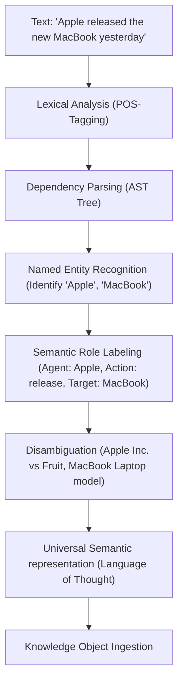

# HSCI V4 — Language Understanding Architecture (Language_Understanding_Architecture.md)

This document specifies the pipeline stages of human language understanding and walks through the benchmark sentence parse structure.

---

## 1. Grammatical Parsing & Disambiguation Flow



---

## 2. Ingestion Walkthrough Benchmark: *"Apple released the new MacBook yesterday"*

We trace the step-by-step semantic conversion of the benchmark query:

### 2.1 Lexical & Dependency parsing
*   **Tokens**: `[Apple, released, the, new, MacBook, yesterday]`
*   **Dependency Link**: `Apple` (Noun, Subject) \(\rightarrow\) `released` (Verb, root) \(\leftarrow\) `MacBook` (Noun, Object).

### 2.2 Named Entity & Disambiguation
*   **Entity 1**: `Apple` resolves to context namespace `concept.corporation.apple_inc` (not `concept.fruit.apple`).
*   **Entity 2**: `MacBook` resolves to context namespace `concept.hardware.macbook`.

### 2.3 Semantic Role Labeling & Temporal Extraction
*   **Actor**: `concept.corporation.apple_inc`
*   **Action**: `concept.action.release_product`
*   **Recipient**: `concept.hardware.macbook`
*   **Time**: Temporal offset `yesterday` maps to absolute timestamp `2026-07-17T12:00:00Z` (relative to current execution time `2026-07-18`).

### 2.4 Knowledge Object Packaging
```json
{
  "concepts": ["concept.corporation.apple_inc", "concept.hardware.macbook"],
  "relations": [
    {
      "source": "concept.corporation.apple_inc",
      "target": "concept.hardware.macbook",
      "type": "RELEASES"
    }
  ],
  "temporal": "2026-07-17T12:00:00Z"
}
```
