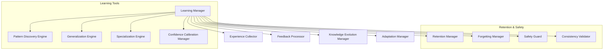

# HSCI V5 — Learning & Adaptation Architecture (LAA-1)

**Version**: 1.0  
**Status**: Constitutional Cognitive Specification  
**Verdict**: Approved for Milestone 2 Development  

---

## 1. Purpose

The Learning & Adaptation Architecture (LAA-1) manages symbolic lifelong learning and behavioral optimization for HSCI. It adapts cognitive weights and structures based on experience without relying on gradient descent.

### Terminology Matrix
*   **Learning**: The persistent acquisition of new rules and concepts.
*   **Adaptation**: Real-time adjustment of operational parameters (e.g. priority queues).
*   **Training**: Batch ingestion of structured ontology records.
*   **Experience**: Historical trace metrics associated with executed plans.
*   **Skill / Capability**: HTN action schemas and tool availability flags.
*   **Reflection / Meta-Reasoning**: Live evaluation of reasoning performance.

*Stability Preservation*: Learning alters future parameters by updating weight variables in persistent cache databases, while system invariants (ontological primitives, safety policies) remain immutable.

---

## 2. Positioning Inside HSCI

```
Task Planner (HTN) ──► Action Execution ──► Performance Feedback
                                                 │
                                                 ▼
                                     Learning & Adaptation (LAA-1)
                                                 │
                                                 ▼
                                     Universal Semantic Memory
```
### Why Learning Occurs After Task Completion and Feedback Collection
Learning is a post-hoc analysis. The system must collect final latency, error metrics, and success results from the executed task before it can calculate prediction errors or update confidence parameters. Attempting to learn mid-task runs the risk of introducing incomplete, corrupt weight patterns.

---

## 3. Subsystem Architecture Overview



---

## 4. Learning Object Schema & Lifecycle

### 4.1 Learning Object Schema
*   **Learning ID**: Unique coordinate namespace (e.g. `learn.optimization.db_query.001`).
*   **Source Task**: Reference to the executed task.
*   **Observed Outcome / Expected Outcome**: Target state comparison predicates.
*   **Confidence Before / Confidence After**: Calibration change floats.
*   **Knowledge Updated**: Reference to mutated USM tables.

### 4.2 Experience Processing Flow
```
Task Executed ──► Outcome Logged ──► Reflection Manager ──► Z3 Validator ──► USM Update
```
*   **Rollback Safety**: Updates are written to a Staging DB and only committed to USM after validation.

---

## 5. Knowledge Evolution & Forgetting Models

### 5.1 Knowledge Evolution Lifecycle
1.  **Addition**: Instantiates candidate nodes.
2.  **Consolidation**: Merges synonyms and properties.
3.  **Deprecation**: Lowers concept activation weights.
4.  **Retirement**: Archives unused nodes (Ebbinghaus forgetting curve decay model).

### 5.2 Forgetting Curve Equation
The Forgetting Manager applies activation decay over time:

\[
Activation(t) = Activation_0 \cdot e^{-\frac{t}{S}}
\]

Where:
*   \(S\) is the memory strength parameter reinforced by successful task hits.
*   *Reversibility*: Decayed concepts are migrated to archived tables rather than deleted, permitting rollback recoveries.

---

## 6. Complete Walkthrough Benchmarks

### Scenario A: Successful Query Optimization
User: *"Optimize a database query."*
1.  **Execution**: Task Planner generates HTN plan using index creation tasks.
2.  **Measurement**: Performance metrics register a latency reduction of \(45\%\).
3.  **Reflection**: Experience Collector records success outcome.
4.  **Learning Candidate**: Generalization Engine proposes optimization rule: `apply_index(table, column) -> reduces_latency`.
5.  **Validation**: Z3 verifies that index creation does not violate safety disk-space constraints.
6.  **Consolidation**: Rule is committed to USM. Confidence parameter increases from 0.50 to 0.85.

### Scenario B: Negative Feedback Correction
User: *"The previous optimization made performance worse."*
1.  **Failure Detection**: Feedback Processor registers negative feedback event.
2.  **Experience Analysis**: Performance metrics show latency increased by \(80\%\).
3.  **Pattern Discovery**: Pattern Discovery Engine correlates index rule with lock contentions on high-write tables.
4.  **Knowledge Revision**: Specialization Engine restricts the rule: `apply_index(table, column) -> reduces_latency [except table = high_write]`.
5.  **Confidence Recalibration**: Target rule confidence drops to 0.40. Learning History preserves the change log.

---

## 7. Learning Metrics

*   **Learning Accuracy**: Correlation between updated confidence weights and actual task performance.
*   **Knowledge Growth Rate**: Number of new validated rules compiled per 1000 tasks.
*   **Retention Efficiency**: Memory space saved by archiving decayed concepts.

---

## 8. LAA-1 Architecture Principles

The Learning & Adaptation Architecture **MUST NOT**:
1.  Mutate the active World Model state variables directly.
2.  Commit tasks to execution queues.
3.  Learn from unvalidated or contradictory evidence.

Its sole responsibility is calculating weight updates, pattern generalities, and concept decay curves.
