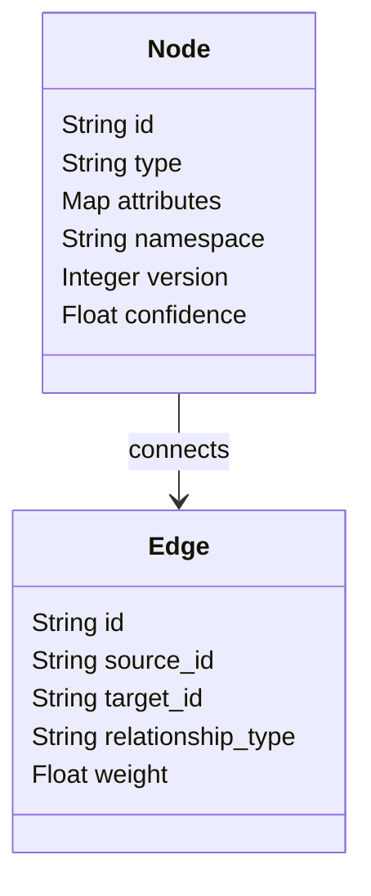
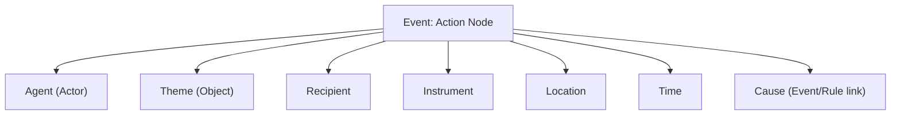
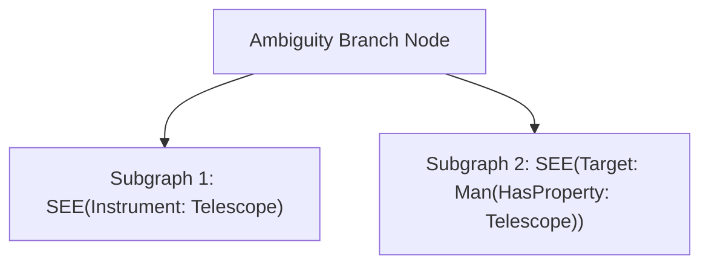

# HSCI V5 — Meaning Graph Specification (MGS-1)

**Version**: 1.0  
**Status**: Constitutional Cognitive Specification  
**Verdict**: Approved for Milestone 2 Development  

---

## 1. Purpose

The Meaning Graph represents pre-logical, semantic semantics within the HSCI cognitive processing pipeline.
*   **Syntax Tree (AST)**: Highlights grammatical phrasing structure (verbs, adjectives).
*   **Dependency Graph**: Shows grammatical term modifier relationships.
*   **Meaning Graph (SIA-1 Output)**: Captures conceptual roles, semantic relations, and situational context before logical conversion. It is language-independent.
*   **Language of Thought (LoT)**: Abstract predicate logic and SMT math equations (Z3 formulas).
*   **Knowledge Graph (USM)**: Persistent, unified concept node mappings in long-term memory database tables.

---

## 2. Positioning Inside HSCI

```
Ingestion Payload ──► Syntax Parser ──► Dependency Graph ──► Semantic Interpreter
                                                                 │ (SIA-1)
                                                                 ▼
      Knowledge Objects ◄── Knowledge Compiler ◄── Meaning Graph (MGS-1)
```

---

## 3. Core Design Principles

1.  **Preserve Ambiguity**: Unresolved references must coexist as branch alternatives.
2.  **Lossless Semantic Integrity**: Grammatical aspects (mood, emotional weight, modality) are fully preserved.
3.  **Language Independence**: Meaning Graph mappings use semantic namespaces rather than language-specific syntax.
4.  **Incremental Construction**: Support adding node parameters dynamically.

---

## 4. Graph Structure Schema


*   **Graph Boundaries**: Meaning graphs are bounded by context scopes.
*   **Subgraphs**: Group related events or temporal scopes.

---

## 5. Node Categories & Relationship Ontology

### 5.1 Node Types
*   **Entity / Object / Agent / Person / Organization**: Identifiable things.
*   **Event / Action / State**: Chronological transitions.
*   **Goal / Belief / Rule / Constraint / Hypothesis**: Evaluated rules.
*   **Time / Location / Property**: Context properties.

### 5.2 Relationship Types
*   *Taxonomic*: `IS_A`, `INSTANCE_OF`, `SPECIALIZATION`, `GENERALIZATION`.
*   *Partitive*: `PART_OF`, `CONTAINS`.
*   *Temporal & Spatial*: `PRECEDES`, `FOLLOWS`, `LOCATED_IN`, `NEAR`.
*   *Logical & Causal*: `CAUSES`, `DEPENDS_ON`, `SUPPORTS`, `CONTRADICTS`, `IMPLIES`, `EQUIVALENT_TO`.

---

## 6. Event & Semantic Role Model

Every event node conforms to a semantic role mapping structure:



---

## 7. Context, Uncertainty, and Ambiguity

### 7.1 Branching Ambiguity Model
*   *Benchmark Query*: *"I saw the man with the telescope."*
*   *MGS-1 Representation*: SIA-1 generates a branch node splitting into two subgraphs:


*   **Pruning**: Once context confirms target intent, the non-matching branch is deleted.

---

## 8. Transformation to Language of Thought (LoT)

The Knowledge Compiler translates Meaning Graphs into SMT-compatible predicate expressions:
1.  **Normalization**: Resolves pronoun bindings and extracts timestamps.
2.  **Predicate Generation**: Translates relational links into formal assertions (e.g. `LOCATED_IN(A, B)`).
3.  **Constraint Generation**: Formulates mathematical Z3 logic inequalities from property attributes.

---

## 9. Failure Modes & Recovery Strategies

*   **Graph Cycles**: Trapped using depth-first search loop detectors.
*   **Conflicting Meanings**: The validator flags contradictions and holds the transaction in staging pending user resolution.

---

## 10. Complete Example Ingestion Mapping

Query: *"John gave Mary a red book yesterday because she needed it."*

### 10.1 Meaning Graph Serialization Map
```json
{
  "nodes": [
    { "id": "n_john", "type": "Person", "name": "John" },
    { "id": "n_mary", "type": "Person", "name": "Mary" },
    { "id": "n_book1", "type": "Object", "properties": { "color": "red" } },
    { "id": "e_give", "type": "Event", "action": "give" },
    { "id": "e_need", "type": "Event", "action": "need" }
  ],
  "edges": [
    { "source": "e_give", "target": "n_john", "type": "AGENT" },
    { "source": "e_give", "target": "n_book1", "type": "THEME" },
    { "source": "e_give", "target": "n_mary", "type": "RECIPIENT" },
    { "source": "e_need", "target": "n_mary", "type": "AGENT" },
    { "source": "e_need", "target": "n_book1", "type": "THEME" },
    { "source": "e_need", "target": "e_give", "type": "CAUSES" }
  ],
  "temporal": { "anchor": "yesterday", "offset": "-24h" }
}
```

### 10.2 Language of Thought (LoT) Predicates Output
```
Person(john) ∧ Person(mary) ∧ Book(book1) ∧ color(book1, red) ∧
Give(event1, john, mary, book1) ∧ Need(event2, mary, book1) ∧
CAUSES(event2, event1) ∧ time(event1, yesterday)
```
*   **SMT Verification Formula (Z3 input)**:
    `z3.solve(Give(e1, john, mary, book1) == True)`
