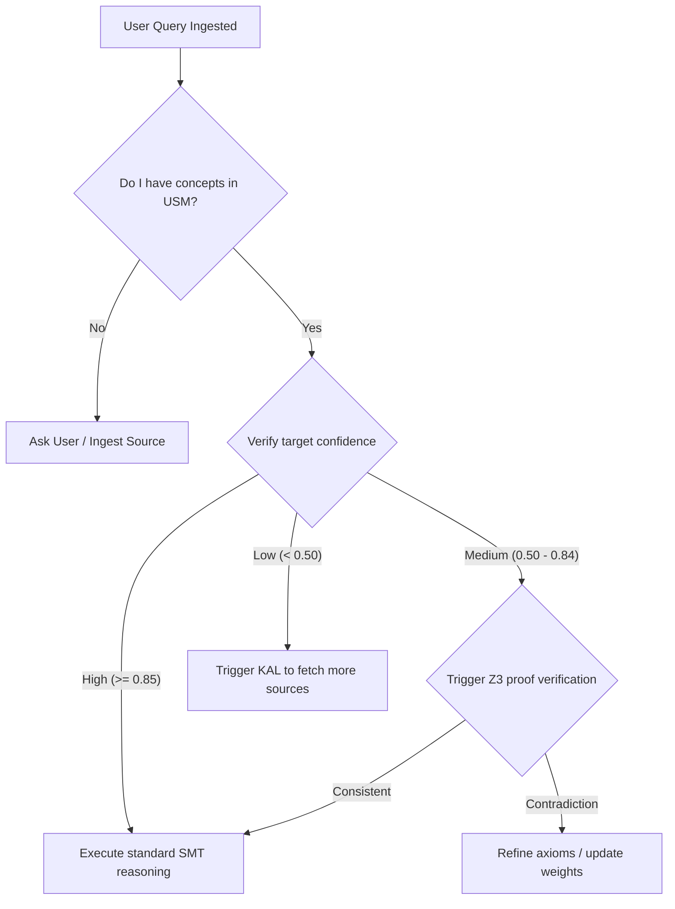

# HSCI V4 — Meta-Cognition Design (Meta_Cognition_Design.md)

This document specifies the meta-cognitive monitoring loops, confidence thresholds, self-improvement hooks, and verification triggers.

---

## 1. Meta-Cognitive Verification Loop

The meta-cognitive loop acts as a watchdog supervising the active reasoning workspace:

---

## 2. Metacognitive Questions Solved

*   **"What do I know?"**: Evaluated by checking if input terms resolve to concept nodes in the `KnowledgeManager` cache.
*   **"How certain am I?"**: Aggregated confidence scores calculated by the validation engine trust formulas.
*   **"Should I search for more evidence?"**: If confidence is below \(0.50\), it halts reasoning and triggers the Acquisition Layer to pull additional documentation.
*   **"Should I ask the user?"**: If SMT consistency checks return contradictory options (`unsat` both ways), it prompts the user to resolve the contradiction.
*   **"How do I improve myself?"**: Updates concept weights and decays unused links based on learning engine parameters.
