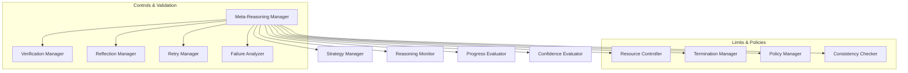
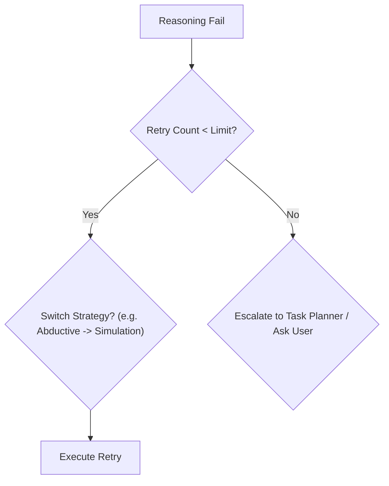

# HSCI V5 — Meta-Reasoning Architecture (MRA-1)

**Version**: 1.0  
**Status**: Constitutional Cognitive Specification  
**Verdict**: Approved for Milestone 2 Development  

---

## 1. Purpose

Meta-Reasoning is the ability of the system to reason about its own reasoning processes. It answers: *How should I think? Which reasoning strategy should I use? Did my reasoning fail?*

### Terminology Matrix
*   **Reasoning / Thinking**: Calculating logical implications or proofs over domain-specific concepts.
*   **Meta-Reasoning**: Supervising, evaluating, and optimizing the reasoning pipeline.
*   **Reflection**: Ex-post auditing of completed tasks to identify errors.
*   **Self Model**: Symbolic representation of the agent's identity and capabilities.
*   **Simulation**: Projecting hypothetical world branches.
*   **Executive Control**: Dispatching high-level cognitive task queues.
*   **Planning**: Sequenced path-finding tasks.

*Executive Supervision*: Meta-Reasoning does not solve the domain problem (e.g. proof math); it selects and monitors the solver configurations, preempting execution loops that fail to make progress.

---

## 2. Positioning Inside HSCI

```
Self Model (SMA-1) ──► Meta-Reasoning (MRA-1) ──► Reasoning Engine (CRE)
                                                      │
                                                      ▼
                                              Task Planner (HTN)
```
### Why Meta-Reasoning Executes Before and During Reasoning
Meta-Reasoning must select the optimal solver strategy (e.g., abductive vs. deductive) *before* loading formulas into Z3. During Z3 execution, it monitors the solver thread in real time to interrupt infinite loops, recursive locks, or contradiction deadlocks.

---

## 3. Subsystem Architecture Overview



---

## 4. Meta-Reasoning Object Model & Strategy Selection

### 4.1 Meta-Reasoning Session Schema
*   **Session ID**: Unique coordinate namespace (e.g. `meta.reason.session.001`).
*   **Selected Strategy**: Active type enum (e.g. `Deductive`, `Abductive`).
*   **Progress**: Completeness fraction \(P \in [0.0, 1.0]\).
*   **Retry Count**: Integer tracking verification attempts.
*   **Termination Condition**: Active stop trigger.

### 4.2 Reasoning Strategies

*   **Deductive**: Axiomatic truth derivation (Used for mathematical / logical proofs).
*   **Inductive**: Generalizing rules from observations (Used in learning engines).
*   **Abductive**: Inferring the most likely cause for an event (Used in diagnostic tasks).
*   **Constraint-Based**: Checking boundary compliance (Z3 solver).
*   **Simulation-Guided**: Projecting world forks to verify assertions.

---

## 5. Reasoning Supervision & Retry Policies

### 5.1 Supervision Alerts
The Reasoning Monitor halts execution under the following conditions:
*   **Deadlock / Loop**: No state modifications for 3 consecutive cycles.
*   **Inconsistency**: SMT solver returns `unsat` for base assumptions.

### 5.2 Retry & Recovery
If verification fails, the Retry Manager executes deterministic escalation rules:



---

## 6. Complete Walkthrough Benchmarks

### Scenario A: Analytical Proof
User: *"Prove that Algorithm A is more efficient than Algorithm B."*
1.  **Session Ingest**: Meta-Reasoning Manager instantiates session `meta.reason.001`.
2.  **Strategy Selection**: MRA-1 selects strategy `Deductive` combined with `Constraint-based` (Complexity analysis).
3.  **Supervision**: Monitor tracks Z3 context updates. Complexity constraints are proved as consistent.
4.  **Verification**: Verification Manager checks proof assertions against base math axioms.
5.  **Output**: Session reports completion; Answer Generation compiles the complexity proof report.

### Scenario B: Diagnostic Abduction
User: *"Diagnose why the server keeps crashing."*
1.  **Initial Strategy**: Selects `Abductive` reasoning to infer crash causes (evidence logs).
2.  **Low Confidence Detection**: Initial pass returns three conflicting hypotheses with low confidence (0.40).
3.  **Escalation**: Retry Manager switches strategy to `Simulation-guided` reasoning.
4.  **Simulation**: Dispatches Simulation Engine to test each crash hypothesis on parallel forks.
5.  **Verification**: Evaluates simulated outcomes. Hypothesis 2 (`out_of_memory`) replicates the error trace exactly.
6.  **Final Diagnosis**: Confidence re-evaluates to 0.95. Server crash diagnosis is returned.

---

## 7. Meta-Reasoning Metrics

*   **Strategy Selection Accuracy**: Ratio of selected strategies that resolve within time budgets to total tasks.
*   **Average Retry Count**: Number of strategy shifts executed before target resolution.
*   **Confidence Calibration Error**: Variance between pre-execution estimated confidence and ex-post verification outcomes.

---

## 8. MRA-1 Architecture Principles

The Meta-Reasoning System **MUST NOT**:
1.  Directly solve domain-specific mathematical or logical puzzles.
2.  Mutate active World Model state variables.
3.  Execute HTN task plan loops.

Its sole responsibility is supervising solver cycles, selecting reasoning strategies, and executing retry escalations.
