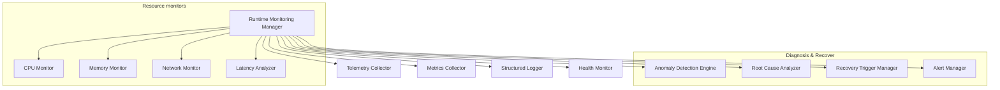

# HSCI V5 — Runtime Monitoring & Observability Architecture (RMA-1)

**Version**: 1.0  
**Status**: Constitutional Cognitive Specification  
**Verdict**: Approved for Milestone 2 Development  

---

## 1. Purpose

The Runtime Monitoring & Observability Architecture (RMA-1) functions as HSCI's "nervous system." It collects telemetry, measures module health, detects anomalies, and coordinates failure diagnostics and recovery.

### Terminology Matrix
*   **Monitoring**: Tracking predefined runtime thresholds (e.g. CPU spikes).
*   **Observability**: Inferring internal cognitive state from external outputs.
*   **Telemetry / Heartbeat**: Real-time thread pulse checks.
*   **Logging / Tracing**: Recording sequential execution logs and trace spans.
*   **Diagnosis / Recovery**: Identifying root causes and triggering corrective actions.

*Non-Reasoning Design*: Monitoring never performs domain reasoning or planning; it parses telemetry inputs and dispatches triggers to the appropriate managers.

---

## 2. Positioning Inside HSCI

```
Governance (GCA-1) ──► Verification (VVA-1) ──► Runtime Observability (RMA-1)
                                                     │
                                                     ▼
                                            All Cognitive Modules
```
### Why Monitoring Continuously Observes All Runtime Activities
To guarantee system stability, monitoring must audit every cognitive layer. If any engine behaves unexpectedly (e.g., Z3 memory leaks, infinite loops, deadlocks), RMA-1 must intercept the thread, execute cleanups, and restore stable operation.

---

## 3. Subsystem Architecture Overview



---

## 4. Monitoring Object Model & Telemetry Pipeline

### 4.1 Monitoring Object Schema
*   **Monitor ID**: Unique coordinate namespace (e.g. `monitor.thread.reasoning.001`).
*   **CPU / Memory Usage**: Numeric percentages.
*   **Health Status**: State enum (`Healthy`, `Warning`, `Degraded`, `Critical`, `Offline`).
*   **Trace ID**: Trace identifier.

### 4.2 Telemetry Pipeline
```
Event Generated ──► Telemetry Collection ──► Metrics Extraction ──► Trace Correlation ──► Health Evaluation ──► Alert / Storage
```

---

## 5. Health Assessment & Anomaly Detection

### 5.1 Health Score Thresholds
The Health Monitor evaluates status metrics to assign a System Health Score (\(H_{sys}\)):

\[
H_{sys} = 1.0 - (w_{cpu} \cdot CPU_{util} + w_{mem} \cdot Memory_{util} + w_{err} \cdot \frac{Error_{count}}{t})
\]

*   \(H_{sys} < 0.30\) triggers a `Critical` alert, initiating automatic thread preemption and diagnostics.

### 5.2 Anomaly Detection Engine
Monitors trace logs to flag anomalies (e.g., memory leaks, logic loops, deadlock locks).

---

## 6. Complete Walkthrough Benchmarks

### Scenario A: Reasoning Slowdown (10× Latency Spike)
1.  **Telemetry Collection**: Latency Analyzer registers a reasoning task duration increase from 5ms to 50ms (10× latency spike).
2.  **Threshold Evaluation**: Performance Analyzer flags `Degraded` state.
3.  **Alert Generation**: Alert Manager dispatches an override event to Meta-Reasoning (MRA-1).
4.  **Root Cause Analysis**: Root Cause Analyzer checks Z3 formula complexity, identifying an infinite loop in SMT solver checks.
5.  **Recovery Recommendation**: Diagnostics Manager recommends solving rollback.
6.  **Recovery Execution**: Recovery Trigger Manager interrupts the Z3 solver thread, rolls back the formula context, and updates the monitoring log.

### Scenario B: Collaboration Node Crash
Distributed worker agent `agent.coder` stops responding.
1.  **Heartbeat Loss**: Heartbeat Manager detects a missing heartbeat pulse from `agent.coder`.
2.  **Failure Classification**: Anomaly Detection Engine flags state transition: `Healthy -> Offline`.
3.  **Notification**: Alert Manager dispatches failure notification to Inter-Agent Collaboration (ICA-1).
4.  **Recovery Monitoring**: Recovery Trigger Manager tracks progress as ICA-1 transfers tasks to backup nodes.
5.  **Audit**: Complete trace logs are archived.

---

## 7. Observability Metrics

*   **Mean Time to Detect (MTTD)**: Average latency (ms) required to flag a system exception.
*   **Mean Time to Recover (MTTR)**: Average time (ms) to complete fallback rollbacks.
*   **Trace Coverage**: Percentage of cognitive tasks recorded in telemetry pipelines.

---

## 8. RMA-1 Architecture Principles

The Runtime Monitoring & Observability Architecture **MUST NOT**:
1.  Directly perform domain reasoning or planning actions.
2.  Modify USM or World Model databases.
3.  Bypass Governance policies.

Its sole responsibility is telemetry processing, health checks, anomaly logs, diagnostics, and recovery triggers.
