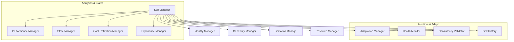
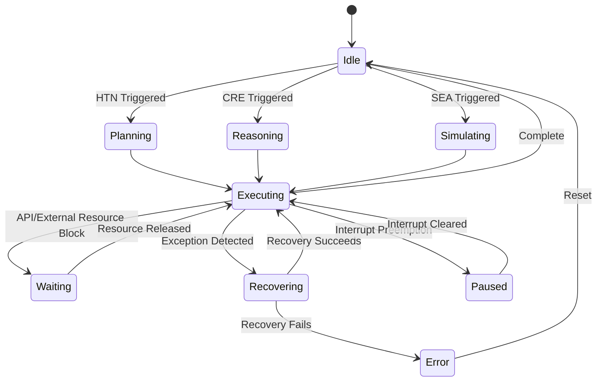

# HSCI V5 — Self Model Architecture (SMA-1)

**Version**: 1.0  
**Status**: Constitutional Cognitive Specification  
**Verdict**: Approved for Milestone 2 Development  

---

## 1. Purpose

The Self Model (SM) represents HSCI's understanding of itself. It maintains an explicit, symbolic representation of identity, capabilities, limitations, internal states, resources, and performance metrics to guide cognitive decisions.

### Terminology Matrix
*   **World Model**: Representation of external reality.
*   **Self Model**: Representation of the internal agent architecture (capabilities, limits).
*   **Identity / Self / Agent**: The unique coordinates distinguishing the system.
*   **Metacognition**: Watchdog loops evaluating logical consistency.
*   **Consciousness**: Not represented (HSCI is a non-conscious, symbolic operating system).
*   **Capability / Limitation**: Explicit descriptions of what the agent can and cannot perform.
*   **Performance / Confidence**: Historical trace stats and calibrated expectation scores.

*Representing the Agent*: The Self Model represents the system's own resource configurations and functional limits rather than external environmental entities.

---

## 2. Positioning Inside HSCI

```
Simulation Engine (SEA-1) ──► Self Model (SMA-1) ──► Reasoning Engine (CRE)
                                                         │
                                                         ▼
                                                    Task Planner (HTN)
```
### Why Reasoning Benefits From Explicit Self-Representation
By querying the Self Model first, the Reasoning Engine (Z3) can preemptively reject goals requiring capabilities the system lacks (e.g. embodied robot controls). This stops the planner from executing impossible searches, saving CPU resources.

---

## 3. Subsystem Architecture Overview



---

## 4. Self Object Model & State Transitions

### 4.1 Self Object Schema
*   **Agent ID**: Coordinate namespace URI (e.g. `agent.hsci.v5.001`).
*   **Capabilities / Limitations**: Indexed list of tool/reasoning categories.
*   **Resources**: Memory limits, thread ceilings.
*   **Health Status**: Exception counters, memory heap stats.
*   **Operational State**: Active State Manager values.

### 4.2 Internal State Model
The State Manager maps the active operational mode:



---

## 5. Performance, Confidence, and Adaptation

### 5.1 Performance Model
Tracks task execution history:
*   **Task Success Rate**: \(S_{rate} = \frac{T_{success}}{T_{total}}\).
*   **Resource Utilization**: Average CPU/Memory usage per task.

### 5.2 Confidence & Self Assessment
Confidence updates are calibrated:

\[
C_{cal}(task) = C_{base}(task) + \delta \cdot (S_{rate}(task) - C_{base}(task))
\]

*   Prevents overconfidence (where confidence exceeds actual success rate) and underconfidence.

### 5.3 Adaptation Model
If task performance falls below \(0.80\), the Adaptation Manager automatically throttles concurrency budgets and adjusts priority rules.

---

## 6. Complete Walkthrough Benchmarks

### Scenario A: Capability Validation (Legal Analysis)
User: *"Analyze a legal contract and summarize the risks."*
1.  **Ingest**: Executive Controller receives contract summary task.
2.  **Capability Check**: Capability Manager queries available tools index: `capability.document_parsing` and `capability.logical_deduction` resolve to `True`.
3.  **Resource Estimation**: Resource Manager calculates thread requirements: Capped at 4 threads. Confidence maps to \(0.88\).
4.  **Deduction**: Tasks are dispatched.
5.  **Audit**: Performance metrics (execution duration, memory footprint) are compiled, updating the `Self History` logs.

### Scenario B: Limitation Check (Robot Arm Control)
User: *"Control a physical robot arm."*
1.  **Capability Lookup**: Capability Manager queries active capabilities list.
2.  **Limitation Detection**: Limitation Manager flags mismatch: `embodiment == False`.
3.  **Preemption**: Self Manager immediately blocks execution, returning exception: `Lacks_Physical_Actuators`.
4.  **Recovery**: Executive Controller bypasses planner, routing response straight to Answer Generation: *"I cannot execute physical robot movements as I do not possess physical actuators."*

---

## 7. Self Model Metrics

*   **Self Assessment Accuracy**: Absolute error between estimated task confidence and final success rate.
*   **Capability Coverage**: Ratio of supported user task domains to total requested domains.
*   **Adaptation Rate**: Average latency (cycles) required to adjust resource allocations after an error event.

---

## 8. SMA-1 Architecture Principles

The Self Model **MUST NOT**:
1.  Verify logical proofs using Z3 solver contexts.
2.  Execute HTN planner actions.
3.  Modify World Model databases directly.

Its sole responsibility is maintaining the identity state variables, resource budgets, and operational performance matrices of the agent itself.
