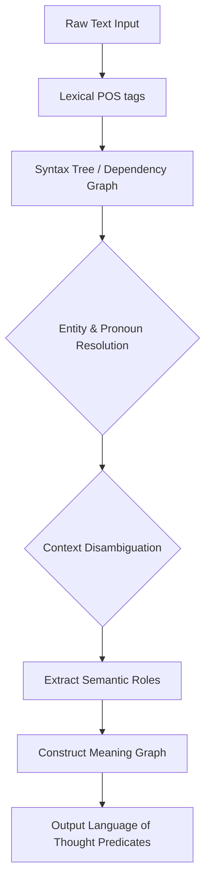
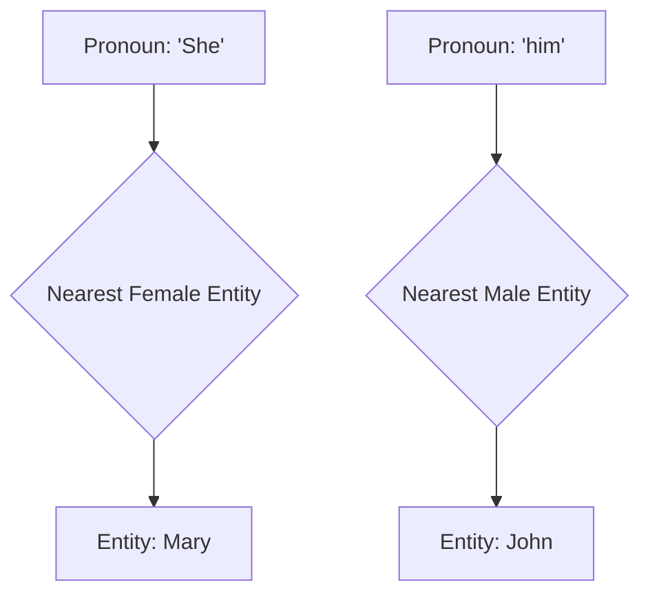
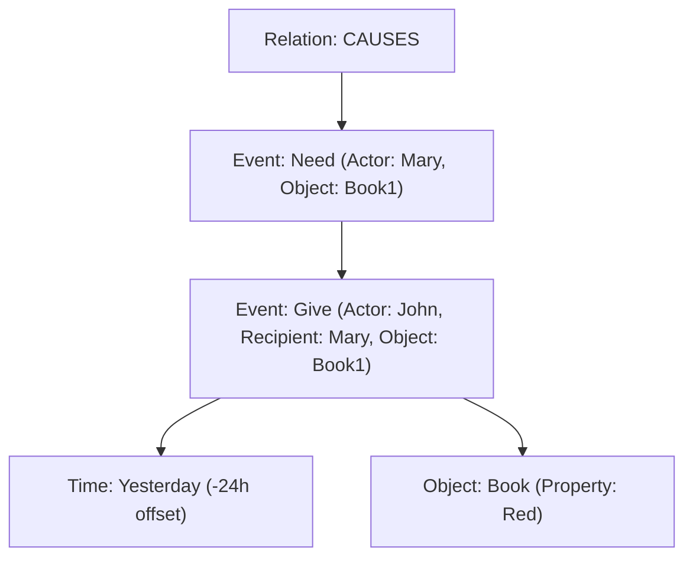

# HSCI V5 — Semantic Interpreter Architecture (SIA-1)

**Version**: 1.0  
**Status**: Constitutional Cognitive Specification  
**Verdict**: Approved for Milestone 2 Development  

---

## 1. Purpose

The Semantic Interpreter translates grammatical structure into structured conceptual meaning.
*   **Syntax**: Grammatical structure (e.g. POS tags, dependency links). Grammar alone is insufficient because identical structures have different meanings (e.g., "The bank is closed").
*   **Semantics**: Meaning graph (e.g. mapping words to explicit concept IDs).
*   **Knowledge**: Fact verification and long-term memory index integration.
*   **Reasoning**: Logical calculations over active concept graphs.

---

## 2. Positioning Inside HSCI

```
Raw Language
     ↓   [Acquisition KAL plugins normalize formatting]
Lexical Analysis (POS-Tagging)
     ↓   [Grammar structures mapped]
Syntax Parser (AST tree)
     ↓   [Term relations connected]
Dependency Graph
     ↓   [SIA-1: Resolves referents, ambiguity, and contexts]
Semantic Interpreter (SIA-1)
     ↓   [Outputs structured concept nodes]
Meaning Graph
     ↓   [Compiles graph properties into SMT assertions]
Knowledge Compiler
     ↓   [Logical object packages]
Knowledge Objects
```

---

## 3. Internal Subsystem Architecture

The Semantic Interpreter comprises 12 modular subsystems:
1.  **Lexical Resolver**: Maps vocabulary tokens to ontology synonyms.
2.  **Coreference Resolver**: Connects pronouns (`he`, `she`, `it`, `former`) to source entities.
3.  **Entity Resolver**: Binds names to specific namespace coordinates.
4.  **Intent Analyzer**: Classifies speech intentions (Question, Command, Counterfactual).
5.  **Context Resolver**: Evaluates conversation history priorities.
6.  **Temporal Interpreter**: Maps timestamps and relative offsets (`yesterday`).
7.  **Spatial Interpreter**: Extracts topological alignments (`inside`, `north`).
8.  **Causality Detector**: Identifies causal relationships (`because`).
9.  **Emotion Interpreter**: Models sentiment tags.
10. **Pragmatic Interpreter**: Maps indirect requests and sarcasm.
11. **Semantic Graph Builder**: Constructs the intermediate **Meaning Graph**.
12. **Meaning Validator**: Evaluates consistency.

---

## 4. Semantic Pipeline Stages



---

## 5. Meaning Graph Design

The Meaning Graph represents pre-logical syntax meaning:

*   **Nodes**: Entities, Actions, Events, properties.
*   **Edges**: Semantic roles (Agent, Patient, Instrument, Location, Time).
*   **Uncertainty & Emotion**: Attributes track probability indices (e.g. `confidence: 0.90`) and emotional weight.

---

## 6. Context Engine Priority Rules

To resolve homonyms (e.g. `Java`, `Apple`), the Context Engine evaluates context in this order of priority:
1.  **Current Workspace**: Concepts currently active in WorkingMemory.
2.  **Conversation History**: Previous 5 request contexts.
3.  **User Intent**: Current goal.
4.  **World Knowledge**: Namespace hierarchies.

---

## 7. Coreference Resolution

Resolves pronouns using distance matrices:
*   *Benchmark*: *"John gave Mary a book. She thanked him."*
*   *SIA-1 Resolution*:
    *   `She` (female noun) resolves to `Mary`.
    *   `him` (male noun) resolves to `John`.



---

## 8. Causal, Spatial, and Temporal Mappings

*   **Temporal**: Maps relative terms using timestamps: `yesterday` \(\rightarrow\) \(-24h\) offset.
*   **Spatial**: Uses topological constraints: `inside` \(\rightarrow\) `CONTAINED_IN(A, B)`.
*   **Causal**: Mapped as causal dependency links: `A because B` \(\rightarrow\) `CAUSES(B, A)`.

---

## 9. Ambiguity Resolution

*   *Benchmark*: *"I saw the man with the telescope."*
*   *SIA-1 Ambiguity Representation*:
    ```
    Interpretation 1: SEE(Agent: I, Target: Man, Instrument: Telescope)
    Interpretation 2: SEE(Agent: I, Target: Man(HasProperty: Telescope))
    ```
*   SIA-1 stores **both** interpretations as branch options in the Meaning Graph, resolving them later based on context priorities.

---

## 10. Failure Modes & Recovery

*   **Unknown Word**: Fallback to parent concept generalization.
*   **Pronoun Ambiguity**: Request clarification from the user.

---

## 11. Complete Walkthrough Benchmark

Sentence: *"John gave Mary a red book yesterday because she needed it."*



*   **SRL Mapping**: `she` \(\rightarrow\) `Mary`, `it` \(\rightarrow\) `Book1`.
*   **Causality**: `Event2` CAUSES `Event1`.

---

## 12. SIA-1 Architecture Principles

The Semantic Interpreter **MUST NOT**:
1.  Perform SMT logic reasoning.
2.  Apply forgetting curve decays or learning adjustments.
3.  Write directly to Universal Semantic Memory databases.

Its sole responsibility is translating grammatical syntax into semantic Meaning Graphs.
