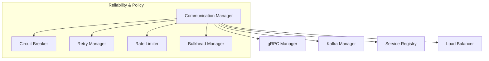

# HSCI V5 — Service & Communication Architecture (SCA-1)

**Version**: 1.0  
**Status**: Constitutional Engineering Specification  
**Verdict**: Approved for Milestone 2 Development  

---

## 1. Purpose

The Service & Communication Architecture (SCA-1) defines the engineering standards, transmission protocols, routing models, and serialization schemas that govern communication between all HSCI cognitive services.

### Core Communication Goals
*   **Low Latency**: Synchronous execution paths (ECA-1 \(\rightarrow\) CRE \(\rightarrow\) HTN) must use gRPC over HTTP/2.
*   **High Throughput**: Telemetry events, audit history logs, and USM synchronization records use Kafka message streams.
*   **Reliability & Fault Tolerance**: Cascading failures are prevented by implementing Circuit Breakers and bulkheads.

---

## 2. Terminology

*   **Service / RPC**: Isolated application namespaces providing gRPC endpoints.
*   **Message / Event**: Schema-validated payloads (Protobuf / JSON).
*   **Broker**: Event bus coordination layer (Apache Kafka).
*   **Serialization**: Packing memory structures into binary wire formats (Protocol Buffers).
*   **Service Discovery**: Health-based dynamic registry checks (Consul / gRPC Resolver).

---

## 3. Positioning Inside HSCI

```
                     User Request (REST/WS)
                               │
                               ▼
                        API Gateway (SCA-1)
                               │
                               ▼
        Executive Controller (gRPC) ──► Task Planner (gRPC)
                               │
                               ▼
                  All Cognitive Submodules
                               │
                               ▼
                    Telemetry Bus (Kafka)
```
### Why Every Module Communicates Through SCA-1 Standards
Enforcing a single communication protocol prevents custom parsing code in individual modules, maintaining contract validation (ASC-1) and enabling the security engine to enforce least-privilege token filters at the socket level.

---

## 4. Internal Architecture Modules



---

## 5. Service Discovery & Routing

*   **Dynamic Registration**: Services register their ports and versions with the Service Registry at startup.
*   **Health-Based Routing**: Load Balancer queries registries. If a node fails to report a heartbeat for 3 consecutive cycles, it is marked `Degraded` and excluded from routing targets.

---

## 6. Message Contracts (Protocol Buffers)

Synchronous payloads must be serialized using Google Protocol Buffers (.proto) to ensure backward-compatible schema changes:

```protobuf
syntax = "proto3";
package hsci.cognition.v5;

message VerificationRequest {
  string verification_id = 1;
  string target_formula = 2;
  int64 timeout_ms = 3;
  map<string, string> metadata = 4; // Correlation IDs, Trace IDs
}
```

---

## 7. Kafka Event Architecture

*   **Partition Strategy**: Topics are partitioned using hashes of `agent_id` coordinates to guarantee order preservation.
*   **Dead Letter Queue (DLQ)**: telemetries or updates failing schema checks are routed to `topic.dlq.invalid_schema` for analysis.

---

## 8. Reliability & Fault Tolerance

To prevent cascading failures across services, SCA-1 defines structural limits:
*   **Circuit Breakers**: Tripped when error rates exceed \(15\%\) over a 10s sliding window.
*   **Timeouts**: Active gRPC calls are capped at a maximum timeout ceiling of **50ms** for CRE verification tasks.

---

## 9. Failure Scenarios

### Scenario 1: Task Planner Unavailable
1.  **Detection**: gRPC Manager registers connection timeout; client returns `Unavailable`.
2.  **Circuit Breaker**: Connection pool trips to `Open` state.
3.  **Graceful Degradation**: Executive Controller falls back to the local plan-cache database, retrieving alternative cached paths, and alerts the monitoring system.

### Scenario 2: Kafka Broker Failure
1.  **Buffer Allocation**: Telemetry Collector detects broker disconnection.
2.  **Queue**: Event records are written to local disk ring-buffers.
3.  **Resynchronization**: Once the Kafka broker recovers, the queue manager replays events in order, preserving log offsets.

---

## 10. Observability Metrics

*   **gRPC Latency (p99)**: Round-trip duration (ms) for synchronous module calls.
*   **Consumer Lag**: Message counts sitting unparsed in Kafka topic queues.
*   **Retry Rate**: Count of request retries executed due to transport failures.

---

## 11. SCA-1 Architecture Principles

The Service & Communication Architecture **MUST NOT**:
1.  Perform domain reasoning or planning actions.
2.  Mutate database memory stores directly.
3.  Bypass Governance policies or Verification proof checks.

Its sole responsibility is establishing connection pools, serializing payloads, routing gRPC/Kafka messages, enforcing transport security, and managing connection fallbacks.
