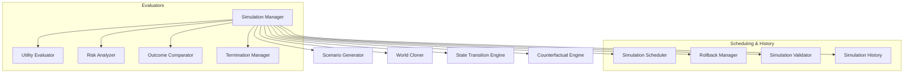

# HSCI V5 — Simulation Engine Architecture (SEA-1)

**Version**: 1.0  
**Status**: Constitutional Cognitive Specification  
**Verdict**: Approved for Milestone 2 Development  

---

## 1. Purpose

The Simulation Engine (SE) acts as HSCI's "imagination." It evaluates possible futures without mutating the active, real-world state of the World Model.

### Terminology Matrix
*   **Prediction / Forecasting**: Extrapolations of current trends.
*   **Counterfactual**: Speculative "what if" queries contradicting known historical events.
*   **Mental Model / Imagination**: A temporary execution environment isolating branches from real-world changes.
*   **Planning**: Sequenced actions to achieve a target state.
*   **Reasoning**: Proving logical axioms.
*   **Simulation**: Projecting state transitions chronologically to evaluate risk and utility.

*Simulation never changes reality*: Simulated branches use copy-on-write page allocations. Direct modifications occur only on forks, preventing corruption of the real-world branch.

---

## 2. Positioning Inside HSCI

```
World Model (WMA-1) ──► Attention System ──► Belief System (BSA-1)
                                                 │
                                                 ▼
                                        Simulation Engine (SEA-1)
                                                 │
                               ┌─────────────────┴─────────────────┐
                               ▼                                   ▼
                         Task Planner                       Reasoning Engine
```
### Why Simulation Operates Before Planning Execution Commits
Before executing an HTN task sequence in the real world, the system must verify its expected utility and side effects. Running task sequences directly can lead to physical collisions or logic crashes. The Simulation Engine forks a mental branch, evaluates outcomes, and returns recommendation scores, allowing the planner to select the optimal path.

---

## 3. Subsystem Architecture Overview



---

## 4. Simulation Object Model & Lifecycle

### 4.1 Simulation Object Schema
*   **Simulation ID**: Unique coordinate namespace (e.g. `sim.route.choice.001`).
*   **Parent World**: Reference branch pointer.
*   **Simulation Depth**: Current trajectory step count.
*   **Utility & Risk Scores**: Normalized floats \(\in [0.0, 1.0]\).
*   **Assumptions**: A list of temporary beliefs injected for this simulation branch.

### 4.2 Simulation Lifecycle
`Created` \(\rightarrow\) `Initialized` \(\rightarrow\) `Running` \(\rightarrow\) `Branching` \(\rightarrow\) `Evaluating` \(\rightarrow\) `Completed` \(\rightarrow\) `Compared` \(\rightarrow\) `Archived`.

---

## 5. World Branching & Copy-on-Write Isolation

To support parallel scenario exploration, the World Cloner implements **Copy-on-Write (CoW)** isolation:

```mermaid
graph TD
    Base["Base World (Real State: John in Kitchen)"]
    Base --> BranchA["Branch A (Route A: John drives car)"]
    Base --> BranchB["Branch B (Route B: John walks)"]
    
    Note over BranchA, BranchB: Branches clone entity references. Changes write locally to Branch tables.
```
*   **Merge Prohibition**: Sim branches can never be merged back into the live World Model. They serve exclusively as informational read outputs.

---

## 6. State Transition & Utility Scoring

### 6.1 State Transition Model
Transitions map state changes:

\[
State_{t+1} = Transition(State_t, Action_t)
\]

### 6.2 Utility & Risk Scoring
The Outcome Comparator calculates net utility (\(U_{net}\)) to select recommendations:

\[
U_{net}(s) = P_{success}(s) \cdot Utility_{Goal}(s) - (1.0 - Confidence(s)) \cdot Risk_{Cost}(s)
\]

---

## 7. Complete Walkthrough Benchmarks

### Scenario A: Route Recommendation
User: *"Should I take Route A or Route B to reach the airport?"*
1.  **Branching**: World Cloner forks `BranchA` (Route A) and `BranchB` (Route B) from Base World.
2.  **Simulation Runs**:
    *   `BranchA`: Transition(Route_A, drive) \(\rightarrow\) `duration: 35m`, `risk: 0.1` (highway).
    *   `BranchB`: Transition(Route_B, drive) \(\rightarrow\) `duration: 40m`, `risk: 0.3` (city construction).
3.  **Utility Comparison**:
    *   \(U_{net}(BranchA) = 0.95 \cdot 0.9 - 0.05 \cdot 0.1 = 0.85\).
    *   \(U_{net}(BranchB) = 0.90 \cdot 0.8 - 0.10 \cdot 0.3 = 0.69\).
4.  **Recommendation**: "Take Route A (estimated 35 minutes, lower congestion)."

### Scenario B: Weather counterfactual
*"What if heavy rain begins halfway through the journey?"*
1.  **Fork**: Scenario Generator forks `BranchA_rain` at `t = 15m`.
2.  **Assumption Ingested**: `weather(rain) = True`.
3.  **Transition Propagation**: `rain -> road_grip: low -> speed: low -> delay: +20m`.
4.  **Recalculation**: \(U_{net}(BranchA\_rain)\) drops to \(0.55\).
5.  **Rollback**: Rollback Manager resets simulated actions; Outcome Comparator adjusts recommendation.

---

## 8. Simulation Metrics

*   **Average Branching Factor**: Number of parallel paths explored per query.
*   **Utility Estimation Accuracy**: Correlation between predicted outcomes and final real-world event results.
*   **Rollback Frequency**: Number of step resets executed during conflict handling.

---

## 9. SEA-1 Architecture Principles

The Simulation Engine **MUST NOT**:
1.  Mutate the live World Model.
2.  Update permanent Belief scores.
3.  Commit tasks to planning execution.

Its sole responsibility is generating speculative state projections and calculating risk-utility weights.
