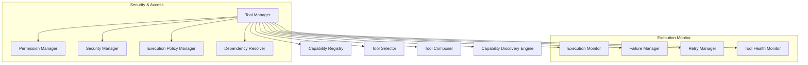
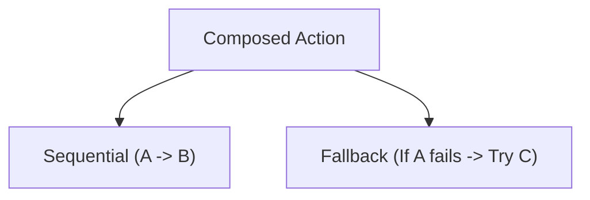

# HSCI V5 — Tool & Capability Architecture (TCA-1)

**Version**: 1.0  
**Status**: Constitutional Cognitive Specification  
**Verdict**: Approved for Milestone 2 Development  

---

## 1. Purpose

The Tool & Capability Architecture (TCA-1) manages executable capabilities and validates external system calls for HSCI. It isolates execution environments to enforce security and resource policies.

### Terminology Matrix
*   **Capability**: The symbolic description of a functional category (e.g. `capability.network.send_email`).
*   **Tool**: The concrete script or API implementing a capability (e.g. `sendgrid_smtp_sender`).
*   **Permission**: Tokenized access rights to execute a tool.
*   **Action**: A single task step executed in a plan.
*   **Resource**: CPU, Memory, or Disk budgets assigned to a tool run.

*Decoupled Representation*: Capabilities are described symbolically (Preconditions, Postconditions, Schema) inside the registry, independent of the underlying code, allowing the task planner to draft actions before loading dependencies.

---

## 2. Positioning Inside HSCI

```
Meta-Reasoning (MRA-1) ──► Tool & Capability (TCA-1) ──► Task Planner (HTN)
                                                               │
                                                               ▼
                                                       Execution Engine
```
### Why Tool Selection Occurs Before Execution Planning
The HTN planner needs to know which tools are available and what parameters they require *before* building the task hierarchy. If planning ran first, it might compile task nodes for which no executable tools or permissions exist, leading to redundant calculations and plan rollbacks.

---

## 3. Subsystem Architecture Overview



---

## 4. Tool Object Schema & Execution Lifecycle

### 4.1 Tool Object Schema
*   **Tool ID**: Unique coordinate namespace (e.g. `tool.system.pdf_parser.001`).
*   **Capabilities**: Array of capability URIs satisfied.
*   **Preconditions / Postconditions**: Predicate conditions verified by Z3.
*   **Reliability Score**: Float \(\in [0.0, 1.0]\) tracking success history.
*   **Timeout**: Maximum execution runtime limit (ms).

### 4.2 Execution Lifecycle
`Requested` \(\rightarrow\) `Validated` \(\rightarrow\) `Authorized` \(\rightarrow\) `Allocated` \(\rightarrow\) `Executing` \(\rightarrow\) `Monitoring` \(\rightarrow\) `Completed` \(\rightarrow\) `Verified` \(\rightarrow\) `Archived`.

---

## 5. Tool Selection & Composition

### 5.1 Tool Selection Policy
The Tool Selector resolves tool requests deterministically using a selection score (\(S_{tool}\)):

\[
S_{tool} = w_r \cdot Reliability(t) - w_l \cdot Latency(t) - w_c \cdot Cost(t)
\]

*   Selected tools must satisfy all Z3 consistency preconditions and policy permissions.

### 5.2 Tool Composition
TCA-1 supports sequential, parallel, conditional, and fallback pipeline orchestration:



---

## 6. Complete Walkthrough Benchmarks

### Scenario A: PDF Summary & Email Pipeline
User: *"Summarize this PDF and email it to my manager."*
1.  **Discovery**: Capability Discovery Engine queries registry for target requirements: `capability.document_parsing` and `capability.network.send_email`.
2.  **Selection**: Tool Selector matches `pdf_extractor_v2` and `outlook_smtp_v1`.
3.  **Permission check**: Permission Manager verifies user authorization token.
4.  **Composition**: Tool Composer structures a sequential pipeline: `pdf_extractor_v2 | email_sender`.
5.  **Execution**: Monitor verifies input PDF schema, launches extraction, captures output string, verifies SMTP connection, and dispatches the email.
6.  **Archive**: Execution logs are saved to history.

### Scenario B: SMTP Fallback Recovery
SMTP server fails due to network outage.
1.  **Failure Detection**: Execution Monitor captures connection timeout error.
2.  **Retry**: Retry Manager attempts connection 3 times (500ms intervals).
3.  **Fallback Trigger**: Failure Manager halts SMTP execution and requests a fallback tool from the Selector.
4.  **Recovery**: Selector returns alternative tool `slack_notifier_v1`.
5.  **Composition Shift**: Composer reroutes summary output to the slack API channel.
6.  **Audit**: Tool Health Monitor penalizes `outlook_smtp_v1` reliability score, logging the event.

---

## 7. Capability Metrics

*   **Execution Success Rate**: Percentage of completed tool runs to total dispatches.
*   **Failure Recovery Rate**: Ratio of successful fallback resolutions to total tool errors.
*   **Policy Compliance Rate**: Compliance fraction to security constraints.

---

## 8. TCA-1 Architecture Principles

The Tool & Capability Architecture **MUST NOT**:
1.  Bypass permissions checked by the Executive Controller.
2.  Directly mutate World Model state variables.
3.  Execute tools outside sandboxed process boundaries.

Its sole responsibility is registry audits, dependency resolutions, sandbox authorization, pipeline composition, and failure recovery.
