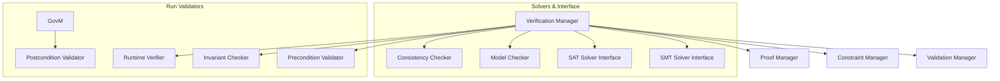
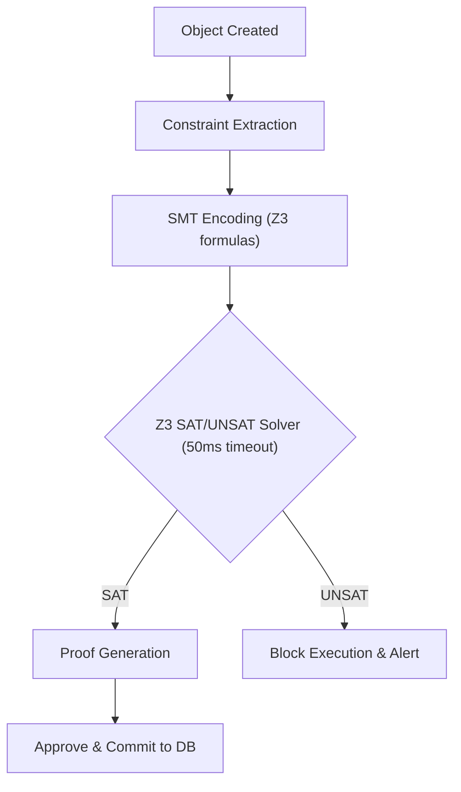

# HSCI V5 — Verification & Validation Architecture (VVA-1)

**Version**: 1.0  
**Status**: Constitutional Cognitive Specification  
**Verdict**: Approved for Milestone 2 Development  

---

## 1. Purpose

The Verification & Validation Architecture (VVA-1) functions as HSCI's formal correctness layer. It generates formal proofs to ensure all system decisions, beliefs, and updates are mathematically and logically correct.

### Terminology Matrix
*   **Verification**: Proving that the system is building the product correctly according to design specs (using SMT solvers like Z3).
*   **Validation**: Proving that the product solves the target user task correctly (using runtime trace assertion checks).
*   **Proof**: A formally derived sequence of sat logical axioms.
*   **Model Checking**: Systematically exploring state transition paths to find invariant violations.
*   **Constraint / Invariant**: Immutable system invariants that must be satisfied.

*Decoupled Governance*: Governance (GCA-1) defines the rules, whereas Verification (VVA-1) executes the mathematical SMT checks proving that target actions satisfy those rules.

---

## 2. Positioning Inside HSCI

```
Governance (GCA-1) ──► Verification (VVA-1) ──► Executive Controller (ECA-1)
                                                     │
                                                     ▼
                                            All Cognitive Modules
```
### Why Verification Occurs Before and After Execution
*   **Pre-execution**: Proves that the plan's preconditions are logically satisfied and that the plan does not violate any safety rules.
*   **Post-execution**: Validates that actual output matches the postconditions, detecting logic errors or hardware faults.

---

## 3. Subsystem Architecture Overview



---

## 4. Verification Object Model & Formal Pipeline

### 4.1 Verification Object Schema
*   **Verification ID**: Unique coordinate namespace (e.g. `verify.tx.transfer_funds.001`).
*   **Proof Status / Validation Status**: Enums (`SAT`, `UNSAT`, `TIMEOUT`, `UNKNOWN`).
*   **Verification Version**: Monotonically increasing number.
*   **Proof Cache Reference**: Pointer to matching proof artifacts.

### 4.2 Formal Verification Pipeline


---

## 5. Runtime Validation & Proof Management

*   **Runtime Precondition Checks**: Before a tool runs, VVA-1 evaluates whether system state variables match preconditions.
*   **Proof Cache**: Stores verified proofs. If a new request matches a cached proof signature, VVA-1 returns the cached validation, skipping the Z3 solver run.

---

## 6. Complete Walkthrough Benchmarks

### Scenario A: Funds Transfer Verification
User: *"Transfer $100 from Account A to Account B."*
1.  **Goal Ingest**: Goal Manager routes request to VVA-1.
2.  **Constraint Extraction**: Extract predicates:
    *   Preconditions: `balance(Account_A) >= 100` and `valid(Account_B) = True`.
    *   Postconditions: `balance_after(Account_A) == balance_before(Account_A) - 100` and `balance_after(Account_B) == balance_before(Account_B) + 100`.
    *   Invariants: `balance(Account_A) >= 0` and `balance(Account_B) >= 0`.
3.  **SMT Encoding**: Translates constraints to Z3 formulas.
4.  **SMT Solve**: Z3 checks consistency. Verification returns `SAT` (assuming Account A has sufficient funds).
5.  **Governance Check**: Passes safety policy.
6.  **Post-Execution Validation**: Execution engine completes the transfer. VVA-1 checks account balances, confirms the postconditions, generates a transaction proof log, and archives the transaction.

### Scenario B: Optimization Rule Integration
LAA-1 proposes new rule: `apply_index(table, column) -> reduces_latency`.
1.  **Ingest**: Rule passes to Consistency Checker.
2.  **SMT Encoding**: Rule behavior translated to logic assertions.
3.  **Constraint Solving**: Z3 verifies that the rule does not conflict with existing indexing schemas.
4.  **Proof Generation**: Z3 returns `SAT` with proof trace.
5.  **Commit**: Proof is saved; rule is committed to USM.

---

## 7. Verification Metrics

*   **Verification Success Rate**: Ratio of successfully verified actions to total requests.
*   **Proof Generation Latency**: Time (ms) required to generate proofs (under 50ms constraint).
*   **Proof Reuse Rate**: Percentage of verification requests resolved using cached proofs.

---

## 8. VVA-1 Architecture Principles

The Verification & Validation Architecture **MUST NOT**:
1.  Alter system governance policies directly.
2.  Execute tasks in the live environment.
3.  Permit execution of actions when Z3 returns `UNSAT` or `TIMEOUT`.

Its sole responsibility is SMT constraint solving, runtime trace checking, proof trace archiving, and consistency auditing.
