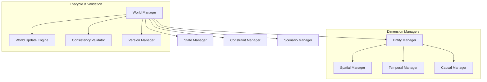
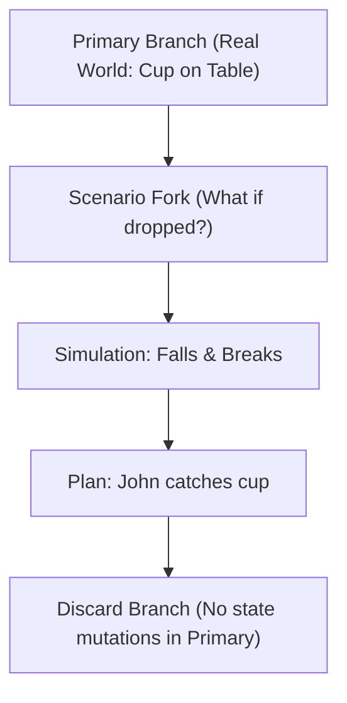
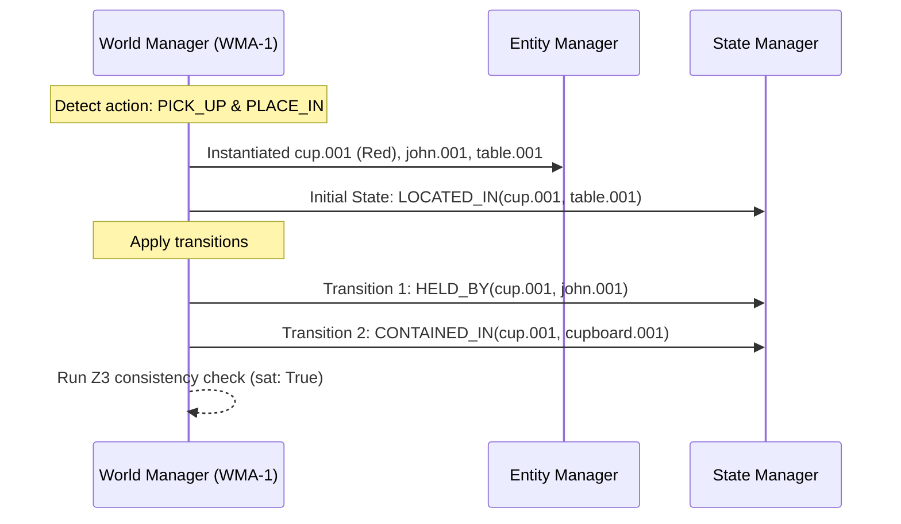

# HSCI V5 — World Model Architecture (WMA-1)

**Version**: 1.0  
**Status**: Constitutional Cognitive Specification  
**Verdict**: Approved for Milestone 2 Development  

---

## 1. Purpose

The World Model (WM) is HSCI's internal representation of reality. It tracks the current state of entities, temporal-spatial variables, and causal dependencies to serve as a shared, logical substrate for reasoning, planning, and simulation.

### Subsystem Distinctions
*   **Knowledge**: Persistent abstract categories, semantic primitive classifications, and rules.
*   **Memory (USM)**: Storage indexing tracking historical states and assertions.
*   **Meaning Graph**: Pre-logical syntax semantics extracted from individual sentences.
*   **Context**: Active focus parameters (goals, conversation) used for disambiguation.
*   **World Model**: The unified, active state of the current environment containing instantiated entities and constraints.
*   **Reasoning / Planning / Simulation**: Algorithmic executions operating over the World Model.

---

## 2. Positioning Inside HSCI

```
Context-Enriched Meaning Graph ──► Executive Controller (ECA-1)
                                             │
                                             ▼
                                     World Model (WMA-1)
                                             │
                       ┌─────────────────────┼─────────────────────┐
                       ▼                     ▼                     ▼
                Reasoning Engine       Task Planner        Simulation Engine
```
All cognitive engines query the World Model rather than raw text. This guarantees a unified, non-contradictory state during logical deduction and HTN planning.

---

## 3. Subsystem Architecture Overview



### Module Descriptions
*   **World Manager**: Main executive module managing updates and orchestration.
*   **Entity Manager**: Instantiates and tracks objects, agents, and organizations.
*   **State Manager**: Tracks active state variables (e.g. `is_locked`, `temperature`).
*   **Constraint Manager**: Enforces physical and logical laws (e.g. gravity, non-contradiction).
*   **Scenario Manager**: Manages hypothetical parallel world branches.
*   **Causal Manager**: Resolves event effect propagation chains.
*   **Consistency Validator**: Dispatches Z3 to ensure new states do not violate invariants.

---

## 4. World Representation & State Lifecycle

### 4.1 State Entities Model
*   **Identity**: Immutable coordinate namespace (e.g. `entity.cup.001`).
*   **Current State**: Active attributes (`color: red`, `location: table`).
*   **Historical State**: Chronological stack of previous versions.
*   **Possible Future State**: Branches managed by the Scenario Manager.

### 4.2 State Lifecycle Transitions
`State Creation` \(\rightarrow\) `State Update` \(\rightarrow\) `State Transition` \(\rightarrow\) `State Merge / Split` \(\rightarrow\) `Archival / Deletion`.

---

## 5. Event, Temporal, and Spatial Models

### 5.1 Event Model
Events represent transitions between states:
*   **Preconditions**: Logical constraints required to trigger the event (e.g. `LOCKED(door) == False`).
*   **Postconditions / Effects**: Mapped state modifications (e.g. `CONTAINED_IN(cup, cupboard) == True`).

### 5.2 Temporal Model
Tracks intervals using Allen's Interval Algebra. Enforces chronological order consistency (e.g. an event cannot have postconditions that occur before preconditions).

### 5.3 Spatial Model
Represents containment and topology (`LOCATED_IN`, `CONTAINED_IN`, `ADJACENT_TO`). Avoids coordinate math bottlenecks by using qualitative spatial representation schemas.

---

## 6. Constraint System & Causal Model

*   **Constraint System**: Physical constraints (e.g. solid objects cannot occupy the same spatial coordinates simultaneously) are defined as logical invariant rules in Z3.
*   **Causal Model**: Propagation loops calculate side effects. For example, if a cup is dropped, the Causal Manager propagates the effect: `dropped(cup) -> falls(cup) -> hits_floor(cup) -> breaks(cup)`.

---

## 7. Hypothetical Worlds (Simulation & Planning)

The Scenario Manager implements thread-safe **World Branching**:
*   **Real World (Primary Branch)**: Represents current known reality.
*   **Hypothetical Branch (Fork)**: Clones entity nodes using copy-on-write pointers. Planning and simulation operate exclusively inside the fork, isolating the Primary Branch from speculative edits.
*   **Rollback**: Simply discards the Hypothetical Branch.



---

## 8. Failure Modes & Recovery Procedures

*   **Impossible State / Inconsistency**: Occurs if a state change violates spatial or physical laws (e.g., cup in table and cupboard simultaneously).
*   **Recovery**: Aborts the update transaction, rolls back to the previous version snapshot, and alerts the Context Engine.

---

## 9. Complete Walkthrough Benchmark

### Ingestion 1: *"John picks up a red cup from the kitchen table and places it inside the cupboard."*



### Counterfactual Branch: *"What if John dropped the cup?"*
1.  **Fork**: Scenario Manager clones `Primary` state to `branch.fork.01`.
2.  **Trigger Event**: `DROP(john.001, cup.001)`.
3.  **Causal Propagation**:
    *   `FALL(cup.001)` \(\rightarrow\) `COLLIDE(cup.001, floor.001)`.
    *   `COLLIDE` triggers constraint: `velocity > threshold -> STATE(cup.001) = broken`.
4.  **Hypothetical Outcome**: Branch returns result `broken(cup.001)`, leaving Primary Branch unmodified.

---

## 10. WMA-1 Architecture Principles

The World Model **MUST NOT**:
1.  Verify downstream logical proofs.
2.  Execute HTN planner steps.
3.  Modify long-term permanent concept databases.

Its sole responsibility is representing and managing active world state variables.
