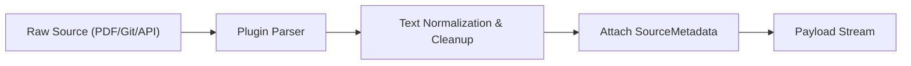

# HSCI V4 — Knowledge Acquisition Design (Knowledge_Acquisition_Design.md)

This document specifies the design of the plugin-based Knowledge Acquisition Layer (KAL), responsible for reading and normalizing raw text files, live APIs, and database sources into standard semantic ingestion payloads.

---

## 1. Plugin Architecture & Interfaces

The KAL defines a standard `IKnowledgeSourcePlugin` interface. New input types (PDF, Markdown, HTML, Wikipedia, Source Code) implement this interface to register formatting converters:

```python
from abc import ABC, abstractmethod
from typing import Generator, Dict, Any

class SourceMetadata:
    def __init__(self, source_id: str, URI: str, source_type: str, ingestion_timestamp: float):
        self.source_id = source_id
        self.URI = URI
        self.source_type = source_type
        self.ingestion_timestamp = ingestion_timestamp

class IngestionPayload:
    def __init__(self, content: str, metadata: SourceMetadata):
        self.content = content
        self.metadata = metadata

class IKnowledgeSourcePlugin(ABC):
    @abstractmethod
    def initialize(self, config: Dict[str, Any]) -> None:
        pass

    @abstractmethod
    def acquire(self) -> Generator[IngestionPayload, None, None]:
        """Streams normalized payloads from the source repository."""
        pass
```

---

## 2. Ingestion Pipeline



---

## 3. Streaming vs. Batch Ingestion Modes

*   **Streaming Mode**: Continuous real-time API integrations (e.g. Chat stream, Live Slack, Webhook feeds) push chunks to the validation buffer iteratively.
*   **Batch Ingestion**: Bulk operations (e.g. loading a collection of PDF books or Wikipedia dumps) use memory-mapped chunk file readers to parallelize parsing workloads.

---

## 4. Error Handling & Data Fault Isolation

If a source plugin fails (due to decryption errors, bad encodings, or connection timeouts):
1.  **Isolation**: The pipeline traps the exception using plugin-level try-catch wrappers, preventing the global kernel process from failing.
2.  **Quarantine**: The raw source URI is flagged and written to a quarantine database (`quarantined_sources`).
3.  **Logs**: An `IngestionFailed` event is emitted via the `EventBus` for system diagnosis.
