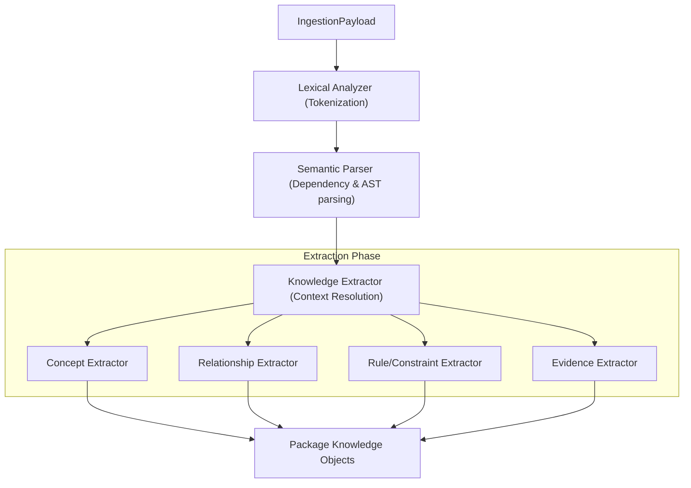

# HSCI V4 — Knowledge Compiler Design (Knowledge_Compiler_Design.md)

This document specifies the design of the Knowledge Compiler (KC), which processes raw text payloads through lexical, grammatical, and extraction phases to produce structured, logical Knowledge Objects.

---

## 1. Compiler Pipeline Stages

The Knowledge Compiler is designed similarly to a programming language compiler, translating natural language into formal logical declarations:

---

## 2. Compiler Phase Details

### Phase 1: Lexical Analysis
*   Tokenizes raw string feeds into unified term tokens.
*   Assigns Pos-Tags (Parts of Speech) to identify nouns, verbs, and qualifiers.

### Phase 2: Semantic Parsing
*   Builds an Abstract Syntax Tree (AST) representing grammatical hierarchies.
*   Resolves semantic reference targets (e.g. pronouns resolving to correct entities).

### Phase 3: Extraction Engines
*   **Concept Extractor**: Identifies nouns matching established concept lists or defines new proposals.
*   **Relationship Extractor**: Extracts logical links (verbs forming assertions like `specializes_to` or `generalizes_to`).
*   **Rule/Constraint Extractor**: Translates conditional sentences (e.g. "If X is true, then Y must occur") into Z3-compatible symbolic equations.
*   **Evidence Extractor**: Binds assertions to source hashes and citations.

---

## 3. Output Package: Knowledge Objects

The compilation process produces `KnowledgeObject` structures containing:
*   `concepts`: Lists of proposed concept changes.
*   `relations`: Map of discovered target coordinate tuples.
*   `axioms`: SMT-compliant validation string schemas.
*   `evidence`: Linked hashes referencing the source document metadata.
