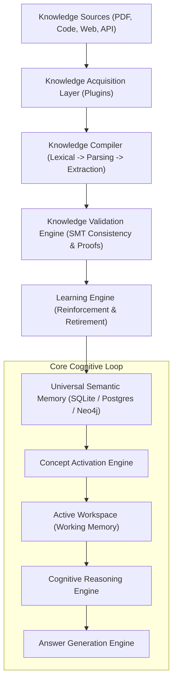
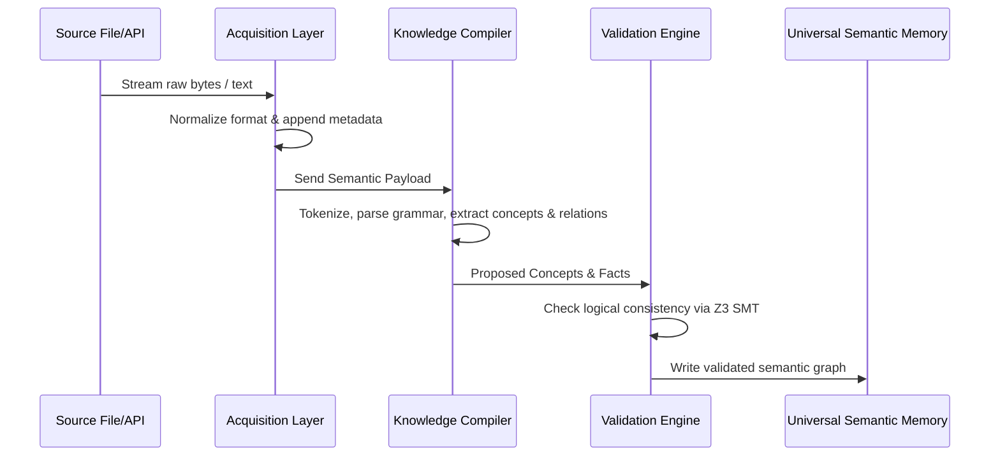

# HSCI V4 — Knowledge Infrastructure Architecture Specification (Knowledge_Infrastructure_Architecture.md)

This document specifies the architectural layout, core processing pipelines, and modular subsystems comprising the HSCI V4 Knowledge Infrastructure.

---

## 1. Overall System Architecture Diagram

The knowledge flow pipeline is structured as follows:

---

## 2. Dynamic Pipeline Life-Cycle & Data Flow

---

## 3. Subsystem Breakdown & Non-Functional Requirements

The knowledge infrastructure is segmented into 10 decoupled subsystems:
1.  **Core Ontology**: The base representation classes.
2.  **Acquisition Layer**: Plugin endpoints normalizing raw text.
3.  **Ontology Builder**: Maintains taxonomy hierarchies, aliases, and splits/merges.
4.  **Knowledge Compiler**: The lexical/semantic extraction pipeline.
5.  **Validation Engine**: Checks logical alignment using SMT theorem solvers.
6.  **Learning Engine**: Implements reinforcement and memory forgetting.
7.  **Relationship Discovery Engine**: Derives semantic links (`IS_A`, `PART_OF`, etc.).
8.  **Knowledge Lifecycle**: Maps concept states (Raw -> Accepted -> Optimized).
9.  **Universal Semantic Memory**: Long-term memory store.
10. **Orchestration**: Coordinated by the `BrainKernel`.

### Non-Functional Requirements
*   **Scale**: Designed to support millions of concepts and billions of relationships.
*   **Storage Portability**: Abstract memory interfaces allow migration from SQLite today to PostgreSQL or Neo4j graph databases tomorrow.
*   **Concurrency**: Lock-free reads, thread-isolated SQLite writes, and transactional savepoints.
