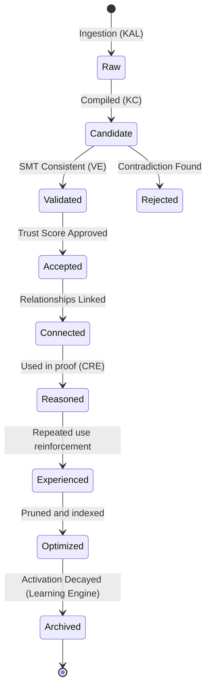

# HSCI V4 — Knowledge Lifecycle Specification (Knowledge_Lifecycle_Specification.md)

This document specifies the states, state transition rules, and validation policies that govern semantic concepts during their lifespan.

---

## 1. Lifecycle State Machine

A concept progresses through 9 distinct lifecycle states:

---

## 2. Transition Guard Constraints

To move between lifecycle states, the concept payload must satisfy strict constraints:

| Start State | Target State | Required Action / Guard Condition |
|---|---|---|
| **Raw** | **Candidate** | Syntactic parsing passes with clean JSON AST packaging. |
| **Candidate** | **Validated** | Z3 solver evaluates the logic checks matrix as consistent (`sat`). |
| **Validated** | **Accepted** | Trust formula calculation returns \(Trust_{final} \ge 0.65\). |
| **Accepted** | **Connected** | At least one relationship type link is verified to another concept node. |
| **Connected** | **Reasoned** | The concept ID is recorded in a successful request-scoped `ReasoningTrace`. |
| **Reasoned** | **Experienced** | Activation count exceeds 10 instances. |
| **Experienced** | **Optimized** | Redundant or duplicate properties are consolidated. |
| **Optimized** | **Archived** | Memory forgetting time-based decay threshold is breached. |
