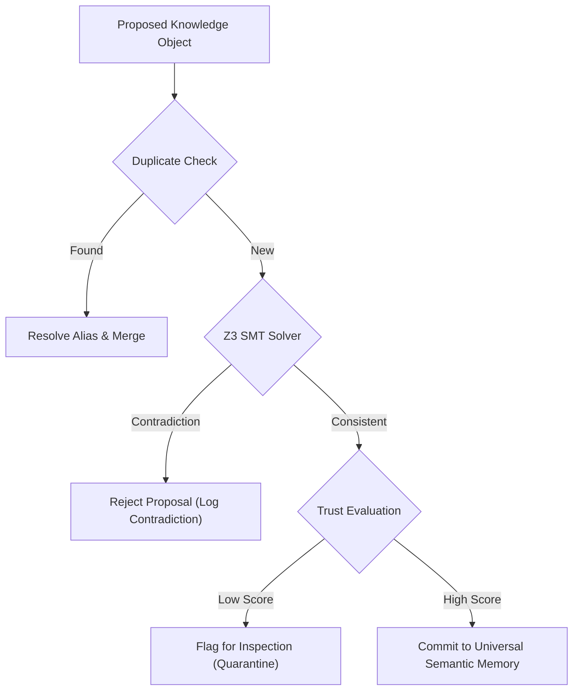

# HSCI V4 — Knowledge Validation Design (Knowledge_Validation_Design.md)

This document specifies the validation systems that safeguard the Universal Semantic Memory against duplicate, contradictory, or low-trust concept injections.

---

## 1. Validation Verification Architecture

Validation is processed sequentially using SMT validation engines and trust calculators:

---

## 2. Validation Engines

### 2.1 Duplicate Concept & Alias Resolution
*   Calculates alias mapping and synonym matches using case-insensitive lookup indices.
*   Merges identical entities to prevent ontology namespace pollution.

### 2.2 SMT Contradiction Detection
*   Translates new rule proposals and facts into Microsoft Z3 solver assertions.
*   Validates consistency: if Z3 evaluates the assertion matrix as `unsat`, the system flags a negation contradiction and rejects the update.

### 2.3 Trust & Provenance Calculations
*   **Confidence Score (\(C_{k}\))**: Initial score assigned during compilation based on extract clarity.
*   **Source Trust Factor (\(T_{s}\))**: Hardcoded or dynamic trust rating of the ingestion path (e.g. verified textbook = 1.0, user chat = 0.6).
*   **Evidence Quality (\(E_{q}\))**: Quantity of independent sources confirming the assertion.
*   **Consolidated Trust Formula**:
    \[
    Trust_{final} = C_{k} \times T_{s} \times \left(1.0 - e^{-E_{q}}\right)
    \]

---

## 3. Version Conflict Resolution

If a concept exists with a higher version stamp, the manager rejects backward updates unless an administrator triggers a manual historic restoration rollback.
