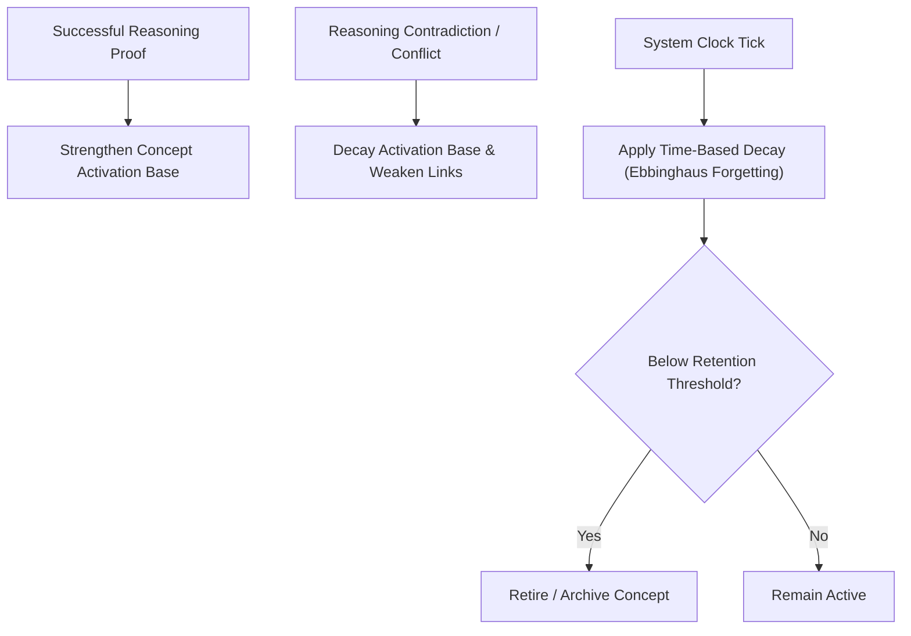

# HSCI V4 — Learning Engine Design (Learning_Engine_Design.md)

This document specifies the design of the Learning Engine, which governs self-evolution, activation adjustments, forgetting metrics, and concept retirement strategies.

---

## 1. Learning Lifecycle Loop

---

## 2. Dynamic Memory Optimization Algorithms

### 2.1 Ebbinghaus Forgetting Curve Simulation
The system periodically decays the activation potential base value (\(A_{base}\)) of concepts over time to prevent memory bloat and prioritize frequently used concepts:
\[
A_{base}(t) = A_{base}(0) \times e^{-\frac{t}{S}}
\]
Where:
*   \(t\) is the time elapsed since the concept was last accessed or verified.
*   \(S\) is the memory strength factor (increased by successful reasoning activations).

### 2.2 Relationship Reinforcement
Each time a relationship is traversed in a successful reasoning proof, its weight is reinforced:
\[
W_{new} = W_{old} + \alpha \times (1.0 - W_{old})
\]
Where \(\alpha\) is the learning rate factor (defaults to 0.1).

### 2.3 Knowledge Weakening and Retirement
If a concept's base activation score drops below a minimum retention threshold (e.g. \(A_{base} < 0.10\)), the Learning Engine:
1.  Removes the concept from the active cache database.
2.  Compresses and serializes it into the long-term historical archive storage table.
