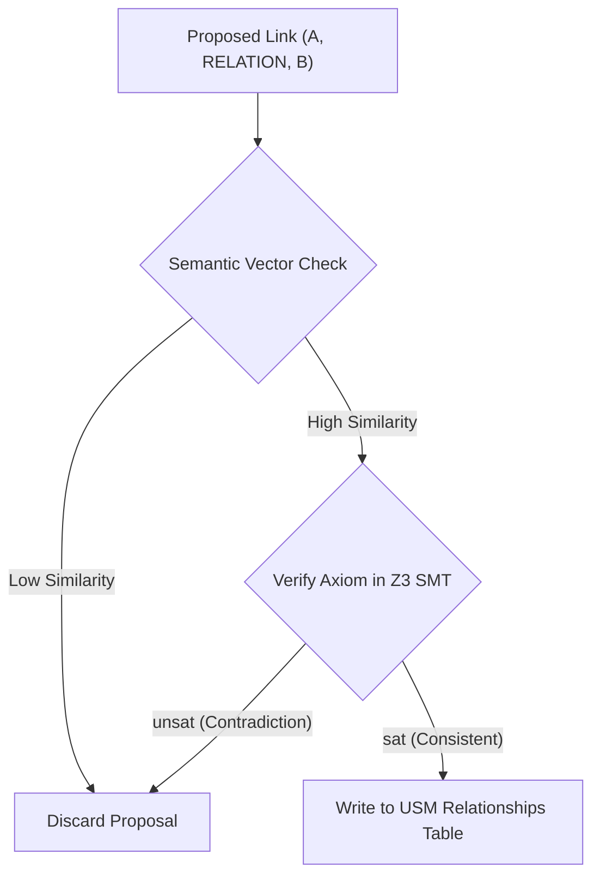

# HSCI V4 — Relationship Discovery Design (Relationship_Discovery_Design.md)

This document specifies the strategies, heuristic indicators, and logical verifiers used by the Relationship Discovery Engine (RDE) to establish structured links between concepts.

---

## 1. Discovered Relationship Types

HSCI automatically targets and indexes 12 core relationship types:

| Relationship Code | Type Category | Discovery Strategy |
|---|---|---|
| **IS_A** | Specialization | Extracted via subclass tokens and dictionary hierarchies. |
| **PART_OF** | Mereology | Derived from containment and structural descriptions. |
| **CAUSES** | Causality | Detected via event sequencing logs and causal transition statements. |
| **USES** | Functional | Extracted when an Action requires a target Entity. |
| **DEPENDS_ON** | Logical dependency | Solved via AST constraints compilation. |
| **SIMILAR_TO** | Heuristic similarity | Computed via alias index overlap or attribute match ratios. |
| **RELATED_TO** | General association | Populated for co-occurring concepts within similar scopes. |
| **SPECIALIZATION** | Taxonomy | Hierarchical child matching. |
| **GENERALIZATION** | Taxonomy | Hierarchical parent mapping. |
| **TEMPORAL** | Chronological | Derived from Event timestamps (e.g. `BEFORE`, `AFTER`). |
| **SPATIAL** | Topological | Calculated via coordinate mappings (e.g. `CONTAINED_IN`). |
| **FUNCTIONAL** | Action capability | Derived from methods, traits, and interface contracts. |

---

## 2. Discovery Verification Loops

Relationship proposals are verified through a logical pipeline before commitment:

*   **SMT Verification**: Before marking two concepts with `CAUSES` or `DEPENDS_ON`, the Z3 solver verifies that the dependency matches all global validation axioms.
