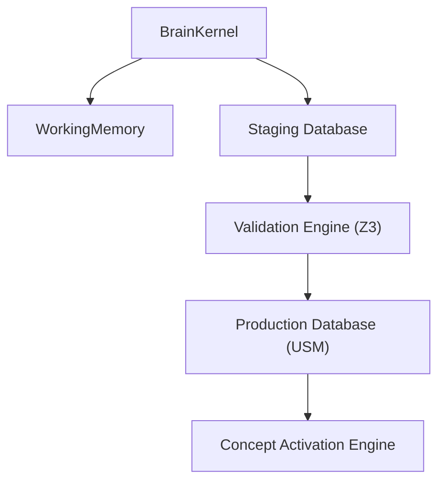

# SYSTEM ARCHITECTURE REVIEW (SAR-1)
## HSCI Knowledge Infrastructure Architecture Review Panel Report

**Status**: Published  
**Review Date**: 2026-07-18  
**Target Release**: Milestone 2 (v0.2.0-beta)  
**Authoritative Verdict**: **MAJOR REVISIONS REQUIRED**  

---

## 1. Executive Summary

This document presents the formal System Architecture Review (SAR-1) for the proposed HSCI Knowledge Infrastructure. The review panel analyzed the core ontology, acquisition streams, validation logic, compiler parsing, and semantic memory models. While the architecture presents a solid modular foundation leveraging Z3 SMT verifications and clean repository separations, critical failure points were identified in concept identity mapping, transaction boundaries under concurrent writes, and the lack of validation staging environments.

---

## 2. Architecture Scorecard

| Metric Category | Score (0-10) | Evaluation Rationale |
|---|---|---|
| **Core Ontology** | `7.0` | Well-defined primitives, but lacks dynamic contextual namespaces for domain shifts. |
| **Concept Identity** | `4.0` | High vulnerability to alias collisions and homonyms (e.g. Java Island vs. Language). |
| **Knowledge Compiler** | `8.0` | Solid 8-stage compiler design, but parsing requires semantic feedback loops. |
| **Validation Engine** | `6.0` | Z3 logical consistency is powerful but lacks CPU constraints under large transaction loops. |
| **Learning Engine** | `5.5` | In-place mutations of production database values present stability risks. |
| **Universal Memory** | `7.5` | Decoupled repository patterns are correct; SQLite concurrent writes present bottleneck issues. |
| **Implementation Readiness** | **5.0 / 10** | **MAJOR REVISIONS REQUIRED** before code implementation begins. |

---

## 3. Deep-Dive Subsystem Audits

### 3.1 Core Ontology
*   **Completeness**: Primitives (`Entity`, `Action`, etc.) map static facts well. However, they fail to model **meta-cognition** or **process state machines** natively.
*   **Extensibility**: Domain shifting (e.g. mapping quantum physics rules vs. corporate law codes) lacks a namespace containment boundary.
*   **Failure Case**: Corporate Law requires modeling "jurisdiction constraints" which cannot easily specialize from a simple `Object` or `Property` without introducing custom metadata dictionaries.

### 3.2 Canonical Concept Identity
*   **Alias Collisions**: Case-insensitive lookup fails under homonyms (e.g. `Apple` [fruit] vs. `Apple` [company]). 
*   **Homonym Vulnerability**: Ingestion of "Java is a programming language" and "Java is an island" would merge into a single concept `Java` without context-based namespaces.
*   **Resolution Requirement**: We must enforce mandatory namespace partitioning (`concept.fruit.apple` vs. `concept.corporation.apple`) for all concept identifiers.

### 3.3 Knowledge Object Schema Design
We define the canonical `KnowledgeObject` JSON Schema:
```json
{
  "$schema": "http://json-schema.org/draft-07/schema#",
  "title": "KnowledgeObject",
  "type": "object",
  "required": ["uuid", "canonical_name", "ontology_type", "validation_state", "lifecycle"],
  "properties": {
    "uuid": { "type": "string", "format": "uuid" },
    "canonical_name": { "type": "string" },
    "aliases": { "type": "array", "items": { "type": "string" } },
    "ontology_type": { "type": "string" },
    "description": { "type": "string" },
    "relationships": { "type": "array", "items": { "type": "object" } },
    "evidence": { "type": "array", "items": { "type": "string" } },
    "confidence": { "type": "number", "minimum": 0.0, "maximum": 1.0 },
    "trust": { "type": "number", "minimum": 0.0, "maximum": 1.0 },
    "version": { "type": "integer" },
    "validation_state": { "type": "string", "enum": ["Raw", "Candidate", "Validated", "Rejected"] },
    "lifecycle": { "type": "string" }
  }
}
```

### 3.4 Knowledge Validation & Concurrency
*   **Z3 Latency Bottleneck**: Performing SMT logic verification synchronously on the write thread under high concurrency will lead to execution freezes.
*   **Double-Write Transaction Violations**: Under concurrent database writes, SQLite's thread locking could abort long-running validation sequences.

### 3.5 Learning Engine & Mutations
*   **Direct Modification Risk**: The proposed design directly mutates production weights in the memory database.
*   **Correction**: All incoming concept proposals must be committed to a **Staging Database**. Once validated and optimized, they are migrated to Production.

---

## 4. Risk Classification Matrix

### 4.1 High Risk Areas
1.  **Homonym Merge Collisions**: High likelihood of merging unrelated entities sharing identical term tags.
2.  **Validation Loop Latencies**: Z3 execution durations under recursive dependency loops could escalate beyond the 50ms transaction timeout budget.

### 4.2 Medium Risk Areas
1.  **SQLite Concurrent Write Locks**: Database contention bottlenecks during batch document acquisitions.
2.  **Ebbinghaus Decay Starvation**: Aggressive forgetting curves may retire concepts currently referenced in pending workspace branches.

---

## 5. Recommended Refactoring & Diagrams

### 5.1 System Subsystem Dependencies


### 5.2 Decoupled Knowledge Ingestion Pipeline


---

## 6. Verdict Justification

**Verdict: MAJOR REVISIONS REQUIRED**

We cannot approve implementation in its current state. The concept identity model fails under homonyms, and mutating the production database directly without staging validation guarantees introduces structural logic corruption risks. The design must be revised to incorporate namespace isolates and staging tables before coding begins.
