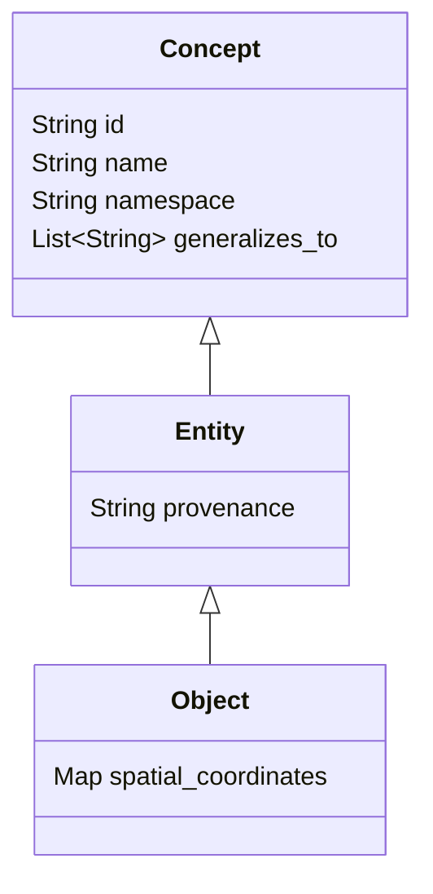

# HSCI V4 — Core Ontology Specification (Core_Ontology_Specification.md)

This specification defines the foundational semantic primitives, hierarchical relationship rules, and extension interfaces that compose the HSCI V4 core ontology schema.

---

## 1. Foundational Semantic Primitives

To establish a complete, structured model of the universe without probabilistic drift, HSCI defines 14 core primitives:

| Primitive Name | Definition | Role in Pipeline |
|---|---|---|
| **Entity** | A unique identified thing in the universe (physical or abstract). | The base coordinate node for all concepts. |
| **Object** | A physical Entity with spatial or structural coordinates. | Grounding for spatial and physical reasoning. |
| **Property** | A descriptive key-value attribute associated with an Entity. | Populates entity states (e.g. `color: blue`). |
| **Action** | A state transition or operation performed by or on an Entity. | Maps state changes (e.g. `c_inh` resolves redundancy). |
| **Event** | An instance of an Action occurring at a specific Time and Space coordinate. | Populates historical episode logs. |
| **State** | The condition of an Entity (its combined Properties) at a given point in Time. | Evaluated during reasoning validation. |
| **Goal** | A target State that an Agent seeks to satisfy. | Targets for the HTN task planner. |
| **Constraint** | A logical rule restricting valid values, properties, or actions. | Feeds SMT verifications (Z3 boundaries). |
| **Rule** | An implication axiom (e.g. `If A and B Then C`). | The reasoning rules evaluated by the CRE. |
| **Fact** | A verified relationship or state property with confidence score = 1.0. | Solidified, invariant knowledge. |
| **Relationship** | A typed directed link connecting two Entities. | Spreading activation hop routes. |
| **Time** | An absolute or relative chronological coordinate. | Order events and establish state provenance. |
| **Space** | A topological or geometric coordinate mapping. | Context limits. |
| **Evidence** | Supporting references (e.g. source document IDs, observation facts). | Populates answer verification trees. |

---

## 2. Ontology Inheritance Model

HSCI enforces strict single or multiple inheritance using structural `specializes` relationships:

---

## 3. Taxonomy Extensibility

The ontology is dynamically extensible. Third-party domains (e.g. Medicine, Java OOP) define namespaces (`lang.java.oop.*`) that inherit from the root primitives. New attributes are appended as serialized JSON properties to prevent database schema migrations when extending fields.
