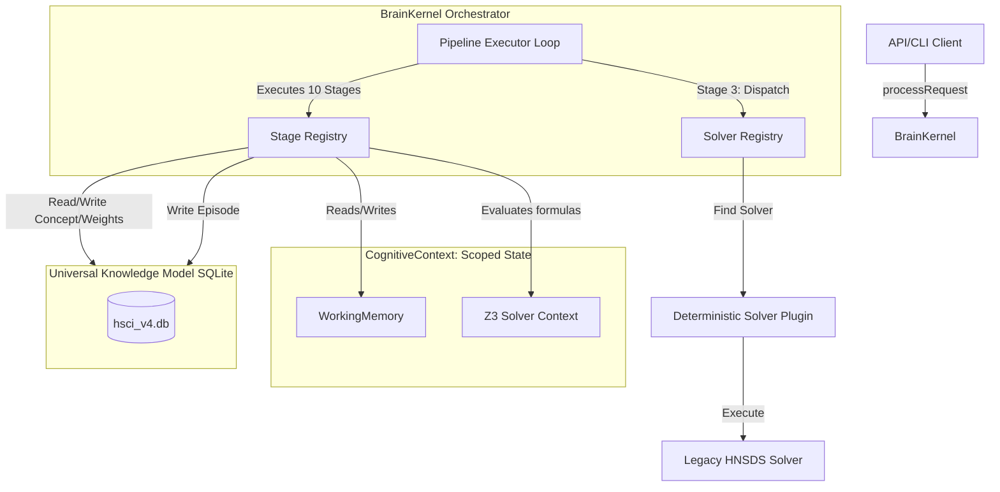
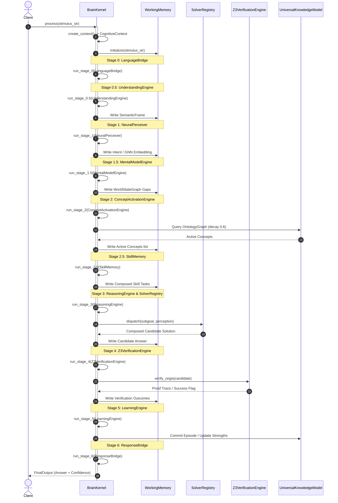
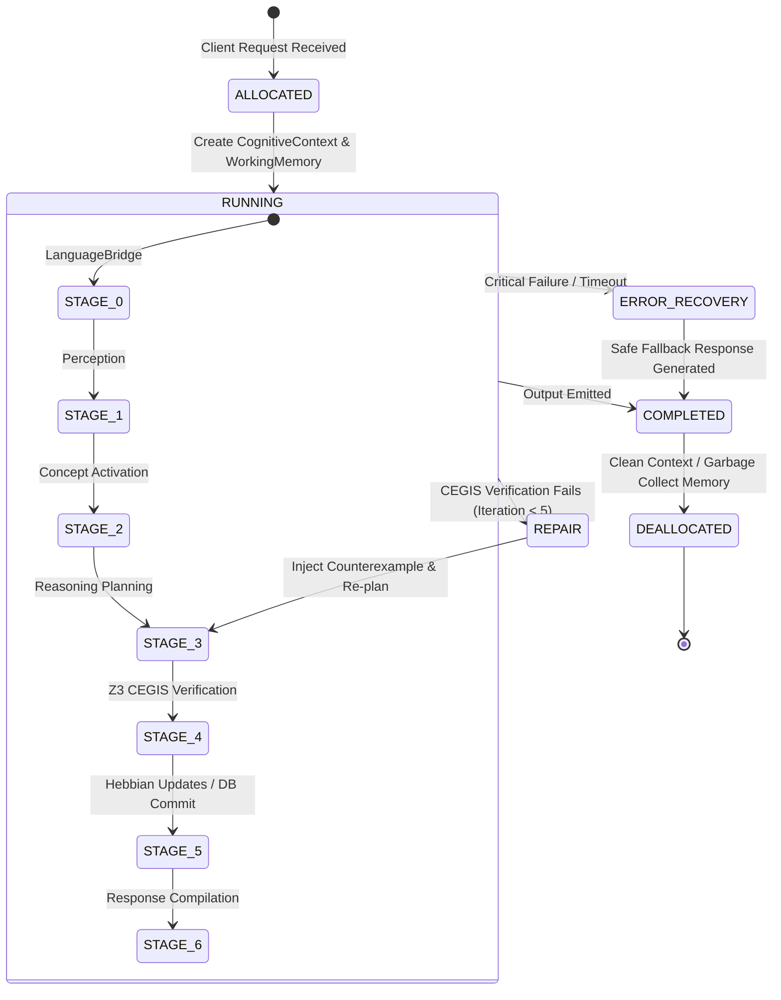
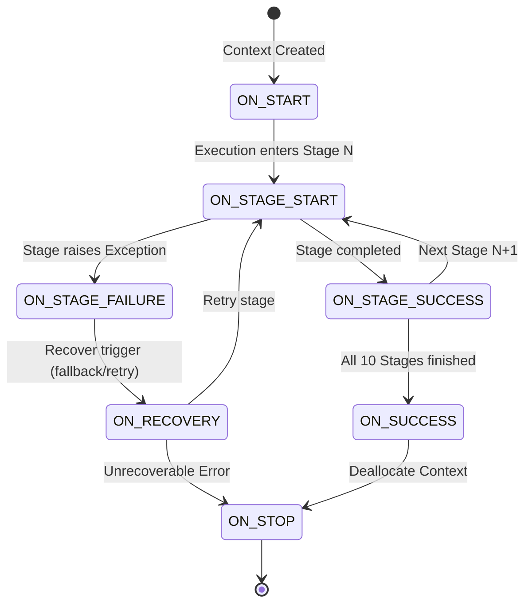

# HSCI V4 — BrainKernel Engineering Design (BrainKernel_Engineering_Design.md)

This document presents the technical design and architectural specifications for the `BrainKernel`, the core orchestrator of the Hyper-Symbolic Cognitive Invention (HSCI) V4 Cognitive Operating System.

---

## 1. Executive Summary & Scope

The `BrainKernel` is the central runtime orchestrator of HSCI V4, replacing the legacy V3 `RIRLoop` and V2 `HyperSymbolicBrain`. The primary objective is to manage the 10-stage execution pipeline, ensuring that every natural language request is formally parsed, reasoned about, verified via the Z3 SMT solver, and registered into the persistent database.

This engineering design provides the formal contract interfaces, context models, concurrency rules, lifecycle protocols, and testing strategies required to implement the `BrainKernel` in subsequent sprints.

---

## 2. Architecture Diagrams

The diagram below maps the runtime architecture of the `BrainKernel`, showing the interaction between the request execution loop, the stateful context, the plugins, and the database persistence layers.



---

## 3. Sequence Diagrams

The sequence diagram below traces the execution of a single cognitive process from client submission to response delivery, showing the flow across the 10 sequential pipeline stages.



---

## 4. Lifecycle Diagrams

### 4.1 Thinking Session Lifecycle
A "Thinking Session" represents the context lifecycle associated with processing a single prompt. It goes through four main phases:



### 4.2 Event Lifecycle
The `BrainKernel` emits lifecycle events to hooks or observers at each milestone:



---

## 5. System Interfaces & APIs

### 5.1 Public Interfaces

The primary gateway class for interacting with the cognitive runtime:

```python
class BrainKernel:
    """
    Core orchestrator of the 10-stage execution pipeline.
    """
    def __init__(self, config: SystemConfig, db_pool: ConnectionPool):
        self.config = config
        self.db_pool = db_pool
        self.stage_registry = StageRegistry()
        self.solver_registry = SolverRegistry()

    def initialize(self) -> None:
        """
        Initializes background threads, databases, and registers solver plugins.
        """
        ...

    def process(self, stimulus: str, session_id: str) -> FinalOutput:
        """
        Executes the 10-stage pipeline on the input prompt.
        """
        ...

    def shutdown(self) -> None:
        """
        Performs orderly shutdown of background threads and databases.
        """
        ...
```

### 5.2 Internal Interfaces

Every stage of the pipeline must implement the `IStageExecutor` interface:

```python
class IStageExecutor(ABC):
    """
    Standard interface for all 10 stages of the BrainKernel pipeline.
    """
    @abstractmethod
    def execute(self, context: CognitiveContext) -> None:
        """
        Reads inputs from context.working_memory, executes the stage, 
        and updates context.working_memory with outcomes.
        """
        pass
```

All deterministic solvers must implement the `ISolverPlugin` interface:

```python
class ISolverPlugin(ABC):
    """
    Interface for wrapping HNSDS solvers.
    """
    @abstractmethod
    def can_solve(self, subgoal: SubGoal, perception: PerceptionMap) -> bool:
        """
        Returns True if the solver is capable of solving the sub-goal.
        """
        pass

    @abstractmethod
    def solve(self, subgoal: SubGoal, context: CognitiveContext) -> Expression:
        """
        Executes deterministic solver verification and returns the Expression.
        """
        pass
```

---

## 6. Core Infrastructure Policies

### 6.1 Dependency Injection Model
To ensure Clean Architecture separation:
*   **Constructor Injection**: The `BrainKernel` constructor requires concrete instances of `SystemConfig` and `ConnectionPool`.
*   **Context Parameter Injection**: Method signatures for `IStageExecutor.execute` and `ISolverPlugin.solve` accept `CognitiveContext` directly. Services must never import global configurations or construct their own persistence connections.

### 6.2 Module Registry & Plugin Loading
*   **Static Stage Registry**: The 10 stages are hardcoded and loaded into `StageRegistry` during `BrainKernel` initialization.
*   **Dynamic Solver Registry**: Solver plugins located in `hsci/reasoning/plugins/` are discovered dynamically using python's `pkgutil` and registered with the `SolverRegistry` on startup.

### 6.3 Execution Context
Every cycle allocates a fresh `CognitiveContext`. The context contains:
*   `request_id`: A UUID string tracking execution logging.
*   `session_id`: Identifies the conversation session.
*   `working_memory`: The ephemeral scratchpad dataclass.
*   `z3_context`: A thread-local Z3 solver context, isolating verification parameters from concurrent request sessions.

### 6.4 Concurrency Model
*   **Isolated Requests**: The FastAPI server processes concurrent HTTP requests on separate threads. Since the `BrainKernel` and its stages are completely stateless, requests execute in isolation.
*   **Thread-Local Z3 Contexts**: Z3 solver instances are thread-unsafe when shared. Creating a dedicated `z3.Context()` for each request prevents verification collisions.
*   **SQLite WAL Locking**: The database pool uses Write-Ahead Logging. Write transactions utilize a re-entrant lock (`threading.RLock`) to prevent database write blocks.

### 6.5 State Transitions
The execution loop manages transition states of the active context:
*   `UNINITIALIZED` $\rightarrow$ `STAGE_0_START` $\rightarrow$ `STAGE_0_COMPLETE` $\rightarrow$ ... $\rightarrow$ `STAGE_4_START` $\rightarrow$ `STAGE_4_COMPLETE` $\rightarrow$ ... $\rightarrow$ `FINISHED`.
*   If `STAGE_4` (Verification) fails: Transition to `REPAIR_PLANNING` (re-runs a modified Stage 3 planning step with counterexample bounds) up to 5 times. If it still fails, transition to `FAILED` status.

### 6.6 Failure Recovery
*   **Z3 Verification Timeout**: Individual Z3 verification steps are capped at 5 seconds. If a timeout occurs, Z3 raises a `VerificationTimeoutError`.
*   **Plan Recovery**: The `ReasoningEngine` catches `VerificationTimeoutError` or verification failures. It registers the failed plan, extracts counterexamples, and triggers a modified planning loop.
*   **Subsystem Fallbacks**: If GNN intent classification fails or has low confidence, the system falls back to a deterministic keyword search map.
*   **Safe Failure Response**: If the CEGIS loop exhausts all 5 attempts without a successful proof, the `ResponseBridge` generates a safe fallback response clarifying that the system could not mathematically verify the logic, rather than emitting unverified output.

### 6.7 Logging Strategy
*   **Context Logging**: Every log emitted inside a stage must include `[RequestID: UUID]` in the header.
*   **Timing Traces**: The execution loop records elapsed time (in milliseconds) at the boundary of each stage and logs metrics to database logs upon completion.

### 6.8 Configuration Model
The `SystemConfig` class loads variables from environment files:
*   `CEGIS_MAX_ITERATIONS`: Default `5`.
*   `SOLVER_TIMEOUT_MS`: Default `5000` (5 seconds).
*   `ONTOLOGY_DECAY_RATE`: Default `0.6`.
*   `LRU_CACHE_SIZE`: Default `256`.

### 6.9 Startup Sequence
1.  Initialize `SystemConfig` and print environment bounds.
2.  Open SQLite `ConnectionPool` and execute database schema migrations.
3.  Load active weights from the database `WeightStore` into `NeuralPerceiver`.
4.  Instantiate `SolverRegistry` and dynamically register all solver plugins.
5.  Initialize `StageRegistry` loading the 10 standard stages.
6.  Start background worker threads for self-play updates.

### 6.10 Shutdown Sequence
1.  Stop background self-play worker threads and wait for active cycles to finish.
2.  Flush all pending updates in the UKM write buffers to SQLite.
3.  Close the database connection pool.
4.  Deallocate caches and memory matrices.
5.  Orderly log exit signals.

---

## 7. Data Models

The following typed Python dataclasses govern information flow between stages:

```python
@dataclass
class SemanticFrame:
    """
    Stage 0.5: Extracted semantic variables, entities, and constraints.
    """
    intent: str
    entities: Dict[str, Any]
    constraints: List[Dict[str, Any]]
    raw_tokens: List[str]

@dataclass
class PerceptionMap:
    """
    Stage 1: Neural classifications and GNN node activation coordinates.
    """
    intent_class: str
    confidence: float
    gnn_embedding: List[float]

@dataclass
class SubGoal:
    """
    Stage 3: Task sub-goal representations.
    """
    subgoal_id: str
    axiom_type: str  # REDUCTION, SYNTHESIS, COMPOSITION, TRANSFORMATION
    target_variables: List[str]
    inputs: Dict[str, Any]

@dataclass
class Expression:
    """
    Stage 3/4: Symbolic solver candidates or verifier proofs.
    """
    formula: str
    ast_representation: Dict[str, Any]
    variables: List[str]

@dataclass
class WorkingMemory:
    """
    Request-scoped scratchpad carried in CognitiveContext.
    """
    stimulus: str
    semantic_frame: Optional[SemanticFrame] = None
    perception_map: Optional[PerceptionMap] = None
    active_concepts: List[str] = field(default_factory=list)
    active_skills: List[str] = field(default_factory=list)
    plan_subgoals: List[SubGoal] = field(default_factory=list)
    candidate_solutions: List[Expression] = field(default_factory=list)
    verification_passed: bool = False
    proof_trace: Optional[str] = None
    stage_durations: Dict[str, float] = field(default_factory=dict)
```

---

## 8. Testing Strategy

*   **Mock-Driven Pipeline Tests**: Test `BrainKernel` loop execution by mocking individual `IStageExecutor` stages. Verify that the loop transitions correctly when exceptions are thrown or invalid states are returned.
*   **Solver Plugin Isolation Tests**: Test each `ISolverPlugin` using dummy context values and verify that outputs align with Z3 verification conditions.
*   **Concurrency Stress Tests**: Spin up 50 concurrent client threads calling `process()` on the `BrainKernel` using a single database engine. Verify that thread-local variables remain isolated and database writes do not lock.
*   **Failure and Timeout Tests**: Inject Z3 solvers that timeout (exceeding 5s) and verify that plan recovery loops handle the failure and return safe warning responses.

---

## 9. Migration Strategy

*   **Dual-Running Phase**: During development, keep `HyperSymbolicBrain` (V2) active. Create a test runner that executes prompts against both `HyperSymbolicBrain` and the new V4 `BrainKernel`.
*   **Legacy Adapter Wrapping**: Maintain legacy verifiers under `hnsds/verifier/` and wrap them inside `DeterministicSolverPlugin` implementations, preventing rewriting of functional solver logic.
*   **Incremental Decommissioning**: Once V4 benchmarks show $100\%$ accuracy and zero latency regressions, update `brain_api.py` to route all FastAPI endpoints through `BrainKernel`, deprecating the legacy orchestrator.

---

## 10. Performance Targets

*   **End-to-End Latency**: $\le 100\text{ms}$ for standard arithmetic and constraint tasks.
*   **Stage Processing Targets**:
    *   Language parsing (Stage 0 to 1.5): $\le 15\text{ms}$
    *   Concept search (Stage 2 to 2.5): $\le 15\text{ms}$
    *   Solver planning and verification (Stage 3 & 4): $\le 60\text{ms}$
    *   Learning and database commits (Stage 5 & 6): $\le 10\text{ms}$
*   **Cache Performance**: Main cache hit ratio must exceed $80\%$ for repeated semantic shapes.

---

## 11. Implementation Plan

*   **Sprint 3 (Phase 2 UKM Data Layer)**: Implement database schemas, write JSON migrations, and deploy transactional Concept, Episode, and Weight stores.
*   **Sprint 4 (Phase 3 Working Memory)**: Refactor perceiver services to be stateless; introduce request-scoped contexts.
*   **Sprint 5 (Phase 4 & 5 BrainKernel Core)**: Implement the 10-stage execution loop, create solver plugin adapters, and route API calls through the registry.
*   **Sprint 6 (Phase 6 & 7 CAE & NLP Grounding)**: Implement decay-weighted concept activation, LRU cache structures, and co-reference understanding.
