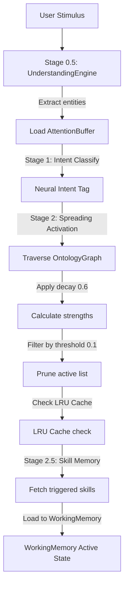

# HSCI V4 — UKM Cognitive Access Model (UKM_Cognitive_Access_Model.md)

This document establishes the storage-independent cognitive retrieval, activation, and attention filtering models that govern how the `BrainKernel` accesses knowledge in the Universal Knowledge Model (UKM).

---

## 1. Purpose & Core Principles

The Cognitive Access Model defines the logic and algorithms used by the `BrainKernel` to retrieve information from long-term storage and load it into request-scoped `WorkingMemory`. 

To prevent bottleneck latencies, knowledge retrieval does not rely on direct database queries. Instead, the retrieval process is guided by **attention salience**, **decay-weighted spreading activation**, and **context-sensitive namespace filtering**. The entire access pipeline is storage-independent, executing against abstract interfaces.

---

## 2. The Retrieval Lifecycle

Every request follows a structured retrieval pipeline to filter, activate, and load concepts:



---

## 3. Cognitive Activation & Retrieval Algorithms

### 3.1 Spreading Activation (Stage 2)
The Concept Activation Engine (CAE) retrieves active concepts dynamically using spreading activation:
1.  **Seed Selection**: Retrieve concepts explicitly matching entities inside the `AttentionBuffer` and the intent class from the `Perceiver`. Set their initial activation strength to $1.0$.
2.  **Breadth-First Traversal**: Traverse relationship edges (`IS_A`, `DEPENDS_ON`, `GENERALIZES`) in the `OntologyGraph` up to a maximum depth of **2 hops**.
3.  **Decay Propagation**: For each traversed edge, compute the propagated activation strength:
    $$A_{\text{target}} = A_{\text{source}} \cdot \text{decay\_rate} \quad (\text{decay\_rate} = 0.6)$$
4.  **Inhibition & Competition**: If two activated concepts contain conflicting rules (linked by `CONFLICTS_WITH`), they compete. The concept with lower activation is weakened by $50\%$.
5.  **Threshold Pruning**: Concepts with computed activation strength $< 0.1$ are discarded.

### 3.2 Attention-Guided Retrieval
The `AttentionBuffer` acts as a focus filter. Any concept retrieved via spreading activation that does not reference at least one entity currently held in the `AttentionBuffer` (or its ancestor concepts) has its activation strength halved, ensuring relevance to the active conversation turn.

### 3.3 Analogical & Episodic Retrieval (Stage 5)
When a problem is parsed:
1.  Generate a query vector representation from the `SemanticFrame`.
2.  Invoke analogical search over the `EpisodeStore`.
3.  Retrieve the top **5 similar episodes** based on cosine similarity thresholds ($\ge 0.7$).
4.  If a highly matching episode is found ($\ge 0.95$), retrieve its associated `ProofTrace` to bypass standard reasoning and verification, routing directly to Stage 6 response compilation.

### 3.4 Skill & Constraint Retrieval
*   **Skill Retrieval (Stage 2.5)**: Query the `SkillStore` using GNN embeddings. Skills with trigger similarity matching the active context are loaded into `WorkingMemory.active_skills`.
*   **Constraint Retrieval**: Retrieve logical rules and constraints linked by the active goals from `GoalContext`.

---

## 4. Abstract Access Interfaces

The cognitive retrieval layers interact exclusively through abstract access interfaces:

```python
class ICognitiveAccessEngine(ABC):
    @abstractmethod
    def activate_concepts(self, context: CognitiveContext) -> List[str]:
        """
        Executes Stage 2 spreading activation, filtering, and pruning.
        Updates context.working_memory.activation_field.
        """
        pass

    @abstractmethod
    def retrieve_skills(self, context: CognitiveContext) -> List[str]:
        """
        Retrieves skills based on the GNN embedding inside the context.
        """
        pass

    @abstractmethod
    def retrieve_analogies(self, context: CognitiveContext) -> List[Episode]:
        """
        Queries the EpisodeStore for analogical matches.
        """
        pass

    @abstractmethod
    def retrieve_constraints(self, subgoal_id: str, context: CognitiveContext) -> List[Expression]:
        """
        Retrieves mathematical constraints linked to the subgoal.
        """
        pass
```

---

## 5. Cache Strategy

To satisfy the $\le 100\text{ms}$ total latency budget, the retrieval layer implements a two-tier caching strategy:
1.  **Concept Cache**: An LRU cache (256 slots) stores fully resolved `Concept` objects, preventing repeated SQLite disk loads for hot concepts (e.g., standard addition or variable lookup).
2.  **Activation Field Cache**: Caches spreading activation outcomes keyed by the combined hash of the `AttentionBuffer` entities and intent classification, bypassing graph traversals.

---

## 6. Scalability & Extensibility

*   **Vector Database Extensibility**: The analogical query signature accepts standard float lists, allowing the system to scale from simple SQL string queries to high-throughput vector index providers (e.g., Pinecone or pgvector) without modifying the `BrainKernel` stage loops.
*   **Graph Engine Separation**: The spreading activation algorithms traverse relationships through `IOntologyStore`. This separates the graph database provider (Neo4j or local index lists) from the cognitive layer.
