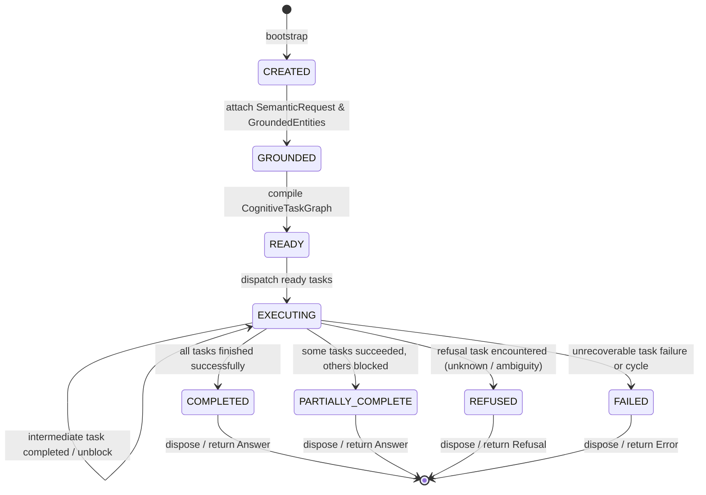

# HSCI VS-7 — Cognitive Workspace Model Design
## Request-Scoped State, Intermediate Results & Provenance Preservation

**Date**: August 2026  
**Status**: `SPECIFICATION & DESIGN`

---

## 1. Objectives & Principles

The `CognitiveWorkspace` is an ephemeral, request-scoped scratchpad that holds all active cognitive work state for a single request without becoming a shadow knowledge database or autonomous agent.

### Non-Negotiable Constitutional Boundaries:
1. **Ephemerality**: Created at request start, disposed at request termination. No leaked state between user queries.
2. **No Knowledge Authority**: References UKM concepts by ID/canonical name; never stores ungrounded facts or acts as a permanent store.
3. **Strong Typing**: Tasks, results, entities, constraints, and context references are strongly typed dataclasses.
4. **Causal Provenance**: Every task result records its source, execution duration, confidence, and input dependencies.

---

## 2. Workspace Lifecycle



### Workspace States:
- `CREATED`: Workspace initialized with `workspace_id`, `request_id`, and `created_at`.
- `GROUNDED`: Validated `SemanticRequest` and `GroundedEntity` pool attached.
- `READY`: `CognitiveTaskGraph` constructed with initial `READY` tasks identified.
- `EXECUTING`: One or more tasks actively running or awaiting dependent unblocking.
- `PARTIALLY_COMPLETE`: Some branches completed while others were blocked or failed.
- `COMPLETED`: All planned tasks executed successfully.
- `REFUSED`: Explicit diagnostic refusal produced (e.g. unknown concept or ambiguous alias).
- `FAILED`: Cycle detected, duplicate IDs, or execution exception.

---

## 3. Data Model Specification

### 3.1 Workspace Identity & State
```python
@dataclass
class WorkspaceMetadata:
    workspace_id: str
    request_id: str
    created_at: float
    status: WorkspaceStatus = WorkspaceStatus.CREATED
    session_id: Optional[str] = None
```

### 3.2 Semantic Objects & Context
- `semantic_request`: The validated `SemanticRequest` containing goal, entity mentions, constraints, modality, and negation.
- `grounded_entities`: `Dict[str, GroundedEntity]` mapping normalized entity mentions to their UKM concept resolution.
- `context_references`: `List[ContextReference]` tracking deictic/anaphoric pronouns and their resolution status.
- `constraints`: `List[SemanticConstraint]` tracking exclusion and scope operators.

### 3.3 Tasks & Results
- `task_graph`: A `CognitiveTaskGraph` containing nodes, adjacency lists, and dependency resolution.
- `results`: `Dict[str, TaskResult]` indexing results by `task_id`.
