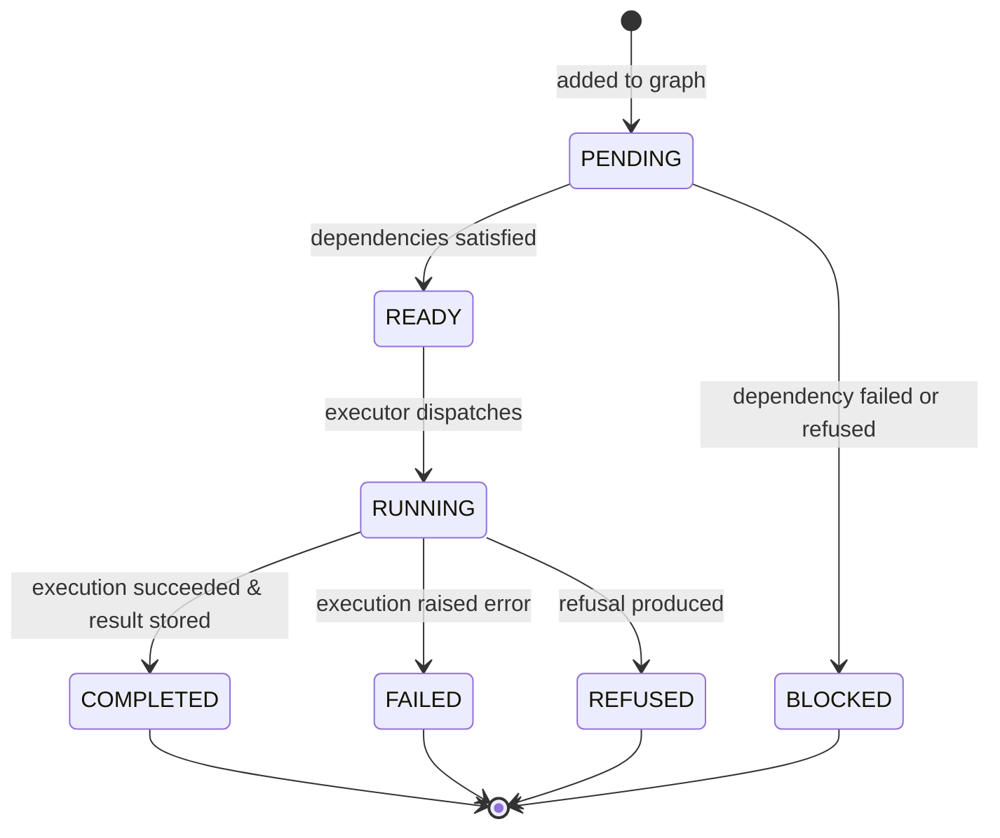

# HSCI VS-7 — Cognitive Task Graph Model Design
## Directed Acyclic Graph (DAG) Task Representation, Decomposition & Dependency Semantics

**Date**: August 2026  
**Status**: `SPECIFICATION & DESIGN`

---

## 1. Objectives & Principles

The `CognitiveTaskGraph` represents the structured dependency network of discrete cognitive operations required to satisfy a single or multi-intent request.

### Principles:
1. **Strict Acyclicity**: Any cycle ($A \rightarrow B \rightarrow A$) triggers immediate graph validation failure (`CYCLE_DETECTED`).
2. **Explicit Dependency Semantics**: Task $B$ depends on Task $A$ only when $B$ consumes $A$'s output, requires $A$'s derived conclusion, or cannot execute before $A$ finishes.
3. **Independent Parallelism**: Tasks with zero unmet dependencies are marked `READY` and can execute independently.
4. **Deterministic Evaluation**: Given identical input graphs, task execution order is strictly deterministic (topological sort order with stable tie-breaking).

---

## 2. Task Lifecycle



### Task Statuses:
- `PENDING`: Task registered in graph with unfulfilled upstream dependencies.
- `READY`: All upstream dependencies successfully `COMPLETED`.
- `RUNNING`: Actively being processed by `CognitiveTaskExecutor`.
- `COMPLETED`: Execution succeeded; `TaskResult` stored in workspace.
- `BLOCKED`: At least one upstream dependency `FAILED` or was `REFUSED`.
- `FAILED`: Execution terminated with error.
- `REFUSED`: Task produced a diagnostic refusal (e.g. unknown concept).

---

## 3. Graph Topologies Supported

### 3.1 Linear Pipeline ($A \rightarrow B \rightarrow C$)
```text
Task A (Retrieve Java Interface)
   ↓
Task B (Derive Transitive Generalization)
   ↓
Task C (Synthesize Explanatory Answer)
```

### 3.2 Branching / Join Graph ($A, B \rightarrow C$)
```text
Task A (Retrieve Concept 1) ────┐
                                ├──→ Task C (Compare Concepts 1 & 2)
Task B (Retrieve Concept 2) ────┘
```

### 3.3 Independent Tasks ($A \parallel B$)
```text
Task A (Explain Concept 1)  [READY]
Task B (Explain Concept 2)  [READY]
```

---

## 4. Multi-Intent Decomposition Example

For a compound request:
`"Explain Java Interface, compare it with Class, and tell me how Java Interface relates to Abstraction."`

Decomposition:
1. `TASK-1`: `EXPLAIN_CONCEPT(Java Interface)` $\rightarrow$ `dependencies: []` [READY]
2. `TASK-2`: `COMPARE_CONCEPTS(Java Interface, Class)` $\rightarrow$ `dependencies: []` [READY]
3. `TASK-3`: `DERIVE_RELATIONSHIP(Java Interface, Abstraction)` $\rightarrow$ `dependencies: [TASK-1]` [PENDING]

Execution Flow:
- Dispatch `TASK-1` & `TASK-2`.
- When `TASK-1` completes, `TASK-3` transitions from `PENDING` $\rightarrow$ `READY`.
- Dispatch `TASK-3`.
- All tasks complete $\rightarrow$ Composite answer synthesized.
