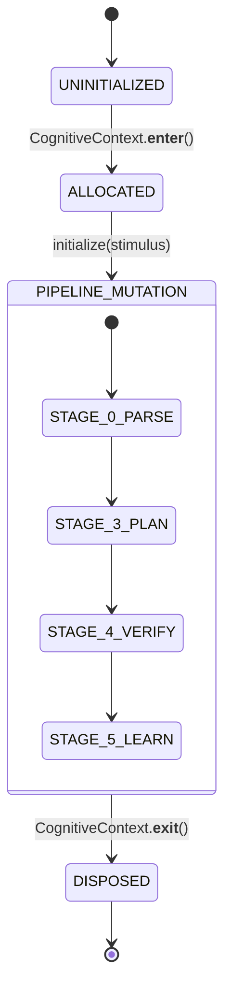

# HSCI V4 — WorkingMemory Engineering Design (WorkingMemory_Engineering_Design.md)

This document presents the detailed technical design and architectural specifications for the `WorkingMemory` subsystem, the request-scoped cognitive workspace of the HSCI V4 Cognitive Operating System.

---

## 1. Purpose

`WorkingMemory` acts as the transaction-scoped cognitive scratchpad for a single Thinking Session in the `BrainKernel`. It provides an isolated, thread-safe memory workspace where pipeline stages store and retrieve raw inputs, semantic frames, neural embeddings, active concept activations, HTN sub-goals, intermediate algebraic expressions, verification proofs, and learning gradients.

`WorkingMemory` is ephemeral. It is allocated at the start of a cognitive cycle, mutated in-place by sequential pipeline stages, and completely deallocated at the end of the session, preventing cross-request state pollution and Python memory leaks.

---

## 2. Architecture Diagrams

### 2.1 Component Ownership Hierarchy
The diagram below maps memory ownership from the thread execution level down to individual data structures:

```
  ┌────────────────────────────────────────────────────────┐
  │ FastAPI / Thread Execution Pool                        │
  └───────────────────────────┬────────────────────────────┘
                              │ owns (thread-local context)
                              ▼
  ┌────────────────────────────────────────────────────────┐
  │ CognitiveContext                                       │
  └───────────────────────────┬────────────────────────────┘
                              │ owns (unique 1-to-1 ref)
                              ▼
  ┌────────────────────────────────────────────────────────┐
  │ WorkingMemory                                          │
  └─────┬──────────────┬──────────────┬──────────────┬─────┘
        │              │              │              │
        ▼              ▼              ▼              ▼
  ┌───────────┐  ┌───────────┐  ┌───────────┐  ┌───────────┐
  │ Attention │  │ Goal      │  │ Reasoning │  │ Execution │
  │ Buffer    │  │ Context   │  │ Context   │  │ Context   │
  └───────────┘  └───────────┘  └───────────┘  └───────────┘
```

### 2.2 Pipeline Data Flow Mapping
The flow of data through `WorkingMemory` across the 10 cognitive stages is mapped below:


---

## 3. Data Structures

Every data structure is fully typed to guarantee structural compile-time safety:

```python
@dataclass
class SessionMetadata:
    """
    Metadata describing the current Thinking Session constraints.
    """
    request_id: str
    session_id: str
    timestamp_start: float
    domain: str = "general"
    timeout_ms: int = 5000

@dataclass
class AttentionBuffer:
    """
    A short-term focus window retaining the top N salient entities.
    """
    salient_entities: List[str] = field(default_factory=list)
    salience_scores: Dict[str, float] = field(default_factory=dict)
    max_capacity: int = 7

@dataclass
class ActivationField:
    """
    Stores concept activations resulting from spreading activation.
    """
    activated_concept_ids: List[str] = field(default_factory=list)
    activation_strengths: Dict[str, float] = field(default_factory=dict)
    decay_rate: float = 0.6

@dataclass
class GoalContext:
    """
    Tracks the active objective and planning sub-goals.
    """
    primary_goal: str
    active_subgoals: List[SubGoal] = field(default_factory=list)
    completed_subgoals: List[str] = field(default_factory=list)
    backlog_goals: List[str] = field(default_factory=list)

@dataclass
class PlannerContext:
    """
    Maintains the state of the HTN Planner during decomposition.
    """
    rule_bindings: Dict[str, Any] = field(default_factory=dict)
    planning_depth: int = 0
    max_depth: int = 5
    cycle_detected: bool = False

@dataclass
class ReasoningContext:
    """
    Stores intermediate solver candidate expressions.
    """
    candidate_expressions: List[Expression] = field(default_factory=list)
    selected_expression: Optional[Expression] = None
    concepts_applied: List[str] = field(default_factory=list)

@dataclass
class VerificationContext:
    """
    Tracks the Z3 verification and CEGIS iteration state.
    """
    status: VerificationStatus = VerificationStatus.UNKNOWN
    cegis_iteration: int = 0
    max_cegis_iterations: int = 5
    counterexample: Optional[Dict[str, Any]] = None
    z3_proof_trace: Optional[ProofTrace] = None
    verification_passed: bool = False

@dataclass
class ExecutionContext:
    """
    Stores stdout, logs, and variables during code synthesis runs.
    """
    local_variables: Dict[str, Any] = field(default_factory=dict)
    console_output: List[str] = field(default_factory=list)
    execution_success: bool = True
    error_message: Optional[str] = None

@dataclass
class ReflectionContext:
    """
    Stores failure classifications and evolution proposal parameters.
    """
    failure_category: Optional[str] = None  # e.g., MATH_ERROR, SYNTAX_ERROR
    diagnosed_root_cause: Optional[str] = None
    proposed_concept_evolutions: List[str] = field(default_factory=list)

@dataclass
class WorkingMemory:
    """
    The main request-scoped active thinking state workspace.
    """
    metadata: SessionMetadata
    attention_buffer: AttentionBuffer = field(default_factory=AttentionBuffer)
    activation_field: ActivationField = field(default_factory=ActivationField)
    goal_context: Optional[GoalContext] = None
    planner_context: PlannerContext = field(default_factory=PlannerContext)
    reasoning_context: ReasoningContext = field(default_factory=ReasoningContext)
    verification_context: VerificationContext = field(default_factory=VerificationContext)
    execution_context: ExecutionContext = field(default_factory=ExecutionContext)
    reflection_context: ReflectionContext = field(default_factory=ReflectionContext)
    
    stage_durations: Dict[str, float] = field(default_factory=dict)
    active_skills: List[str] = field(default_factory=list)
    semantic_frame: Optional[SemanticFrame] = None
```

---

## 4. Interfaces (APIs)

```python
class IWorkingMemory(ABC):
    @abstractmethod
    def initialize(self, stimulus: str) -> None:
        """Initializes sub-contexts and allocates scratch variables."""
        pass

    @abstractmethod
    def activate_concepts(self, concept_ids: List[str], strengths: Dict[str, float]) -> None:
        """Sets active concepts inside the ActivationField."""
        pass

    @abstractmethod
    def store_expression(self, expression: Expression) -> None:
        """Appends a candidate answer to the ReasoningContext."""
        pass

    @abstractmethod
    def store_goal(self, goal: str, subgoals: List[SubGoal]) -> None:
        """Sets the primary goal and decomposed sub-goals in GoalContext."""
        pass

    @abstractmethod
    def get_active_concepts(self) -> List[str]:
        """Returns the list of concept IDs with activation >= 0.1."""
        pass

    @abstractmethod
    def clear(self) -> None:
        """Resets variables, preserving metadata."""
        pass

    @abstractmethod
    def dispose(self) -> None:
        """Releases sub-contexts and deallocates memory."""
        pass

    @abstractmethod
    def snapshot(self) -> Dict[str, Any]:
        """Serializes current memory state into a dictionary for session continuity."""
        pass

    @abstractmethod
    def restore(self, data: Dict[str, Any]) -> None:
        """Restores state from a serialized dictionary."""
        pass
```

---

## 5. Memory Lifecycle & Garbage Collection

The lifecycle of the memory object is managed using a strict parent-context wrapper:



### Cleanup Rules & Ownership (FROZEN SPEC AMENDMENT)
*   **Single Owner**: `CognitiveContext` is the sole owner of `WorkingMemory`. When `CognitiveContext.__exit__` is called, it triggers `WorkingMemory.dispose()`.
*   **Explicit Collection Clearing**: To prevent nested circular reference loops, `WorkingMemory.dispose()` must iterate and explicitly call `.clear()` on all collections inside its sub-contexts:
    *   `attention_buffer.salient_entities.clear()`
    *   `attention_buffer.salience_scores.clear()`
    *   `activation_field.activated_concept_ids.clear()`
    *   `activation_field.activation_strengths.clear()`
    *   `planner_context.rule_bindings.clear()`
    *   `reasoning_context.candidate_expressions.clear()`
    *   `reasoning_context.concepts_applied.clear()`
    *   `execution_context.local_variables.clear()`
    *   `execution_context.console_output.clear()`
    *   `reflection_context.proposed_concept_evolutions.clear()`
    *   `stage_durations.clear()`
    *   `active_skills.clear()`
*   **Explicit Dereferencing**: Set all sub-context references and parent parameters to `None` on dispose.

---

## 6. Concurrency & Thread Safety

*   **Request Scope**: `WorkingMemory` is instantiated inside the execution scope of a single request thread. It is never declared as a global variable, shared variable, or class variable.
*   **Thread Isolation**: Each FastAPI worker thread owns its own `CognitiveContext` and corresponding `WorkingMemory` instance.
*   **Async Compatibility**: The methods are fully synchronous, preventing thread switches and execution drifts during parsing operations.

---

## 7. Performance Targets

*   **Allocation Overhead**: $\le 0.1\text{ms}$. Deallocating and creating Python datastructures must have zero impact on total request latency.
*   **Peak Memory Footprint**: $\le 100\text{KB}$ per request session.
*   **Max Active Concepts**: Hard limit of $500$ activated concepts in the `ActivationField`.
*   **Max Reasoning Depth**: HTN Planner recursion limit capped at $5$ nested decompositions.
*   **Cleanup Latency**: $\le 0.05\text{ms}$ upon calling `dispose()`.

---

## 8. Failure Handling & Recovery

*   **State Corruption Recovery**: If validation errors occur during stage transitions, `BrainKernel` catches `ValidationError`, logs the error to the trace logs, and immediately triggers `WorkingMemory.clear()`.
*   **Timeout Handling**: If execution exceeds the `timeout_ms` parameter (default 5000ms), Z3 cancels active operations. `WorkingMemory` records the timeout status and routes to the response bridge fallback.
*   **Out of Memory (OOM) Mitigation**: Apply size limits on all input strings ($\le 2000$ characters) to prevent allocation spikes.

---

## 9. Subsystem Integration & Snapshot Rules (FROZEN SPEC AMENDMENT)

### 9.1 Z3 & PyTorch Serialization Contracts
*   **Z3 Expressions**: Z3 solver instances (`z3.ExprRef`) are C-linked pointers and cannot be serialized using standard JSON tools. The `snapshot()` method must invoke `str(expr)` or `.sexpr()` to serialize algebraic models to S-expression format.
*   **PyTorch/GNN Embeddings**: Tensors must be converted to standard Python lists of floats using `tensor.tolist()` before serialization.
*   **Restore Parsing**: The `restore()` method must rebuild raw expressions and coordinate vectors.

---

## 10. Testing Strategy

*   **Unit Tests**: Verify constructor initializations and assert that `clear()` and `dispose()` correctly nullify internal sub-context values.
*   **Lifecycle Tests**: Run dummy pipeline stages; verify that stage timings are correctly recorded and retrieved.
*   **Concurrency Verification**: Spawn 100 threads executing overlapping context updates against identical concept lists. Assert that no cross-thread memory contamination occurs.
*   **Memory Leak Benchmarks**: Run 10,000 mock process cycles in a loop and verify that system memory footprint remains completely flat, checking Z3 and python garbage collection sweeps.

---

## 11. Migration Plan

*   **Step 1**: Implement the complete `WorkingMemory` class in `hsci/core/working_memory.py`.
*   **Step 2**: Replace `WorkingMemoryPlaceholder` inside `hsci/core/kernel.py` with `hsci.core.working_memory.WorkingMemory`.
*   **Step 3**: Re-run the core test suite `pytest hsci/tests/test_brain_kernel.py` to confirm compile-time parameters compile and pass successfully.
