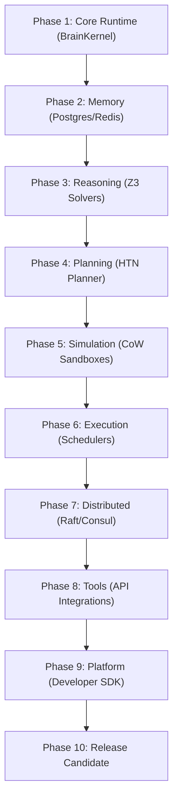

# HSCI V5 — Master Build Roadmap (MBR-1)

**Version**: 1.0  
**Status**: Master Project Execution Blueprint  
**Verdict**: Approved  

---

## 1. Project Mission & Objectives

The Master Build Roadmap (MBR-1) translates the completed architecture and system blueprints into a production-ready engineering plan.
*   **Mission**: Build a deterministic, explainable, and verifiable cognitive operating system.
*   **Non-Goals**: We explicitly avoid integrating third-party LLM APIs, prioritizing local Z3 logical solvers and symbolic representations.

---

## 2. Minimum Viable HSCI (MVH)

The smallest working subset of the cognitive OS requires four core nodes:

```
Bootstrap Loader (CORE) ──► Working Memory Cache (CORE) ──► Z3 Solver Engine (CORE) ──► HTN Planner (CORE)
```

| Subsystem | Classification | Purpose | Can Be Mocked? |
|---|---|---|---|
| **BrainKernel** | **CORE** | Bootstraps configuration and routes requests | No |
| **WorkingMemory** | **CORE** | Isolated active cache storage | No |
| **CRE / SMT** | **CORE** | Formally validates logic assertions | No |
| **HTN Planner** | **CORE** | Resolves task DAGs | No |
| **Simulation (SEA-2)** | **IMPORTANT** | Speculates counterfactual paths | Yes (Mocked in Phase 1) |
| **Raft Sync (DSA-1)** | **OPTIONAL** | Multi-node consensus sync | Yes (Mocked as single-node) |
| **Autoscaler (DEA-1)** | **FUTURE** | Scales execution containers | Yes (Mocked as static pools) |

---

## 3. Master Dependency Graph & Implementation Phases

The execution pipeline progresses sequentially through 10 distinct phases:



---

## 4. Engineering Sprint Plan

### Sprint 1: Bootstrap & In-Memory Storage
*   **Exit Criteria**: Successful boot of the `brainkernel` microservice with working Redis caches.

### Sprint 2: Z3 Logical Reasoning
*   **Exit Criteria**: LogicParser successfully parses assertions and resolves SAT proofs in under 50ms.

---

## 5. Testing & Verification Roadmap

*   **Unit Tests**: Standard mock verification files in `/tests/`.
*   **Integration Tests**: Verifying gRPC endpoints and Kafka topic messages.
*   **Chaos Testing**: Injected network partition partitions to verify minority quorums drop write rights.
*   **Quality Gates**: Code merges require a minimum of **90% branch coverage**.

---

## 6. Project Risk Register

| Risk | Likelihood | Impact | Mitigation |
|---|---|---|---|
| Z3 Solver Timeouts | Low | High | Enforce strict 50ms task-thread ceiling constraints. |
| Replication Lag Spikes | Medium | Medium | Implement lease-based caching models in Working Memory. |
| Partition Split-Brain | Low | High | Quorum-protection rules: drop write access on minority partitions. |

---

## 7. Definition of Done (DoD)

A milestone is considered **Done** only when:
1.  **Documentation**: System Design Specifications (SDS) are fully authored and committed.
2.  **Code Compliance**: 100% of Rust traits conform to SDB-1 conventions.
3.  **Test Coverage**: Branch coverage is \(\ge 90\%\) with passing chaos tests.
4.  **Verification**: SMT validation proofs are validated without regressions.
