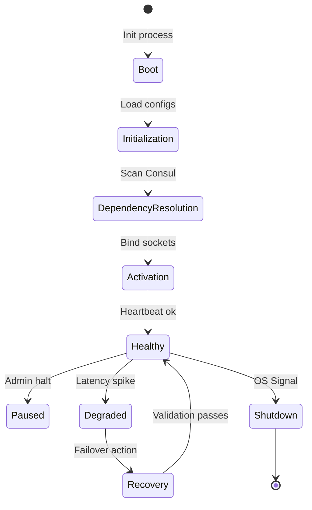

# HSCI V5 — Master System Design Blueprint (SDB-1)

**Version**: 1.0  
**Status**: Master Engineering Specification  
**Verdict**: Approved  

---

## 1. Step 1 — System Design Philosophy

The Master System Design Blueprint (SDB-1) constitutes the technical foundation governing how every subsystem within HSCI V5 must be built.
*   **SOLID Compliance**: Modules must remain single-responsibility and open for extension but closed for modification.
*   **Domain-Driven Design (DDD)**: Compute resources are isolated within strict Bounded Contexts. Aggregates are updated only via transactional boundary roots.
*   **CQRS & Event-Driven**: Reads (Working Memory queries) are decoupled from state-mutating commands.

---

## 2. Step 2 & 15 — System Design Specification (SDS) Standard & Template

Every future **System Design Specification (SDS)** must strictly adhere to the following template layout:

```markdown
# SDS-[Number]: [Subsystem Name]

## 1. Purpose & Architecture Map
Detail the subsystem purpose and how it maps to RCA-1.

## 2. Responsibilities & Non-Responsibilities
Define exactly what the module does and what is out of scope.

## 3. Interfaces & State Machine
List traits, gRPC endpoints, logical states, and transition timeouts.

## 4. Algorithms & Data Structures
Describe data schemas, locks, and algorithmic complexity limits.

## 5. Concurrency & Event Handling
Specify thread locks, async queues, and Kafka topics.

## 6. Observability, Security & Performance Targets
Set latency targets, RLS rules, metrics, and trace keys.

## 7. Verification & Tests
Detail chaos assertions, unit tests, and regression verification boundaries.
```

---

## 3. Step 3 — System Lifecycle

All modules must follow the unified lifecycle transitions managed by the boot kernel:



---

## 4. Step 4 — Communication Standard

*   **Synchronous RPCs**: Standardized on **gRPC over HTTP/2**. Connection timeouts are capped at 50ms for cognitive queries.
*   **Asynchronous Messaging**: Kafka topics must use schema registries. Every message must pass correlation and trace IDs in metadata packages.

---

## 5. Step 5 — Concurrency Standard

*   **Rust async rules**: Use `tokio` for I/O operations and dedicated thread pools for CPU-heavy tasks (e.g., Z3 solver runs).
*   **Locking Hierarchy**: Mutex acquisitions must follow a strict lexicographical sequence to prevent deadlocks. Locks must not be held across gRPC await points.

---

## 6. Step 10 — Coding Standards

### 6.1 Rust Conventions
*   **Memory Safety**: Avoid `unsafe` blocks unless interfacing with low-level solver libraries.
*   **Error Handling**: Utilize the `thiserror` crate for internal modules and `anyhow` for application gateways.

### 6.2 Python Conventions
*   **Typing**: All functions must declare explicit type annotations.
*   **Testing**: Standardize on `pytest` using asynchronous execution loop fixtures.

---

## 7. Step 11 — Testing & Verification Standard

*   **Coverage Gates**: Code merges require a minimum of **90% branch coverage**.
*   **Chaos Testing**: Test networks must support automated partition injection to prove that minority quorums drop database write permissions.

---

## 8. Step 16 — Implementation Governance

Every change must follow the verification pipeline before release:

```
SDS Draft ──► System Architecture Review (SAR) ──► Z3 Verification Pass ──► Git Pull Request ──► 90% Test Coverage Pass ──► Production Merge
```
No developer may bypass verification checks. All decisions must be linked to active Architecture Decision Records (ADRs).
